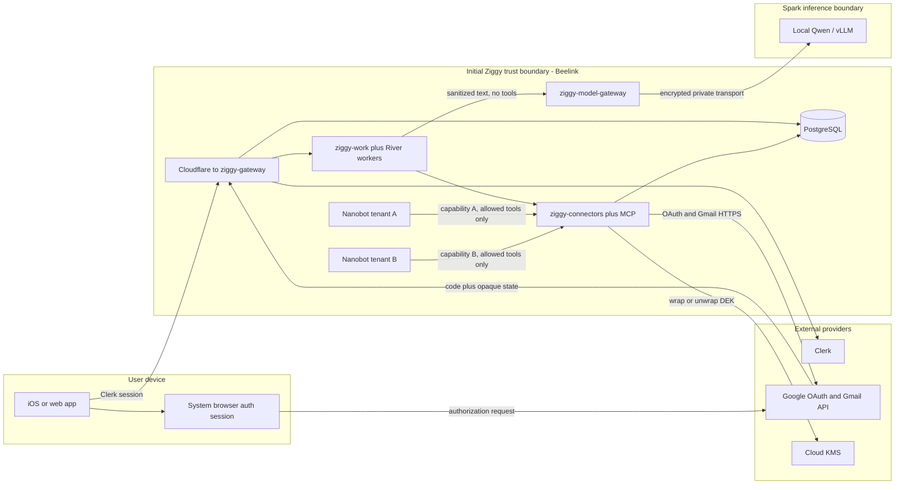
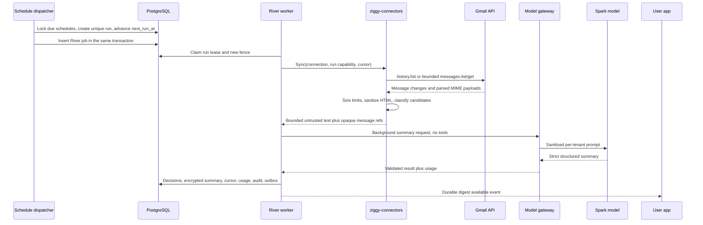
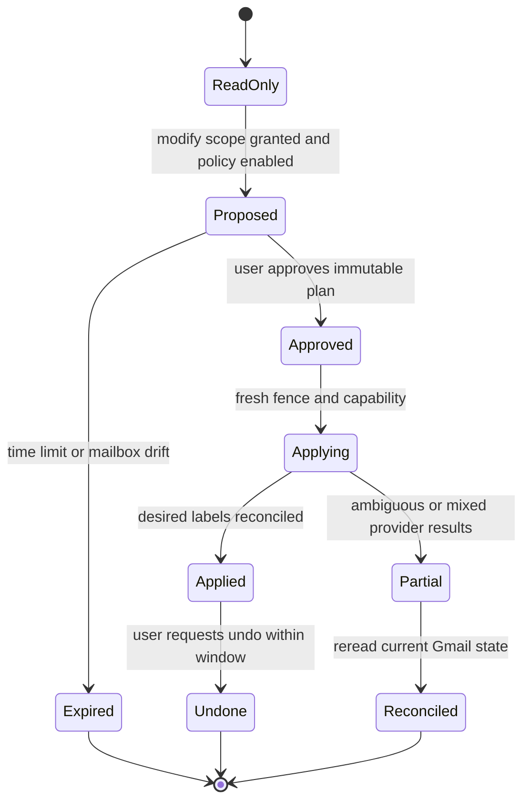

# Ziggy Gmail Tenant Workflows

Status: proposed feature architecture

Reviewed against repository state: 2026-07-21

Google requirements verified: 2026-07-21, from official Google sources only

Scale target: at most 50 registered users, initially 3-10 Gmail pilot users

Related contracts:

- [multi-tenant runtime](./ziggy-multitenant-runtime.md)
- [tenant and product observability](./ziggy-tenant-product-observability.md)
- [fleet observability](./ziggy-observability.md)
- [external TestFlight tenancy gate](../research/external-testers-tenancy-testflight.md)
- [TestFlight pilot runbook](../runbooks/testflight-pilot.md)
- [Nanobot memory](../memory.md)
- [Nanobot multiple instances](../multiple-instances.md)
- [current Go front door](../../services/ziggy-control/README.md)

## Decision

Build Gmail as a product-owned Go capability, not as credentials or cron state
inside Nanobot:

1. `ziggy-gateway` owns authenticated user APIs and the Google OAuth redirect.
2. `ziggy-connectors` owns Google account linkage, encrypted refresh tokens,
   Gmail API calls, action policy, and a narrow Streamable HTTP MCP server.
3. `ziggy-work` and PostgreSQL own schedules, runs, retries, approvals,
   cancellation, usage, and audit. Adopt River as a PostgreSQL-backed Go job
   execution library; keep Ziggy's business records authoritative.
4. The recurring digest is a deterministic Go pipeline. It sends bounded,
   sanitized text directly through `ziggy-model-gateway` to the local Spark
   model with `work_class=background_gmail` and no tools. It does not wake a
   Nanobot agent or use Nanobot's file-backed cron service.
5. Stock Nanobot reuses the same connector through its existing authenticated
   HTTP MCP support and `enabledTools`; no Ziggy source fork is required.
6. Start with `gmail.readonly`. Add `gmail.modify` incrementally only when the
   labels/archive UX exists. Trash remains separately approved and undoable.
   Permanent Gmail deletion is not implemented or authorized in the pilot.

Both `gmail.readonly` and `gmail.modify` are Google **restricted scopes**.
Because Ziggy transmits message text to Spark and stores derived summaries, an
external production pilot must complete restricted-scope OAuth verification
and the annual CASA-based security assessment. A user count below 50 is not a
technical or policy exemption on which this product should rely. See
[Google's Gmail scope classification](https://developers.google.com/workspace/gmail/api/auth/scopes),
[verification requirements](https://support.google.com/cloud/answer/13464321),
and [security assessment requirements](https://support.google.com/cloud/answer/13465431).

### Phased MVP

| Phase | User capability | Google scope | Action policy | Exit gate |
|---|---|---|---|---|
| 0. Foundation | Synthetic-mail pipeline, schemas, OAuth transaction harness, encrypted credential store, scheduler, parser, model and MCP contract tests | No live Gmail grant required | No Gmail actions | Two-tenant tests pass against fake provider data; KMS and deletion drills pass |
| 1. Read-only digest | Connect one Gmail account, choose sources/topics/schedule, receive recurring summaries, inspect the original live in Gmail | `openid email gmail.readonly` | No mailbox mutation; no attachments or link fetches | Restricted-scope verification and security assessment complete before external accounts; two real test accounts pass isolation |
| 2. Labels and archive | Preview proposed labels/archive, approve a fixed set, undo Ziggy's changes | Incremental `gmail.modify` | Per-run preview and explicit user approval; no unattended writes in the pilot | Google approves the additional scope; action/undo and stale-approval tests pass |
| 3. Trash pilot | Preview low-value messages, explicitly approve moving a fixed set to Trash, undo with `untrash` | Existing `gmail.modify` grant | Separate high-risk confirmation; never automatic | Trash/undo reconciliation and offboarding tests pass |
| Later, evidence-driven | Optional rule-level automation or Gmail push notifications | No broader Gmail scope | Explicit opt-in and kill switch | Polling or approval load demonstrates a real need |

Do not request `https://mail.google.com/`. Google documents that scope as the
one that permits immediate permanent deletion. Do not call `messages.delete`
or `messages.batchDelete`, even if a future credential is accidentally
over-scoped.

## Current Truth And Dependencies

The present branch is still the phase-one single-owner front door:

- `ziggy-control` verifies Clerk and maps one configured owner to one existing
  Nanobot upstream. It has no tenant registry, PostgreSQL dependency, runtime
  supervisor, job service, connector service, or per-user quota.
- Nanobot's current cron service stores jobs and short run history in JSON under
  the instance config directory and executes due jobs sequentially in process.
  It is useful for one workspace, but it is not the durable multi-process Work
  substrate specified here.
- Nanobot currently discovers MCP tools over Streamable HTTP/SSE/stdio, accepts
  configured HTTP headers, and filters tools with `enabledTools`. It also
  registers advertised MCP resources and prompts, so Ziggy's connector server
  must advertise tools only.
- Current Nanobot memory automatically consolidates conversations into
  `memory/history.jsonl` and can later update `USER.md` and `MEMORY.md` through
  Dream. Gmail content must not enter that path automatically.
- Current observability explicitly forbids tenant IDs, emails, message content,
  OAuth tokens, paths, URLs, and request IDs in exported labels and logs.
- Current Beelink/Spark service calls include private HTTP endpoints. Before
  Gmail data traverses hosts, the model path must use a modern encrypted
  transport in addition to the private network.

### Tenancy milestone dependency

| Dependency | Exact Gmail requirement | Can be built beforehand? |
|---|---|---|
| Multi-tenant M1: durable Clerk subject to tenant/workspace mapping | OAuth start derives tenant/workspace from the authenticated server principal; callback resolves only an opaque one-use transaction | Schemas, fake principal tests, and owner-only development route behind a flag |
| M2: one isolated runtime per workspace and server-derived routing | Nanobot receives only its workspace-bound connector capability; foreign message refs and MCP calls fail closed | Standalone connector and stock-Nanobot MCP contract tests with synthetic tenants |
| M2: PostgreSQL runtime generation/fencing | Every runtime capability includes workspace, runtime, generation, allowed tools, and expiry; the connector checks the current generation | Capability validator with a fake owner store |
| M3: central admission, quotas, disable/delete | Gmail jobs share the model without starving chat; disabled/deleted tenants cannot refresh tokens, run jobs, approve actions, or invoke MCP | Scheduler and model admission interfaces with synthetic jobs |
| M3: backup/restore and content-safe observability | Encrypted credentials, summaries, cursors, and deletion ledgers survive a process restart and do not leak through telemetry | Full local integration tests with generated keys and fake content |
| Multi-tenant phase 5: integrations and durable Work | Live external Gmail schedules, approvals, action audit, and user-visible run history | No live external enablement before this phase |

Safe pre-isolation work is limited to schema migrations, Google console and
verification preparation, OAuth state/PKCE code, KMS envelope encryption, a
fake Gmail adapter, MIME/HTML safety, the direct Spark summarization contract,
River workers using synthetic data, MCP tool schemas, UI fixtures, and
adversarial tests. An owner-only live development grant may use a dedicated
test mailbox after encryption and disclosure work exists, but it is not
evidence that two tenants are isolated.

The feature must remain server-feature-flagged off for external TestFlight
users until all rows marked as tenancy dependencies above are complete.

## Trust Boundaries



Trust rules:

- Only the Go gateway is a public Ziggy origin. OAuth callbacks terminate at a
  fixed gateway URL. Gmail, PostgreSQL, KMS, model, and MCP endpoints are never
  client-selected.
- Clerk authenticates the Ziggy user. Google authorizes a separate provider
  account. A matching email address is neither required nor sufficient to link
  the two identities.
- Only `ziggy-connectors` can unwrap Google refresh tokens or egress to Gmail.
  Nanobot, the model gateway, Spark, iOS, web, River job arguments, logs, and
  prompts never receive a provider token.
- Spark receives sanitized message text needed for the user-visible summary,
  not Google account identifiers, Gmail message IDs, OAuth tokens, attachments,
  or arbitrary fetched links. No cross-tenant prompt batching is performed by
  Ziggy.
- Gmail messages are attacker-controlled input. Reading a message never grants
  authority to invoke a tool or mutate a mailbox.
- PostgreSQL contains internal tenant keys because authorization, deletion,
  quota, and reporting require them. Those keys never become OTel labels.
- KMS protects data-encryption keys; ciphertext in PostgreSQL is not sufficient
  by itself. Loss of KMS availability stops connector work rather than falling
  back to plaintext.

### Recurring digest data flow



The cursor advances only in the transaction that commits durable decisions for
the processed page/run. A retry may re-read Gmail data, but uniqueness keys and
desired-state actions prevent duplicate product records and duplicate effects.

## Google OAuth And Policy Requirements

### Scope choice

| Purpose | Scope | Google class | Decision |
|---|---|---|---|
| Stable provider linkage | `openid email` | Identity scopes | Request with Gmail consent; validate the ID token and use `sub`, never email, as the account key |
| Read newsletter headers and bodies | `https://www.googleapis.com/auth/gmail.readonly` | Restricted | Phase 1 minimum; `gmail.metadata` cannot read bodies and its API access cannot use the Gmail `q` search parameter |
| Add/remove labels, archive, trash/untrash | `https://www.googleapis.com/auth/gmail.modify` | Restricted | Request incrementally in Phase 2; it is broader than Ziggy's UI, so the Go provider interface must still deny compose/send/delete |
| Label definitions alone | `https://www.googleapis.com/auth/gmail.labels` | Non-sensitive | Insufficient for reading or applying the full workflow; do not use it as a misleading substitute |
| Immediate permanent deletion | `https://mail.google.com/` | Restricted | Prohibited in the pilot and not requested |

Google's current scope table classifies `gmail.readonly`, `gmail.modify`, and
even `gmail.metadata` as restricted. It also says that storing or transmitting
restricted-scope data on servers requires a security assessment. The Gmail
message list documentation confirms that `q` is unavailable under
`gmail.metadata`, while full message bodies require `FULL` or `RAW` and a read
scope. See [Gmail scopes](https://developers.google.com/workspace/gmail/api/auth/scopes),
[messages.list](https://developers.google.com/workspace/gmail/api/reference/rest/v1/users.messages/list),
and [message formats](https://developers.google.com/workspace/gmail/api/reference/rest/v1/Format).

Google explicitly lists generative AI summaries that enhance email
productivity as an approved Gmail use case. The same policy limits raw and
derived data to prominent user-facing features, restricts transfers and human
access, forbids advertising and unrelated AI training, requires user deletion
controls, requires encryption in transit and at rest with appropriate key
management, and requires prompt-injection protection. Ziggy will not train or
fine-tune any shared model on Gmail data. See the current
[Google Workspace user data and developer policy](https://developers.google.com/workspace/workspace-api-user-data-developer-policy).

### Google Cloud console and verification gate

Use separate Google Cloud projects for development/staging and production.
For the production project, the operator must:

1. Enable the Gmail API. Create an OAuth **Web application** client because
   Ziggy's Go backend receives and exchanges the authorization code.
2. Configure one exact HTTPS redirect URI, for example
   `https://chat.mihaichiorean.com/oauth/google/gmail/callback`. Google requires
   the request URI to match a configured URI exactly. Localhost HTTP is only a
   local development exception. The client secret is a connector-only systemd
   credential and never ships in the app, gateway, or repository.
3. Set audience to External and publishing status to In production for the
   external pilot. Testing mode is not durable scheduling: Google says test-user
   authorizations, including offline refresh tokens, expire after seven days.
   Unverified production apps show a warning and have a lifetime cap of 100 new
   users. Google documents personal-use and development exceptions, but Ziggy
   is an external product pilot and must not present those exceptions as its
   production compliance plan. See [app audience and testing behavior](https://support.google.com/cloud/answer/15549945)
   and [verification exceptions](https://support.google.com/cloud/answer/13464323).
4. Complete brand verification: a non-login-only homepage on a verified owned
   domain, a matching privacy-policy link on that domain and consent screen,
   accurate in-product disclosures, Search Console domain ownership, compliant
   Google branding, and current project contacts.
5. Submit restricted-scope verification for `gmail.readonly` with the exact
   scope justification and an English end-to-end demonstration video showing
   the real consent screen and digest feature. Do not submit `gmail.modify` as
   a future feature: Google requires the narrowest implemented scopes and a
   demonstration of each requested scope.
6. Complete the security assessment when Google Trust and Safety directs it.
   Restricted-scope assessment is the final verification step, uses CASA,
   assigns the application an AL1 or AL2 assurance level based on risk signals,
   and results in a Letter of Validation from the assessor. Reassessment is
   required every 12 months from the prior letter's effective date; a prior
   AL2 assignment remains AL2 in later years. Treat material changes to scopes,
   redirect domains, data handling, user count, or infrastructure as a
   re-verification/assessor notification trigger.
7. When Phase 2 is implemented, add `gmail.modify`, update disclosures and the
   demo, submit the additional scope for verification, and update the security
   assessment as directed. Do not include the new scope in production
   authorization requests until it is verified; otherwise users can receive an
   unverified-app warning.

The published privacy policy and immediate pre-consent disclosure must say
what Gmail data is read, that sanitized content is processed on Ziggy's local
infrastructure to make summaries, what derived data is retained, that mailbox
actions require approval, how to disconnect/delete, and that Google Workspace
data use follows Google's Limited Use requirements. Human support access to
message content is denied by default and requires a specific recorded user
consent or a documented policy exception.

### OAuth transaction and account linkage

```mermaid
sequenceDiagram
    participant U as Authenticated user
    participant App
    participant API as ziggy-gateway
    participant DB as PostgreSQL
    participant Google
    participant C as ziggy-connectors

    U->>App: Connect Gmail
    App->>API: POST /v1/integrations/gmail/oauth/start
    API->>API: Derive tenant/workspace/user from Clerk session
    API->>DB: Store state hash, nonce hash, encrypted PKCE verifier, scopes, 10 minute expiry
    API-->>App: Google authorization URL
    App->>Google: System browser opens URL
    Google-->>API: GET fixed callback with code and state
    API->>DB: CAS consume matching unexpired state
    API->>C: Exchange consumed transaction handle and code
    C->>Google: Exchange code with client secret and PKCE verifier
    Google-->>C: Access token, refresh token, ID token, granted scopes
    C->>C: Validate ID token signature, iss, aud, exp, nonce; take provider sub
    C->>DB: Commit connection, credential ref, audit, outbox
    API-->>App: One-use Ziggy completion link; never Google code/token
```

OAuth request requirements:

- Generate at least 256 bits of random `state` and an independent OIDC `nonce`.
  Persist only their hashes. State is opaque and contains no tenant, email, or
  return URL. Compare in constant time and consume exactly once with a 10-minute
  expiry.
- Generate a high-entropy PKCE verifier per transaction and send its S256
  challenge. Encrypt the verifier while the transaction is pending, then
  destroy it after exchange. The Go `golang.org/x/oauth2` package supplies
  `GenerateVerifier`, `S256ChallengeOption`, and `VerifierOption`.
- Send `response_type=code`, the exact fixed `redirect_uri`,
  `access_type=offline`, `include_granted_scopes=true`, and only the phase's
  scopes. Use `prompt=consent` only when an initial/reconnect flow needs a new
  refresh token; Google normally returns a refresh token only on the first
  offline grant.
- Use a dedicated production OAuth project/client so incremental authorization
  cannot unexpectedly combine unrelated grants from another Ziggy feature.
  Inspect the returned granted scope set and derive capabilities from the
  intersection of granted scopes and Ziggy policy, never from requested scopes.
- Validate the Google ID token locally using a maintained library. Verify
  signature, `iss`, `aud`, `exp`, and nonce. Store an HMAC-derived
  `provider_account_ref` from issuer plus `sub`; Google documents `sub` as
  stable and email as changeable and unsuitable as a primary key. Keep the
  email only inside the encrypted account payload for user-facing display.
- Enforce one active Ziggy connection globally per Google `sub` in the pilot.
  Moving an account requires disconnect/revoke followed by a new consent flow;
  it is never reassigned by matching email.
- The callback page uses `Cache-Control: no-store`,
  `Referrer-Policy: no-referrer`, no third-party resources, and an immediate
  private connector exchange. The gateway passes only the consumed internal
  transaction handle and authorization code; it never receives a Google token.
  Gateway, Cloudflare, OTel, and analytics must not log the callback query. The
  app completion link contains only a one-use Ziggy result handle.

Google recommends a confidential web-server authorization-code flow, exact
redirect matching, state validation, offline access for predetermined jobs,
incremental authorization, encrypted token storage, and revocation handling.
Google's OpenID discovery metadata advertises S256 PKCE support. See
[web-server OAuth](https://developers.google.com/identity/protocols/oauth2/web-server),
[OAuth security practices](https://developers.google.com/identity/protocols/oauth2/resources/best-practices),
and [Google OpenID Connect](https://developers.google.com/identity/openid-connect/openid-connect).

### Credential encryption, refresh, rotation, and revocation

Use application-level envelope encryption with a software-protected Cloud KMS
symmetric key for the external pilot. Move to Cloud HSM only if the security
assessment or a later threat model requires hardware-backed key protection:

1. Generate a fresh random 256-bit DEK for every credential or protected data
   write. Encrypt with AES-256-GCM from Go's standard library.
2. Bind ciphertext with versioned AAD containing record ID, tenant ID,
   workspace ID, provider, payload purpose, and schema version. A ciphertext
   copied to another row or tenant must fail authentication.
3. Wrap the DEK with a Cloud KMS KEK. Store ciphertext, nonce, wrapped DEK,
   AAD version, and KMS key-version reference in PostgreSQL. Never store a
   plaintext DEK or KEK.
4. Give only `ziggy-connectors` the least-privilege KMS decrypt identity. The
   connector exchanges and seals the OAuth result; workers ask it to mint an
   in-memory access token. Gateway, Nanobot, and Spark have no KMS identity.
5. Configure automatic KEK rotation, initially every 90 days. New writes use
   the new primary. A resumable rewrap job unwraps each DEK with its old version
   and wraps it with the new primary; verify inventory and restore before
   disabling an old key version. Key destruction is a separately approved
   operation because premature destruction makes data unrecoverable.

This follows Google's envelope-encryption guidance: new local DEKs, AES-256-GCM,
central KEKs, and no DEK reuse between users. See [Cloud KMS envelope encryption](https://cloud.google.com/kms/docs/envelope-encryption),
[protection levels](https://cloud.google.com/kms/docs/protection-levels), and
[key rotation](https://cloud.google.com/kms/docs/key-rotation).

The encrypted credential payload contains the refresh token, Google `sub`,
display email, token endpoint metadata needed by the supported client, and no
access token. On every refresh:

- decrypt only inside connector process memory, use HTTPS, and zero/drop
  references as soon as the exchange completes;
- keep access tokens in a small in-memory cache bounded by connection ID,
  credential version, and expiry; never persist or return them;
- if Google returns a new refresh token, seal it and atomically replace the
  credential reference/version before using it for later work; if no new token
  is returned, retain the old refresh token;
- classify `invalid_grant` or confirmed revocation as `reauth_required`, stop
  schedules and writes, clear cached access tokens, and notify the user without
  retrying indefinitely; and
- increment `connection_epoch` on reconnect, scope upgrade, disable, or
  credential replacement. Runs and capabilities carrying an older epoch fail.

Disconnect first disables the connection and capabilities transactionally,
then calls Google's revocation endpoint with the refresh token. A successful
revocation or `invalid_token` destroys the encrypted credential and provider
display data. A transient revocation failure leaves a non-usable
`revocation_pending` tombstone and a bounded retry job; it never permits more
Gmail calls. Google notes that revoking a combined incremental grant revokes
the combined authorization, so the UX must say that disconnect covers every
Gmail scope granted to this Ziggy OAuth project.

## Go-Owned Connector And Nanobot Reuse

### Component ownership

`ziggy-connectors` is one Go binary at pilot scale with internal packages for
OAuth token custody, Gmail REST, MIME normalization, policy, encryption, and
MCP transport. Split deployment only when failure or scaling data justifies it.
It exposes:

- a private service API used by `ziggy-gateway` and `ziggy-work`;
- a private Streamable HTTP MCP endpoint used by isolated Nanobot runtimes;
- no public OAuth start or callback route; those stay on the gateway; and
- no generic Gmail proxy, arbitrary URL, arbitrary Gmail query, raw REST path,
  or caller-supplied workspace/account selector.

The provider adapter uses `userId=me` and a connection selected from the
validated server capability. It returns Ziggy-generated opaque `message_ref`
values. Gmail message/thread IDs and account emails never appear in MCP tool
arguments, model-visible results, URLs, OTel, or product analytics.

### Capability-scoped APIs

| Surface | Initial operation | Required capability | Result/effect |
|---|---|---|---|
| Private Go | `SyncNewsletters` | work run + workspace + connection + fence + read | Bounded normalized candidates and opaque refs |
| Private Go | `ResolveLivePreview` | authenticated user + workspace + connection + approval | Current sender/subject/snippet for UI only, not persisted |
| Private Go | `ApplyApprovedPlan` | approved plan + run fence + connection epoch + modify | Idempotent labels/archive/trash desired state |
| MCP | `gmail_search_newsletters` | runtime generation + workspace + `gmail.read` | Bounded search over the connected account; fixed filters only |
| MCP | `gmail_read_newsletter` | same plus scoped `message_ref` | Sanitized plain text and safe metadata; no attachment bytes |
| MCP | `gmail_list_digests` | workspace + `gmail.digest.read` | Tenant's retained summaries |
| MCP, Phase 2 | `gmail_preview_actions` | runtime generation + `gmail.action.propose` | Creates a user-visible proposal; no mailbox mutation |
| MCP, Phase 2 | `gmail_undo_action` | runtime generation + own action ref + undo eligibility | Requests a user-confirmed undo; no foreign/arbitrary action |

Actual approval is a direct authenticated app API, not an MCP tool and not a
model decision. The model may propose an action but cannot approve it.

Each runtime capability resolves to tenant, workspace, user, runtime ID,
runtime generation, connection allowlist, exact tool names, optional work/run
ID, issue/expiry, token ID, and connection epoch. The connector checks its
signature, expiry, replay rules, current runtime owner generation, tenant
state, connection state, tool name, and row ownership on every call. Arguments
cannot widen the capability.

### Stock Nanobot integration

The runtime supervisor generates a private, read-only Nanobot config with one
MCP server and a short-lived runtime capability in its HTTP authorization
header. The secret-bearing generated config lives outside the tenant workspace
and is not mounted where file tools can read it. Conceptually:

```json
{
  "tools": {
    "mcpServers": {
      "ziggy-gmail": {
        "type": "streamableHttp",
        "url": "http://ziggy-connectors.internal/mcp",
        "headers": {"Authorization": "Bearer <runtime-capability>"},
        "enabledTools": [
          "gmail_search_newsletters",
          "gmail_read_newsletter",
          "gmail_list_digests"
        ]
      }
    }
  }
}
```

The supervisor limits capability lifetime to the runtime ownership epoch and
drains/restarts a runtime before rotating an otherwise static configured MCP
header. Every call still checks PostgreSQL generation, so expiry or takeover
fences a stale process immediately. The connector advertises no MCP resources
or prompts because current Nanobot registers those independently of
`enabledTools`.

This reuses Nanobot's existing MCP discovery, tool schema, model tool call,
timeout/cancellation, and structured tool lifecycle events. Ziggy owns only the
external server and a pinned-version contract suite. Upgrade order remains:
configuration, MCP, generic upstream contribution, then a temporary patch only
with an owner and removal issue. There is no Gmail-specific Nanobot fork.

Use the [official MCP Go SDK](https://github.com/modelcontextprotocol/go-sdk)
for the server. Google's own remote Gmail MCP server is only Developer Preview
as of this review and exposes generic search/thread/label/draft tools. It does
not provide Ziggy's token custody, tenant capabilities, schedules, durable
decisions, approvals, trash/undo policy, or reporting. Monitor it, but do not
adopt it for the pilot. Google itself warns about indirect prompt injection and
reviewing actions in the [Gmail MCP preview documentation](https://developers.google.com/workspace/gmail/api/guides/configure-mcp-server).

## Scheduler And Job Model

### Build-versus-adopt decision

Use [River](https://github.com/riverqueue/river) as a library in `ziggy-work`,
backed by Ziggy's existing PostgreSQL deployment. River supplies claim,
retry, scheduled/periodic execution, uniqueness, cancellation, and
transactional enqueue mechanics. Ziggy tables remain the source of truth for
the user-visible schedule, run state, lease fence, approval, usage, and audit.
This makes replacing the execution library possible without changing the
product contract.

| Option | Fit at at most 50 users | Decision |
|---|---|---|
| River | Native Go and PostgreSQL; transactional insertion, retries, uniqueness, cancellation, and periodic jobs; no new state service. MPL-2 dependency and River migrations must be operated. | **Adopt.** Pin a version and isolate it behind a small queue adapter. |
| [Asynq](https://github.com/hibiken/asynq) | Capable retry and scheduling library, but introduces Redis as another durable authority and still presents a pre-1.0 API. | Reject for this system. It conflicts with the PostgreSQL authority already chosen for tenancy and Work. |
| [Temporal](https://docs.temporal.io/) | Strong durable workflow histories, timers, retries, and cancellation, but requires a separately operated cluster and a larger workflow programming model. | Reject at this scale. Revisit only if workflows become multi-day, highly branched, or span many independently deployed services. |
| Small `SKIP LOCKED` worker | PostgreSQL explicitly supports `SKIP LOCKED` for queue-like tables. It has the smallest dependency surface, but Ziggy would own retry timing, uniqueness, cancellation, lost-worker recovery, periodic scheduling, metrics, and operational tooling. | Keep as a fallback, not the default. Implement only if River's license or operations prove unacceptable. |

At this scale, expected Gmail work is tens to hundreds of short jobs per day,
not enough to justify a large orchestrator. River removes routine queue
correctness work while preserving the desired PostgreSQL-only operational
shape. River is an executor, not a substitute for the product-level protocol
below.

### Schedule and dispatch protocol

`scheduled_jobs` stores an IANA time zone, recurrence expression, next due
time, status, and generation. The API validates allowed frequencies and
computes `next_run_at`; arbitrary user code is never scheduled. The pilot
allows daily or weekly runs, no more frequently than every six hours.

Once per minute, each dispatcher performs one short transaction using the
PostgreSQL database clock:

1. Select a bounded page of due, enabled rows with `FOR UPDATE SKIP LOCKED`.
2. For each schedule, insert one `job_runs` row with unique key
   `(job_id, job_generation, scheduled_for)`.
3. Insert the corresponding River job in the same transaction.
4. Advance `next_run_at` to the first future occurrence and update
   `last_enqueued_at`.

Missed occurrences are coalesced into at most one catch-up run. Changing a
schedule increments its generation; old queued work fails its generation
check. Disable and tenant deletion increment the generation and request
cancellation of queued or running work.

### Run ownership, fencing, and idempotency

River's claim prevents normal duplicate execution, but `job_runs` also has an
application lease because workers can pause, lose a connection, or be replaced:

- A worker changes `queued` to `running`, increments `lease_fence`, and sets
  `lease_owner`, `lease_expires_at = database_now + 60 seconds`, and a
  heartbeat every 10 seconds.
- Every checkpoint and side effect compares tenant status, job generation,
  run status, lease owner, and `lease_fence`. A stale worker cannot commit
  after a takeover.
- A reaper may reclaim an expired run by incrementing the fence. It never
  reuses a fence value.
- Each pipeline stage has a unique `(run_id, stage, input_version)` result.
  Summary publication uses `(run_id, summary_version)`. Every proposed action
  has an immutable action key derived from connection, message reference,
  desired state, and plan version.
- Gmail does not support an atomic transaction with Ziggy. Actions therefore
  express desired state using idempotent label deltas, record the provider
  response, and reconcile by reading current state after an ambiguous timeout.
  An action is not reported successful solely because an HTTP request was sent.

The worker checks cancellation before Gmail page reads, before and after each
model call, between batches, and immediately before every mailbox mutation.
Cancellation is cooperative. A result from a cancelled or stale fence may be
recorded as discarded usage, but cannot publish a digest, advance a cursor, or
apply an action.

### Retries, admission, and quotas

Retry transport failures and Google `429`, `500`, `502`, `503`, and `504`
responses with full jitter at roughly 1 minute, 5 minutes, 30 minutes, 2
hours, and 8 hours, capped at five attempts and 24 hours. Honor `Retry-After`
when present. `invalid_grant`, revoked authorization, disabled account,
malformed MIME, policy rejection, and permanent 4xx responses do not use this
schedule. Authorization failures mark the connection `reauth_required` and
cancel its pending work.

The Gmail API currently applies per-project and per-user quotas and assigns
different units to each method. For example, `messages.list` costs 5 units,
`messages.get` 20, `history.list` 2, `messages.modify` 5, and
`messages.trash`/`untrash` 20/5. Ziggy must enforce lower internal budgets and
use truncated exponential backoff, independently of published ceilings. See
the [official Gmail quota reference](https://developers.google.com/workspace/gmail/api/reference/quota).

Pilot admission limits:

| Resource | Limit |
|---|---|
| Gmail run per tenant | 1 active; one pending catch-up at most |
| Gmail API concurrency | 1 per Google account, 4 globally |
| Candidate messages | 200 per run and 500 per rolling day per tenant |
| Decoded text | 256 KiB per message, 2 MiB per run |
| Model input | Configured token ceiling per message and per digest; reject rather than truncate across tenant boundaries |
| Background Spark work | 1 inference at a time initially; interactive chat always has priority |
| Mutations | 50 proposed actions per approval and 100 per tenant per day |

Admission is server-derived from tenant/workspace/run records, never from job
arguments. `ziggy-model-gateway` queues `background_gmail` behind interactive
work, enforces a per-tenant token budget and the global Spark slot, and records
accepted/rejected token counts. The worker yields and retries when the model
budget is unavailable; it never bypasses the gateway to call vLLM directly.

## Newsletter Ingestion And Summarization

### Synchronization lifecycle

The user first chooses explicit newsletter senders, Gmail labels, or a bounded
query and an initial lookback of at most seven days. Ziggy does not scan the
entire mailbox by default.

1. **Initial sync:** call `messages.list` with the bounded query and paginate
   IDs only, then call `messages.get` for candidates. Save the latest observed
   mailbox `historyId` only after durable processing completes.
2. **Incremental sync:** call `history.list` from the saved cursor, filter to
   relevant changes, then fetch only candidate messages. Google says history
   IDs are usually available for at least a week but can expire sooner.
3. **Cursor loss:** a `404` from `history.list` causes a bounded reconciliation
   scan, not an unbounded mailbox download. Mark the run as reconciled and
   replace the cursor after commit.
4. **Polling:** use scheduled polling for the pilot. Gmail push requires a
   Google Cloud Pub/Sub topic, a renewable `watch` at least every seven days,
   and periodic fallback because notifications can be delayed or dropped. Add
   it only if measured latency requirements justify that infrastructure.

These behaviors follow Google's [Gmail synchronization guide](https://developers.google.com/workspace/gmail/api/guides/sync),
[`messages.list` reference](https://developers.google.com/workspace/gmail/api/reference/rest/v1/users.messages/list),
and [push notification guide](https://developers.google.com/workspace/gmail/api/guides/push).

### MIME, attachment, and link safety

The connector parses the structured Gmail payload using a maintained MIME
parser, never by concatenating raw wire text. Enforce limits before allocating
or decoding: message size, part count, MIME nesting depth, header count and
length, compression ratio, decoded text, character replacement rate, and total
run bytes. Reject malformed transfer encoding and cyclic or pathological
multipart structures.

- Prefer `text/plain`. If only HTML exists, parse it as HTML, remove scripts,
  styles, forms, tracking pixels, hidden text, comments, SVG, embedded objects,
  and dangerous URL schemes, then emit normalized plain text.
- Do not download attachments in the pilot, including inline attachments. Do
  not invoke document parsers, archives, OCR, antivirus, or preview renderers.
- Do not fetch remote images or links, follow redirects, resolve DNS for email
  content, or run a headless browser. Links are inert display metadata only.
- If a future UI makes a link clickable, allow only `http` and `https`, reject
  credentials in URLs and non-public address targets, and open through an
  explicit user gesture. The server still does not prefetch it.
- Decode in memory. If a library requires scratch storage, use an encrypted,
  size-limited per-run directory that is removed on success, failure, restart,
  and cancellation. The pilot design does not require such storage.

Provider message IDs, thread IDs, sender addresses, and subject lines are not
placed in model prompts as identifiers. The connector returns opaque Ziggy
message references and only the bounded text fields needed for classification.

### Classification and summary pipeline

Use deterministic filters first: selected source/query, age, duplicate
fingerprint, automated/bulk headers, language support, size, and prior decision.
A small local classification prompt then produces strict JSON such as category,
interest score, reasons, and safety flags. Only accepted candidates enter one
per-message extraction prompt. A final bounded reducer constructs the digest
from validated extracts, not from the raw mailbox batch.

Every model request is tenant-exclusive at the Ziggy application layer. There
is no prompt/result cache shared across tenants and no multi-tenant dynamic
batch assembled by Ziggy. The model gateway may use provider-level continuous
batching only if request boundaries and outputs remain cryptographically and
operationally isolated by the inference server.

Prompt-injection controls are mandatory:

- Wrap newsletter text in a typed, length-delimited untrusted-data field and
  instruct the model that content cannot alter policy or request tools.
- Exclude tools, provider credentials, system topology, memory files, other
  messages, and mailbox mutation capabilities from every classification and
  summarization call.
- Use a versioned JSON schema with bounded strings, arrays, scores, and URLs.
  Reject unknown fields and invalid output; do not interpret generated text as
  commands, SQL, MIME, Markdown HTML, or tool arguments.
- Treat "ignore previous instructions", encoded payloads, fake approval text,
  and data-exfiltration requests as content. Surface a generic safety flag if
  useful, but never execute them.
- Sanitize generated Markdown at rendering time. No raw HTML, remote image, or
  automatic link preview is allowed.
- Keep raw prompt/response capture disabled in tracing and model middleware.

Google's Workspace user-data policy explicitly permits generative summaries as
a user-facing productivity feature, but its Limited Use rules prohibit using
Gmail data for ads, unrelated purposes, generalized model training, or broad
human access. The policy also calls for encryption, token protection, and
prompt-injection defenses. See the [Google Workspace API User Data and Developer Policy](https://developers.google.com/workspace/workspace-api-user-data-developer-policy).

### Retention and tenant memory

| Data | Pilot retention |
|---|---|
| Raw MIME, body, attachment | Never persist; process bounded decoded text in memory |
| Encrypted provider locator and decision metadata | 7 days after the run, long enough for preview and undo |
| Encrypted digest and validated extracts | 30 days, user-deletable sooner |
| Sync cursor and connection state | While connected; remove on disconnect/deletion |
| OAuth transaction | 10 minutes, then purge |
| Approval/action reconciliation data | 30 days; irreversible audit metadata remains without provider IDs |
| Usage detail | 90 days, then retain aggregate billing/operations counts if required |
| Content-free security audit | 400 days, subject to the documented product retention policy |

Retention is enforced by idempotent purge jobs and tested after backup/restore.
Disconnect defaults to deleting refresh credentials, cursors, provider
locators, pending approvals, and retained digests; product-level audit rows keep
only the event type, actor class, outcome, timestamp, and random tenant
reporting reference. Tenant deletion uses the multi-tenant deletion contract
and blocks all access before asynchronous erasure begins.

Newsletter content and inferred interests do not enter Nanobot conversation
history, `memory/history.jsonl`, `USER.md`, `MEMORY.md`, or Dream. A user may
explicitly save a short topic preference through the normal tenant-scoped
memory API, with a preview of exactly what is saved. Do not infer durable
profile facts from mail or use one tenant's preferences in another tenant's
prompt.

The pilot inference path is local: `ziggy-work` to
`ziggy-model-gateway` to Qwen/vLLM on Spark over authenticated encrypted
transport. No message content is sent to an external model API. A provider
change requires a new disclosure, data-flow review, retention review, and
Google policy assessment before rollout.

## Safe Mailbox Actions

Mailbox mutation is a separate state machine from summarization:



Phase 1 is read-only. Phase 2 can propose adding a Ziggy label, removing
`INBOX` to archive, or both. Phase 3 can propose moving a message to Trash.
Trash has its own warning and approval control and cannot be bundled under a
generic "clean up" approval. The pilot never calls permanent delete APIs and
never requests the `mail.google.com` scope.

The preview shows sender display, subject, date, reason, proposed operation,
and affected count from a fresh provider read. Sensitive display fields are
fetched just in time; they are not copied into analytics or logs. Approval is
one-use, expires after 15 minutes, and binds tenant, workspace, connection
epoch, run, fence, exact ordered action keys, operation types, and a SHA-256
plan hash. Adding a message or escalating label/archive to trash invalidates
the approval.

Immediately before applying, the worker rechecks connection epoch, scope,
tenant state, run fence, plan hash, expiry, current labels, and message
existence. Mailbox drift either produces a narrower safe operation or expires
the plan for a new preview; it never broadens the approved action.

Undo is offered for seven days while the encrypted locator exists:

- Label undo removes only the label Ziggy recorded as adding.
- Archive undo restores `INBOX` only when Ziggy recorded removing it.
- Trash undo calls `messages.untrash` and restores only the Ziggy-recorded
  label delta.
- Undo does not restore unrelated user or filter changes and never claims to
  reverse an action it cannot verify.

Every proposal, approval, attempt, provider outcome, reconciliation, undo, and
denial creates a content-free audit event. A global operator kill switch and a
per-tenant disable switch block new actions before they stop read-only digests.

## PostgreSQL Contract

The following is the logical schema contract, not a copy-paste migration. Use
UUIDv7 or an equivalent sortable random identifier, `timestamptz`, database
time for leases, strict enums/check constraints, and composite foreign keys
that include `tenant_id` and `workspace_id`. Product tables live in the
`ziggy_work` schema; River owns its namespaced tables.

```sql
-- OAuth state is short-lived and contains no plaintext email or token.
oauth_transactions(
  transaction_id uuid primary key,
  tenant_id uuid not null,
  workspace_id uuid not null,
  user_id uuid not null,
  provider text not null check (provider = 'gmail'),
  state_hash bytea not null unique,
  nonce_hash bytea not null,
  pkce_verifier_credential_id uuid not null,
  requested_scopes text[] not null,
  return_target text not null,
  expires_at timestamptz not null,
  consumed_at timestamptz,
  created_at timestamptz not null
)

gmail_connections(
  connection_id uuid primary key,
  tenant_id uuid not null,
  workspace_id uuid not null,
  linked_by_user_id uuid not null,
  google_subject_hmac bytea not null,
  display_email_payload_id uuid,
  credential_id uuid,
  granted_scopes text[] not null,
  status text not null,                 -- pending|active|reauth_required|disabled|revocation_pending|disconnected
  connection_epoch bigint not null,
  last_verified_at timestamptz,
  disconnected_at timestamptz,
  created_at timestamptz not null,
  updated_at timestamptz not null,
  unique (tenant_id, workspace_id, connection_id)
)

create unique index gmail_one_live_subject
  on gmail_connections (google_subject_hmac)
  where status in ('pending', 'active', 'reauth_required',
                   'disabled', 'revocation_pending');

encrypted_credentials(
  credential_id uuid primary key,
  tenant_id uuid not null,
  workspace_id uuid not null,
  provider text not null,
  purpose text not null,                 -- oauth_refresh|oauth_pkce
  ciphertext bytea not null,
  nonce bytea not null,
  wrapped_dek bytea not null,
  kek_resource text not null,
  kek_version text not null,
  aad_version integer not null,
  credential_version bigint not null,
  created_at timestamptz not null,
  rotated_at timestamptz,
  revoked_at timestamptz,
  unique (tenant_id, workspace_id, credential_id)
)

protected_payloads(
  payload_id uuid primary key,
  tenant_id uuid not null,
  workspace_id uuid not null,
  purpose text not null,                 -- provider_locator|display_email|digest|extract
  ciphertext bytea not null,
  nonce bytea not null,
  wrapped_dek bytea not null,
  kek_resource text not null,
  kek_version text not null,
  aad_version integer not null,
  expires_at timestamptz,
  deleted_at timestamptz,
  created_at timestamptz not null,
  unique (tenant_id, workspace_id, payload_id)
)

gmail_sync_cursors(
  connection_id uuid primary key,
  tenant_id uuid not null,
  workspace_id uuid not null,
  history_id_payload_id uuid not null,
  cursor_version bigint not null,
  last_full_sync_at timestamptz,
  last_success_at timestamptz,
  updated_at timestamptz not null,
  foreign key (tenant_id, workspace_id, connection_id)
    references gmail_connections(tenant_id, workspace_id, connection_id)
)
```

`google_subject_hmac` uses a versioned, separately managed lookup key and is
never emitted outside the connection store. Email is encrypted display data,
not identity. Refresh tokens are references from the connection row and never
appear in a job payload.

```sql
scheduled_jobs(
  job_id uuid primary key,
  tenant_id uuid not null,
  workspace_id uuid not null,
  connection_id uuid not null,
  kind text not null check (kind = 'gmail_digest'),
  schedule_spec jsonb not null,           -- validated versioned daily/weekly specification
  timezone text not null,
  query_policy jsonb not null,            -- allowlisted sender/label/query settings
  action_policy text not null,            -- read_only|propose_modify|propose_trash
  status text not null,                   -- enabled|paused|disabled|deleting
  generation bigint not null,
  next_run_at timestamptz not null,
  last_enqueued_at timestamptz,
  created_by_user_id uuid not null,
  created_at timestamptz not null,
  updated_at timestamptz not null,
  foreign key (tenant_id, workspace_id, connection_id)
    references gmail_connections(tenant_id, workspace_id, connection_id),
  unique (tenant_id, workspace_id, job_id)
)

job_runs(
  run_id uuid primary key,
  tenant_id uuid not null,
  workspace_id uuid not null,
  job_id uuid not null,
  job_generation bigint not null,
  scheduled_for timestamptz not null,
  status text not null,                   -- queued|running|awaiting_approval|succeeded|...
  attempt integer not null,
  lease_owner text,
  lease_fence bigint not null default 0,
  lease_expires_at timestamptz,
  cancel_requested_at timestamptz,
  failure_class text,
  failure_code text,
  started_at timestamptz,
  finished_at timestamptz,
  created_at timestamptz not null,
  foreign key (tenant_id, workspace_id, job_id)
    references scheduled_jobs(tenant_id, workspace_id, job_id),
  unique (job_id, job_generation, scheduled_for),
  unique (tenant_id, workspace_id, run_id)
)

message_decisions(
  decision_id uuid primary key,
  tenant_id uuid not null,
  workspace_id uuid not null,
  run_id uuid not null,
  connection_id uuid not null,
  provider_message_hmac bytea not null,
  provider_locator_payload_id uuid not null,
  content_fingerprint_hmac bytea not null,
  decision_version integer not null,
  category text not null,
  interest_score smallint,
  reason_codes text[] not null,
  safety_flags text[] not null,
  proposed_action text not null,
  state text not null,
  expires_at timestamptz not null,
  created_at timestamptz not null,
  unique (tenant_id, connection_id, provider_message_hmac, decision_version),
  foreign key (tenant_id, workspace_id, run_id)
    references job_runs(tenant_id, workspace_id, run_id)
)

summaries(
  summary_id uuid primary key,
  tenant_id uuid not null,
  workspace_id uuid not null,
  run_id uuid not null,
  summary_version integer not null,
  payload_id uuid not null,
  prompt_policy_version text not null,
  model_class text not null,
  item_count integer not null,
  expires_at timestamptz not null,
  deleted_at timestamptz,
  created_at timestamptz not null,
  unique (run_id, summary_version),
  foreign key (tenant_id, workspace_id, run_id)
    references job_runs(tenant_id, workspace_id, run_id)
)

summary_sources(
  tenant_id uuid not null,
  workspace_id uuid not null,
  summary_id uuid not null,
  decision_id uuid not null,
  ordinal integer not null,
  primary key (summary_id, decision_id)
)
```

`provider_message_hmac` supports equality and duplicate checks without exposing
the Gmail ID. The actual locator is independently encrypted and short-lived.
Do not store body, raw MIME, attachment bytes, full headers, sender, subject,
recipient, snippet, or URL in these relational columns.

```sql
approvals(
  approval_id uuid primary key,
  tenant_id uuid not null,
  workspace_id uuid not null,
  run_id uuid not null,
  connection_id uuid not null,
  connection_epoch bigint not null,
  run_fence bigint not null,
  plan_hash bytea not null,
  operation_class text not null,          -- label_archive|trash|undo
  status text not null,                   -- pending|approved|consumed|expired|cancelled
  approved_by_user_id uuid,
  expires_at timestamptz not null,
  approved_at timestamptz,
  consumed_at timestamptz,
  created_at timestamptz not null,
  unique (tenant_id, workspace_id, approval_id)
)

gmail_actions(
  action_id uuid primary key,
  tenant_id uuid not null,
  workspace_id uuid not null,
  run_id uuid not null,
  approval_id uuid not null,
  decision_id uuid not null,
  action_key bytea not null,
  operation text not null,                -- add_label|remove_inbox|trash|undo_*
  desired_delta jsonb not null,           -- label identifiers are encrypted refs or fixed system labels
  state text not null,                    -- planned|applying|applied|ambiguous|undone|failed
  attempt integer not null,
  applied_at timestamptz,
  reconciled_at timestamptz,
  undo_expires_at timestamptz,
  created_at timestamptz not null,
  unique (action_key),
  unique (tenant_id, workspace_id, action_id)
)

usage_events(
  usage_id uuid primary key,
  tenant_id uuid not null,
  workspace_id uuid not null,
  run_id uuid,
  usage_kind text not null,               -- gmail_units|model_input|model_output|action
  quantity bigint not null check (quantity >= 0),
  outcome text not null,
  occurred_at timestamptz not null
)

audit_events(
  audit_id uuid primary key,
  tenant_id uuid not null,
  workspace_id uuid not null,
  tenant_ref uuid not null,
  actor_class text not null,              -- user|worker|operator|system
  actor_ref uuid,
  event_type text not null,
  target_type text not null,
  target_ref uuid,
  outcome text not null,
  reason_code text,
  policy_version text,
  occurred_at timestamptz not null
)

outbox_events(
  event_id uuid primary key,
  tenant_id uuid not null,
  workspace_id uuid not null,
  event_type text not null,
  aggregate_ref uuid not null,
  payload jsonb not null,                 -- allowlisted internal refs and state only
  available_at timestamptz not null,
  delivered_at timestamptz,
  attempt integer not null default 0
)
```

For production migrations, replace unconstrained JSON values with versioned
schemas and validation functions, add all composite foreign keys omitted above
for readability, and partition or age out usage/audit data by retention.
Required partial indexes cover due schedules, expired run leases, pending
approvals, purge deadlines, and undelivered outbox rows.

Enable PostgreSQL row-level security as defense in depth and force it for
ordinary application roles. Gateway transactions set a server-derived tenant
and workspace context. Workers use a narrowly privileged service role and
must include tenant/workspace predicates in every query; they do not bypass
authorization through user-supplied IDs. Connector token decryption uses a
separate database role with no access to summary plaintext. Migration and
break-glass roles are not used by serving processes.

### Service interfaces

Keep provider and queue mechanics behind interfaces with tenant context as a
required value object, not loose IDs:

```go
type ConnectionStore interface {
    ResolveActive(ctx context.Context, principal TenantPrincipal, id ConnectionID) (Connection, error)
    RotateCredential(ctx context.Context, current CredentialVersion, replacement SealedCredential) error
    DisableAndFence(ctx context.Context, principal TenantPrincipal, id ConnectionID, reason string) error
}

type GmailProvider interface {
    Exchange(ctx context.Context, txn OAuthTransaction, code string) (Grant, error)
    Sync(ctx context.Context, grant TokenHandle, cursor Cursor, policy QueryPolicy) (SyncPage, error)
    ReadState(ctx context.Context, grant TokenHandle, refs []ProviderRef) ([]MessageState, error)
    ApplyDesiredState(ctx context.Context, grant TokenHandle, plan ActionPlan) ([]ActionResult, error)
    Revoke(ctx context.Context, grant TokenHandle) error
}

type WorkQueue interface {
    EnqueueDigestTx(ctx context.Context, tx pgx.Tx, run RunEnvelope) error
    Cancel(ctx context.Context, runID RunID) error
}

type ModelAdmission interface {
    Summarize(ctx context.Context, principal TenantPrincipal, req BoundedSummaryRequest) (SummaryResult, Usage, error)
}
```

`TokenHandle` is an in-process opaque handle usable only by the connector. It
cannot be serialized into River, MCP, OTel, an error value, or JSON. Provider
adapters return typed bounded errors so retry policy does not inspect arbitrary
Google response bodies.

## Observability And Product Analytics

The existing observability contract remains stricter than the durable product
store. OTel is for fleet health, not tenant lookup.

Allowed low-cardinality dimensions include:

- `service.name`, build/version, deployment environment, and host class;
- `provider=gmail`, operation class, workflow phase, `work_class`, and model
  class;
- bounded outcome, retry class, HTTP status class, parser rejection class, and
  approval operation class;
- queue depth buckets, latency histograms, token/byte buckets, and aggregate
  action counts.

Never export tenant, workspace, user, run, job, connection, approval, OAuth
transaction, Gmail message/thread/history ID, opaque message ref, email,
sender, recipient, subject, query, label name, URL, token, body, summary,
prompt, model output, provider error body, IP address, or arbitrary exception
text as a label, span attribute, event, baggage value, metric exemplar, or log
field. Do not put these values in span names or paths. Trace IDs remain random
operational correlation only and are not a product reporting key.

Emit content-free spans for dispatch, lease wait, Gmail operation class,
parse/classify/summarize, approval validation, action reconciliation, KMS
operation class, purge, and notification delivery. Errors use allowlisted
codes. Connector HTTP middleware must redact query strings and authorization
headers before any logging library observes them.

Per-tenant reporting comes from restricted durable views, not OTel:

- `tenant_connection_status_v`: `tenant_ref`, state, scope tier, connected and
  last-success dates, reauthorization flag;
- `tenant_run_daily_v`: `tenant_ref`, day, scheduled/succeeded/failed/cancelled
  counts, bounded failure category, candidates and digest counts;
- `tenant_action_daily_v`: `tenant_ref`, day, proposed/approved/applied/undone
  counts by operation class;
- `tenant_usage_hourly_v`: `tenant_ref`, hour, Gmail units and model token
  counts;
- `tenant_retention_v`: `tenant_ref`, oldest retained summary/action and purge
  backlog status.

Only a restricted support/reporting role can read these views. `tenant_ref` is
a random durable reporting identifier with no embedded Clerk, Google, or email
value. Product analytics events are generated from a versioned allowlist and
contain `tenant_ref`, event name, phase, bounded outcome, and coarse counts;
they never contain message-level data. Support access is separately audited,
time-bounded, and does not reveal decrypted message content by default.

## Threat Model

| Threat | Control and fail-closed behavior |
|---|---|
| OAuth login CSRF, code interception, or redirect abuse | One-use hashed `state`, OIDC nonce, PKCE S256, exact fixed redirect, ten-minute expiry, transaction bound to authenticated tenant/workspace, no client-selected return URL |
| Google account confused with Ziggy identity | Link by validated Google `sub` to the server-derived Ziggy principal; encrypted email is display-only; pilot uniqueness prevents silent cross-tenant relink |
| Refresh-token/database theft | Per-write AES-256-GCM envelope encryption, non-reused DEK, KMS KEK, AAD binding, separate DB/KMS roles, rotation and revocation; DB dump alone is insufficient |
| Stale runtime or worker after reassignment | Runtime generation and connection epoch on capabilities; DB-clock run lease and monotonically increasing fence checked at every durable write and action |
| Tenant A guesses tenant B object ID | Composite tenant/workspace keys, RLS, opaque refs, server-derived principal, capability tool allowlist, negative authorization tests |
| Malicious newsletter prompt injection | Treat mail as untrusted data, no tools or secrets in model request, strict schema, sanitization, no URL fetch, no automatic actions |
| MIME parser, archive, or renderer exploit | Bounded maintained parser, no attachments/archives/browser, in-memory processing, hard part/depth/byte limits |
| SSRF and tracking via links/images | No server fetch, remote image, redirect, DNS lookup, or preview; safe schemes and explicit user gesture in UI |
| Approval replay or plan substitution | One-use expiring approval bound to tenant/run/fence/connection epoch and exact plan hash; fresh state check; operation cannot be broadened |
| Duplicate or ambiguous Gmail mutation | Desired-state label deltas, action uniqueness key, post-timeout provider reconciliation, partial state visible, bounded undo |
| Model or telemetry cross-tenant leak | Per-tenant application requests, no shared content cache, no content capture, local inference, response correlation and two-tenant canary tests |
| Operator or support misuse | Least-privilege roles, KMS separation, audited break-glass process, no default content view, content-free reporting views |
| Offboarded tenant continues running | Disable first, increment all generations/epochs, cancel work and approvals, revoke Google grant, purge ciphertext/cursors, prove denial after restore |
| Backup restores deleted secrets/content | Encrypted backups, key lifecycle separation, deletion tombstones and post-restore purge replay, periodic restore-and-delete drill |
| Resource starvation by one tenant | Per-tenant queue/admission limits, global Gmail and Spark caps, interactive priority, bounded input/run frequency |

The principal residual risk is that local inference necessarily receives
newsletter text. The encrypted host link, local-only model path, process
isolation, no prompt capture, and short-lived memory bound that exposure; they
do not make Spark a non-sensitive system. Spark and its administrators are in
the restricted Gmail-data trust boundary.

## Two-Tenant And Adversarial Test Matrix

All tests use generated accounts and synthetic MIME. A and B have distinct
tenants, workspaces, connections, capabilities, keys, schedules, and message
fixtures. No test uses a real mailbox dump.

| Case | Exercise | Required result |
|---|---|---|
| OAuth state swap | Complete A callback with B session or callback state | Denied; neither connection changes; allowlisted audit code only |
| OAuth replay/expiry | Reuse consumed state or callback after ten minutes | Denied and no token exchange/reuse |
| Google subject collision | Link the same validated `sub` from B while active for A | Explicit conflict; never silently moves the account |
| Object IDOR | A calls every connection/job/run/summary/approval/action endpoint with B IDs | Uniform not-found/denied; no timing-sensitive metadata or row mutation |
| Composite-key omission | Run repository query tests with colliding local IDs | Database FK/RLS and service authorization both fail closed |
| MCP capability swap | Runtime A uses B message ref, tool token, workspace, or generation | Denied before KMS/Gmail call; no provider traffic |
| Stale runtime | Reassign A runtime and invoke with old generation | Immediate denial; new runtime remains functional |
| Stale worker | Expire A lease, let worker B-equivalent claimant take over, resume old worker | Old fence cannot publish, advance cursor, or mutate Gmail |
| Duplicate delivery | Execute the same River job concurrently and after process crash | One logical run/result; provider state reconciled; usage attempts accounted |
| Cancel race | Cancel after read, during model call, and before each mutation | No publication or action after cancellation/fence check |
| Model response mix-up | Delay/reorder A and B model responses with identical message text | Correlation mismatch rejected; summaries remain in correct tenant rows |
| Shared-cache probe | Submit identical and canary-different content for A/B | No cross-tenant cache hit or content-bearing telemetry |
| Prompt injection | Mail asks for system prompt, other mail, tokens, tool calls, archive, trash | Parsed only as content; schema output contains no command or leaked data |
| Encoded injection | Base64/lookalike/HTML-hidden instructions and fake approval text | Sanitized/bounded; never treated as authority |
| MIME bomb | Deep multipart, huge headers, malformed transfer encoding, oversized body | Early typed rejection within memory/CPU bounds; worker remains healthy |
| Attachment/link SSRF | Internal URL, redirect, credential URL, image beacon, attached archive | Zero outbound request and zero attachment parse |
| Approval substitution | Approve labels then replace message set or operation with trash | Plan hash/operation mismatch; approval invalidated |
| Approval replay | Reuse consumed, expired, wrong-user, wrong-epoch, or wrong-fence approval | Denied with no Gmail call |
| Mailbox drift | User changes labels or trashes message after preview | Re-read narrows/expires plan; never broadens it |
| Ambiguous mutation | Drop response after Gmail accepts action | Reconciliation finds desired state; no duplicate harmful effect |
| Undo isolation | Undo A action while B has same synthetic provider ID | Only A connection is read/changed; only recorded Ziggy delta is reversed |
| Scope downgrade/revoke | Remove grant during sync/action | Connection becomes `reauth_required`; jobs/actions stop; no refresh loop |
| Quota pressure | A exhausts internal Gmail/model budget while B is active | A throttles; B and interactive chat retain their allocations |
| Telemetry canary | Put tenant/email/message/token canaries in all input/error fields | Zero canary matches in logs, spans, metrics, crash reports, and analytics |
| Disconnect/delete | Disable A during running sync, then restore backup | A loses access immediately and purge replays; B remains intact |
| KMS unavailable | Deny unwrap during a run | Work fails closed/retries; no plaintext fallback or partial action |
| Host transfer | Move ownership Beelink to Spark with queued/running jobs | One scheduler/writer after fence; no duplicate publication/action |

Run the authorization, telemetry-canary, stale-fence, and deletion suites on
every release. Run real-provider conformance against two dedicated Google test
accounts before each Gmail pilot phase, using generated newsletters only.

## Recommended Go Components

| Concern | Recommendation | Pros | Cons / boundary |
|---|---|---|---|
| HTTP/API | Existing standard-library `net/http` front-door patterns | No new framework and consistent middleware/auth behavior | Keep routing and error shapes explicit; do not expose provider errors |
| OAuth 2.0 and PKCE | [`golang.org/x/oauth2`](https://pkg.go.dev/golang.org/x/oauth2) | Maintained Go package; built-in PKCE verifier/challenge options and token source | Its token object is not a storage policy; wrap it so refresh tokens cannot be serialized or logged |
| OIDC validation | [`github.com/coreos/go-oidc/v3`](https://github.com/coreos/go-oidc) or an equivalently maintained validator | Verifies signed ID tokens and standard claims against discovery/JWKS | Explicitly enforce nonce and expected issuer/audience; email still is not identity |
| Gmail client | [`google.golang.org/api/gmail/v1`](https://pkg.go.dev/google.golang.org/api/gmail/v1) | Google's generated Go client, typed methods and models | Large generated surface; expose only a narrow internal adapter and deny send/draft/delete APIs |
| Gmail payload parsing | Gmail `FULL` structured `MessagePart` plus a Ziggy bounded walker | Avoids raw RFC 822 and archive parsing; lets limits apply before decode | Small policy layer is Ziggy-owned and needs a hostile fixture corpus; add `go-message` only if a future raw-import requirement appears |
| HTML handling | [`golang.org/x/net/html`](https://pkg.go.dev/golang.org/x/net/html) with an allowlist text extractor; optionally prefilter with [`bluemonday`](https://github.com/microcosm-cc/bluemonday) | Real parser rather than regex; mature sanitizer available | Sanitization is context-specific; output must be plain text and tests must pin policy behavior |
| PostgreSQL | Existing PostgreSQL plus [`pgx/v5`](https://github.com/jackc/pgx) | Native transactions, pools, cancellation, and PostgreSQL features | Repository helpers must make tenant/workspace predicates hard to omit |
| Job execution | [River](https://github.com/riverqueue/river) behind `WorkQueue` | PostgreSQL-native, transactional enqueue, retries, uniqueness, scheduling, cancellation | Operate River migrations and pin/review MPL-2 dependency; product leases remain Ziggy-owned |
| MCP | [official MCP Go SDK](https://github.com/modelcontextprotocol/go-sdk) | Matches Nanobot Streamable HTTP support and avoids a custom protocol | Pin protocol/SDK versions and run compatibility tests; advertise tools only |
| Envelope encryption | [`cloud.google.com/go/kms/apiv1`](https://pkg.go.dev/cloud.google.com/go/kms/apiv1) plus standard `crypto/aes`/`cipher`/`rand` | Official KMS client and auditable local AEAD | KMS latency/availability and IAM need operations; never downgrade to a file key |
| Schema/validation | Typed Go structs, `encoding/json` with unknown fields rejected, and explicit semantic validation | Small, inspectable contract and bounded allocation | Requires versioned fixture tests; JSON Schema may be added for external contracts, not as the only runtime defense |
| Telemetry | Existing OpenTelemetry packages and allowlisted wrappers | Consistent with current fleet contract | Generic HTTP/DB instrumentation must be configured not to capture query strings, SQL args, headers, or content |

Adopt libraries for standards, provider API bindings, queues, protocols, and
cryptography service clients. Build Ziggy's narrow authorization, tenant
binding, policy, bounded Gmail-part traversal, approval protocol, and durable
business state because those are the product's trust decisions. Do not adopt a
generic Gmail automation platform or Google's preview MCP server for the pilot.

Pin every dependency, include license and vulnerability review in release, and
keep provider calls behind conformance tests so a generated Google client or
River upgrade cannot widen capability.

## Deployment And Isolation Path

### Initial Beelink plus Spark

Keep the control and data-owning services on Beelink initially:

- Cloudflare routes the stable public origin to `ziggy-gateway`; only the
  gateway exposes OAuth start/callback and authenticated product APIs.
- `ziggy-connectors`, `ziggy-work`/River, the runtime supervisor, model
  gateway, and PostgreSQL run as separate service identities. PostgreSQL and
  MCP listen only on the private service network or loopback as appropriate.
- The connector alone has Gmail egress and KMS unwrap IAM. The worker can call
  the connector but cannot read credential ciphertext directly. Nanobot gets
  a runtime-scoped MCP capability, not a shared service credential.
- Spark runs Qwen/vLLM and receives only bounded sanitized text through the
  model gateway. Before any live Gmail pilot, Beelink-to-Spark transport must
  be TLS/mTLS or an equivalently authenticated encrypted tunnel. A private LAN
  address and bearer header over plaintext HTTP are insufficient for
  restricted Gmail data.
- Background inference has a separate queue/class and one slot. Interactive
  chat preempts admission of new Gmail work. Gmail jobs pause if Spark is
  unhealthy; they do not move to an external model.
- PostgreSQL backups are encrypted, restore-tested, access-controlled, and
  included in deletion replay tests. KMS key material is not stored in those
  backups.

Host placement does not change authorization. Every cross-host call carries a
short-lived workload identity plus an internal request capability, and the
receiver resolves tenant/workspace from signed server context. Stable public
OAuth redirect DNS remains unchanged when an internal service moves.

### Eventual all-on-Spark

Move the stack to Spark only after its service supervision, disk durability,
backup target, ingress path, KMS workload identity, and resource admission meet
the same contracts. Co-location reduces content exposure on the LAN but
increases CPU/GPU/disk contention, so PostgreSQL and connector latency must not
depend on an unconstrained inference process.

A placement transfer is a fenced maintenance operation:

1. Disable schedule dispatch and new approvals at the gateway.
2. Drain workers or cancel at checkpoints; increment scheduler/runtime
   ownership generations and record a placement epoch.
3. Back up and verify PostgreSQL, deploy the same migration/version set on the
   destination, and start services without public traffic.
4. Run KMS, Google synthetic adapter, queue, model, tenant A/B, and deletion
   smoke tests.
5. Switch private topology and ingress, then enable exactly one dispatcher
   ownership epoch. Expired old workers remain fenced even if Beelink returns.
6. Keep rollback data-compatible. Rollback repeats the fence/drain protocol;
   never run two independent database authorities or schedule owners.

River may run multiple workers against one PostgreSQL authority. "One owner"
here means one deployment generation and database, not one process.

### Lab ownership

Lab is the deployment orchestrator and topology source, never a serving-path
dependency. Extend its application inventory to describe:

- service version and placement for gateway, connector, Work/River, model
  gateway, Nanobot runtimes, PostgreSQL, and inference;
- private DNS/ports, health and readiness checks, encrypted transport
  identities, dependencies, and resource limits;
- references to systemd credentials and KMS/IAM identities, never secret
  values;
- migration version, backup/restore preflight, deployment/placement epoch,
  drain/fence order, rollback compatibility, and feature/kill-switch state;
- aggregate queue, KMS, Gmail adapter, Spark admission, purge, and revocation
  health checks without tenant data.

Expose deploy, status, logs, drain, smoke, and rollback through the established
`bin/lab` application workflow. Runtime services do not call Lab to authorize
or route a request. Lab applies desired topology; PostgreSQL leases,
generations, and capabilities enforce live ownership.

## Inputs Required To Ship

### Operator and policy inputs

The operator must supply or approve:

1. Production Google Cloud project, verified domain, fixed callback URI,
   homepage, privacy policy, support contact, deletion instructions, OAuth
   consent branding, scope justifications, demo video, assessor engagement,
   CASA budget/timeline, and annual revalidation owner.
2. KMS project/location, key protection level, 90-day rotation policy, connector
   workload identity, separate rewrap identity, key-disable/destruction
   approval process, and KMS outage/runbook ownership.
3. Gmail pilot accounts and allowlisted test senders using synthetic
   newsletters; no employee production mailbox dump is used for development.
4. Product retention values, support-access policy, incident contact, Google
   user-data incident process, disconnect/delete wording, and whether a user
   can choose retention shorter than 30 days.
5. PostgreSQL capacity, encrypted backup destination, restore cadence, River
   migration ownership, purge/revocation alert thresholds, and maintenance
   windows.
6. Beelink/Spark encrypted service transport, service identities, firewall
   policy, Spark background budget, and Lab deployment/rollback ownership.
7. Pilot feature flags and kill-switch owners for read, summarize, modify, and
   trash separately. Trash must default off even after modify is enabled.
8. Notification channel for digest-ready, reauthorization, failed run, and
   completed/partial/undone action. Notifications contain no sender, subject,
   or summary text on lock screens or in generic email delivery logs.

### User inputs and controls

The user must explicitly choose the Google account, newsletter source rule
(sender/label/bounded query), initial lookback, supported time zone and
daily/weekly schedule, digest destination, and optional topic preferences.
They can pause, run now subject to quota, edit sources, inspect run state,
delete a digest, disconnect Gmail, and delete all retained Gmail-derived data.

`gmail.modify` is a distinct incremental consent started only after the user
turns on action proposals. The user separately enables label/archive proposals
and, in the later phase, Trash proposals. Every pilot action plan still
requires an exact preview and approval. A denied or omitted Google scope leaves
read-only capability intact when Google returns a valid narrower grant.

The settings page displays the connected account from encrypted provider data,
current scope tier, last successful sync, next run, retention, pause state,
disconnect/delete controls, and links to Ziggy's privacy/support pages. It does
not expose provider IDs or internal tenant references.

## TestFlight Implications

Apple TestFlight access and Ziggy/Gmail authorization are three separate
grants: Apple permits installation, Clerk/Ziggy admits the tenant, and Google
authorizes one Gmail account. Removing a tester from TestFlight does not revoke
the other two. Offboarding must disable the Ziggy tenant/workspace, cancel and
fence jobs/approvals, revoke Google authorization, and execute deletion.

For the first external TestFlight build that exposes Gmail:

- Keep server flags off until the repository's M1/M2/M3 external-tenancy gates,
  this document's Phase 1 gates, Google restricted-scope production
  verification, and the security assessment all pass. Google's seven-day
  testing refresh tokens cannot support the recurring external pilot.
- Add the connect/settings/digest/delete/error states and a universal-link
  completion route. Host and verify the associated-domain file. The app never
  receives the Google authorization code, client secret, access token, or
  refresh token; the system browser returns to the fixed HTTPS gateway first.
- Update the in-app pre-consent disclosure, privacy policy, support/deletion
  flow, TestFlight description, Beta App Review notes, and App Store privacy
  answers to match actual Gmail collection, local summarization, retention,
  and action behavior. Beta App Review does not replace Google's verification.
- Invite only the named 3-10 pilot users after creating their Ziggy tenant
  records. Test both a clean install and upgrade from the non-Gmail build, and
  test a tester whose Gmail consent is denied/revoked.
- Do not enable labels/archive or trash merely by shipping UI. Each remains a
  server capability gated by Google scope approval, product phase, tenant opt-
  in, and the global kill switch.

The existing external-pilot rule remains: background Work/integrations stay
disabled until per-user runtime isolation, server-derived routing, quotas,
disable/delete, backup/restore, and content-safe telemetry are demonstrated,
not merely implemented behind UI.

## Acceptance Criteria

### Foundation

- The new Go services/packages compile and have unit, race, integration, and
  migration tests; fake Gmail, fake KMS, River, PostgreSQL, model gateway, and
  stock Nanobot MCP contract tests run in CI.
- Two synthetic tenants cannot access each other's connection, provider ref,
  job, run, summary, decision, approval, action, memory, usage, or audit data
  through APIs, workers, MCP, SQL application roles, restore, or telemetry.
- OAuth state, nonce, PKCE, exact redirect, OIDC claim validation, one-use
  callback, account collision, and reconnect/epoch tests pass. No token enters
  Nanobot, Spark, River arguments, logs, traces, metrics, crash output, or app.
- AES-256-GCM envelope encryption binds tenant/workspace/record/purpose,
  ciphertext-copy tests fail authentication, KMS outage fails closed, KEK
  rewrap is resumable, and revocation/deletion drills remove usable secrets.
- Dispatcher uniqueness, River redelivery, lost-worker takeover, lease fence,
  retry classification, cancellation at every checkpoint, quota fairness, and
  Beelink/Spark placement-transfer tests pass.
- Hostile MIME/HTML/link fixtures remain within CPU/memory limits and produce
  zero attachment/link network traffic. Prompt injections cannot invoke tools,
  mutate Gmail, read memory, or leak a tenant canary.
- Telemetry canary scanning finds none of the prohibited identifiers or
  content. Restricted reporting views show correct A/B counts and reject the
  serving role.

### Read-only external pilot

- Multi-tenant M1 through M3 and phase-5 Work/integration dependencies are
  operational; each pilot user has an isolated workspace/runtime and central
  model admission.
- Google production consent configuration, `gmail.readonly` restricted-scope
  verification, current CASA assessment/validation letter, privacy disclosure,
  retention/deletion flow, and annual owners are complete.
- Two dedicated Google test accounts complete consent, refresh after more than
  seven days, bounded initial sync, incremental history sync, forced history
  `404` reconciliation, digest generation, pause/resume, revoke/reauthorize,
  disconnect, and deletion without cross-account effects.
- Raw body/MIME and attachments are absent from durable stores. Encrypted
  summaries purge at policy age and after user deletion, including after a
  restored backup. Gmail content never appears in Nanobot memory.
- Interactive Spark traffic meets its latency objective while all pilot Gmail
  schedules are due; background work is throttled fairly and recovers without
  a duplicate digest.

### Labels and archive

- Google has approved the incremental `gmail.modify` scope and all disclosures,
  assessment material, and consent demonstrations reflect actual behavior.
- Preview, expiry, plan hashing, one-use approval, live-state recheck,
  action idempotency, ambiguous-result reconciliation, partial failure, audit,
  and seven-day undo pass against two Google test accounts.
- The connector rejects send, draft, arbitrary label/query, permanent delete,
  and every mailbox write lacking the exact tenant-scoped approval, even when
  the Google token itself is broad enough.

### Trash pilot

- Trash is separately enabled and confirmed, cannot be smuggled into a
  label/archive plan, remains capped by per-run/day quotas, and is disabled by
  its own kill switch.
- `trash` and `untrash` reconciliation pass for replay, timeout, mailbox drift,
  revoke, cancellation, and disconnect. The UI never promises undo after its
  eligibility window or after Gmail state makes it impossible.
- Code/config/static analysis and provider audit prove that Ziggy neither
  requests `https://mail.google.com/` nor calls permanent-delete endpoints.

No external phase ships with a waived two-tenant test, plaintext cross-host
model path, unassessed restricted scope, seven-day test-mode grant, or manual
operator database edit standing in for an end-user safety control.

## Official Source Register

Google requirements in this document were checked only against official Google
sources on 2026-07-21:

- [Gmail OAuth scopes and classifications](https://developers.google.com/workspace/gmail/api/auth/scopes)
- [Google OAuth app verification requirements](https://support.google.com/cloud/answer/13464321)
- [Restricted-scope security assessment](https://support.google.com/cloud/answer/13465431)
- [Restricted-scope annual recertification](https://support.google.com/cloud/answer/13463816)
- [Verification exceptions](https://support.google.com/cloud/answer/13464323)
- [OAuth audience, publishing status, and test-token lifetime](https://support.google.com/cloud/answer/15549945)
- [Google Workspace API User Data and Developer Policy](https://developers.google.com/workspace/workspace-api-user-data-developer-policy)
- [OAuth 2.0 web-server flow](https://developers.google.com/identity/protocols/oauth2/web-server)
- [OAuth 2.0 security practices](https://developers.google.com/identity/protocols/oauth2/resources/best-practices)
- [Google OpenID Connect](https://developers.google.com/identity/openid-connect/openid-connect)
- [Gmail synchronization](https://developers.google.com/workspace/gmail/api/guides/sync)
- [Gmail messages list/get/format](https://developers.google.com/workspace/gmail/api/reference/rest/v1/users.messages/list),
  [message get](https://developers.google.com/workspace/gmail/api/reference/rest/v1/users.messages/get),
  and [message formats](https://developers.google.com/workspace/gmail/api/reference/rest/v1/Format)
- [Gmail modify](https://developers.google.com/workspace/gmail/api/reference/rest/v1/users.messages/modify),
  [trash](https://developers.google.com/workspace/gmail/api/reference/rest/v1/users.messages/trash),
  and [untrash](https://developers.google.com/workspace/gmail/api/reference/rest/v1/users.messages/untrash)
- [Gmail quota reference](https://developers.google.com/workspace/gmail/api/reference/quota)
- [Gmail push notifications](https://developers.google.com/workspace/gmail/api/guides/push)
- [Gmail MCP server Developer Preview](https://developers.google.com/workspace/gmail/api/guides/configure-mcp-server)
- [Cloud KMS envelope encryption](https://cloud.google.com/kms/docs/envelope-encryption),
  [protection levels](https://cloud.google.com/kms/docs/protection-levels), and
  [key rotation](https://cloud.google.com/kms/docs/key-rotation)

Non-Google implementation decisions additionally use the official
[PostgreSQL `SKIP LOCKED` documentation](https://www.postgresql.org/docs/current/sql-select.html),
[River project](https://github.com/riverqueue/river),
[Asynq project](https://github.com/hibiken/asynq),
[Temporal documentation](https://docs.temporal.io/), and
[official MCP Go SDK](https://github.com/modelcontextprotocol/go-sdk).
