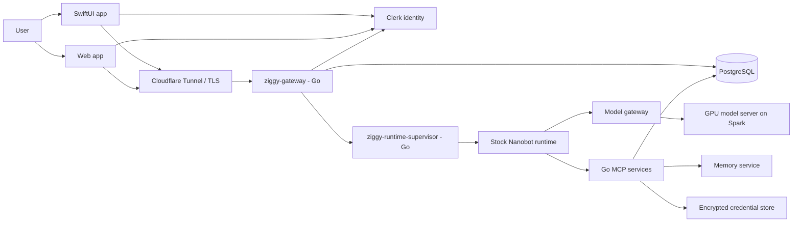
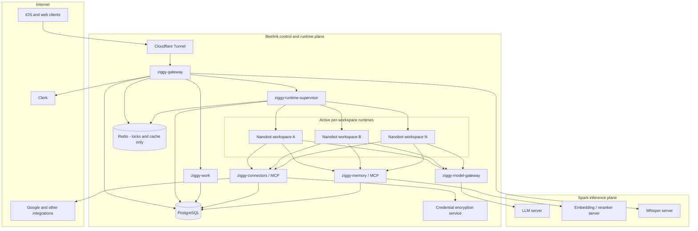
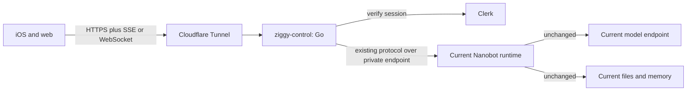
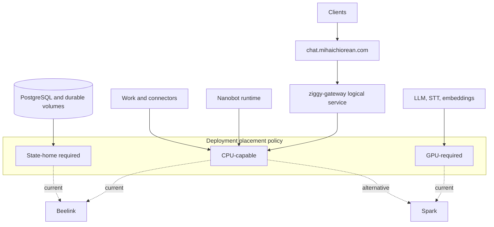
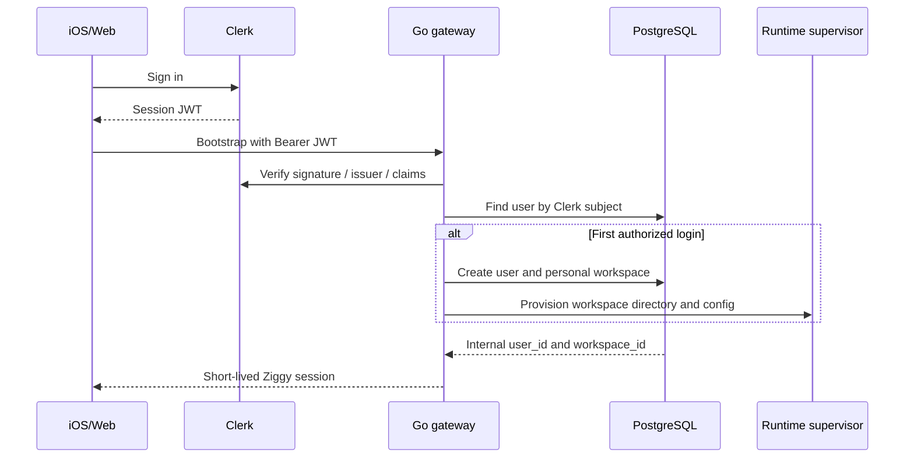
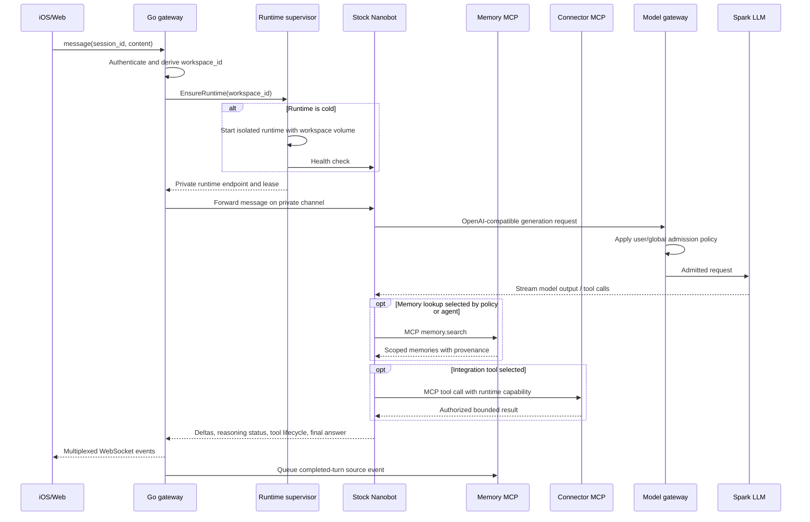
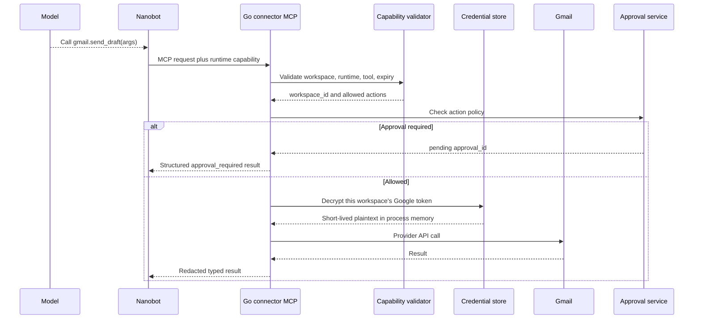
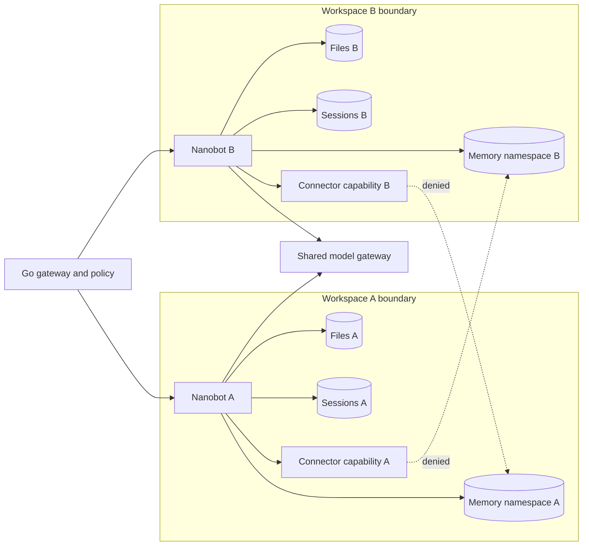
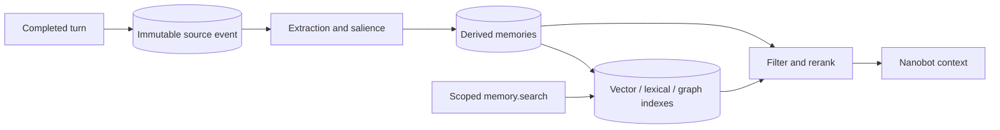

# Ziggy Multi-User Runtime Architecture

Status: proposed target architecture

Scale target: up to 50 registered users, initially 2-8 concurrent agent turns

Primary constraint: consume upstream Nanobot with no permanent Ziggy source fork
Upstream surface checked: `HKUDS/nanobot@9db0d9f3` on 2026-07-20

## 1. Goals

Ziggy is a multi-user product around a powerful single-workspace agent runtime.
The architecture must:

- preserve Nanobot's agent loop, built-in tools, skills, sessions, streaming,
  providers, subagents, and MCP client;
- update Nanobot by changing a pinned version or commit instead of rebasing a
  product fork;
- strictly separate each user's conversations, files, memory, credentials,
  scheduled work, and integration data;
- keep idle RAM bounded as the registered-user count grows;
- share the local model server without loading one model per user;
- keep OAuth refresh tokens and provider secrets outside Nanobot and prompts;
- expose chat, Work, and tool activity through the existing SwiftUI and web
  clients;
- remain operable on the Beelink and Spark deployment.

This design treats a Nanobot process plus workspace as an isolation unit. The
Go control plane supplies identity, routing, lifecycle, quotas, durable product
state, integration authorization, and cross-service auditability.

## 2. Non-Goals

- Making `AgentLoop` internally multi-tenant.
- Reimplementing Nanobot's agent loop or built-in tool machinery in Go.
- Running one LLM copy per user.
- Selecting a permanent vector database before the memory evaluation is done.
- Supporting arbitrary workspace sharing in the first multi-user release.
- Moving every existing behavior out of the fork in one deployment.

## 3. Governing Decisions

| Decision | Rationale |
|---|---|
| Stock, pinned Nanobot | Upgrades become dependency bumps and contract tests. |
| One live Nanobot process per active workspace | Stronger isolation than a shared in-process `AgentLoop`. |
| Processes start on demand and stop when idle | Fifty registered users do not require fifty hot runtimes. |
| Go gateway is the public origin | Nanobot does not need Clerk, allowlists, public TLS, or tenant routing. |
| Go model gateway controls inference admission | Nanobot instances share one model without racing it uncontrollably. |
| Integrations are capability-scoped Go MCP services | OAuth credentials never enter the agent workspace or model context. |
| Memory is a Go MCP service with a replaceable backend | The memory policy can evolve independently of Nanobot and Chroma. |
| Workspace IDs come from server-side identity resolution | A client cannot select another tenant by changing an ID. |
| Product state is durable outside runtime processes | A runtime can be killed and recreated without losing account or Work state. |

## 4. System Context



Only `ziggy-gateway` is a public Ziggy origin. Nanobot, MCP services,
PostgreSQL, the credential store, and model endpoints are private services.

## 5. Deployment Topology



Nanobot processes should run on the Beelink rather than consume Spark's model
memory. Spark remains a shared inference appliance. If measurements later show
that embedding or reranking traffic interferes with interactive generation,
those queues receive separate limits or move to CPU execution.

### 5.1 First Minimum Phase: Stable Front Door

The first deployable phase does **not** depend on the memory decision and does
not attempt multi-user runtime scheduling. Its purpose is to establish the
product-owned boundary and a repeatable deployment path without changing the
working agent behavior.



For this phase, `ziggy-control` can be one Go binary with separate internal
gateway and runtime-driver packages. Splitting it into separately deployed
services before there is an independent scaling or failure requirement adds
operational work without improving isolation.

Deliver only:

1. Validate Clerk tokens and map the configured owner email and optional Clerk
   subject to the one existing workspace. PostgreSQL is not needed yet.
2. Proxy the current REST, SSE, and WebSocket protocol through `ziggy-control`.
3. Bind Nanobot privately; only the Go service is reachable through Cloudflare.
4. Keep the current Nanobot workspace, memory behavior, model provider, and
   integrations unchanged.
5. Deploy only the new Go binary using the existing Beelink service convention;
   do not repackage working backend or Spark services in this phase.
6. Add health/readiness endpoints, one end-to-end smoke test, a recorded build
   version, and a documented one-command rollback for the front door.
7. Put all internal service locations in deployment configuration. The mobile
   app knows only the public Ziggy origin.

Explicitly defer:

- memory migration or backend selection;
- multiple Nanobot runtimes and runtime eviction;
- Kubernetes, automatic rescheduling, and high availability;
- integration write actions and background Work scheduling.

Exit condition: the owner's existing app works through the Go boundary with no
behavior regression; Nanobot has no public listener; and the front door can be
upgraded and rolled back without rebuilding or relocating unrelated services.

The phase-one implementation lives in `services/ziggy-control`. Its bootstrap
path is a compatibility bridge: Go verifies and authorizes the Clerk JWT, then
forwards the original bearer token to Nanobot's existing `/auth/bootstrap` so
Nanobot can mint the opaque REST/WebSocket token expected by current clients.
The duplicate Clerk verification is temporary; a later private token-broker
endpoint can remove it without changing the public protocol.

The next milestone is a **two-user isolation proof**, not a broad launch: add a
second workspace and private Nanobot runtime, keep each runtime's existing
local memory temporarily, then run adversarial cross-tenant tests. That proves
the tenancy boundary while the durable memory design remains under review.

### 5.2 Placement Is Configuration

The Beelink/Spark diagram above is the initial placement, not a code-level
requirement. Every service must expose a stable logical API and receive its
dependencies through configuration. No product code, prompt, or iOS build may
contain a Beelink or Spark address.



| Component | State class | Initial home | Placement rule | What is required to move it |
|---|---|---|---|---|
| Cloudflare connector and Go gateway | Stateless | Beelink | Any healthy CPU node | Change deployment placement; public origin remains unchanged. |
| Runtime supervisor | Node-local control | Beelink | One per runtime-capable node | Add the target node and drain runtimes before removing the old supervisor. |
| Nanobot runtime | Ephemeral process plus workspace files | Beelink | CPU node with workspace access | Stop writes, snapshot/copy and verify workspace, then start exactly one owner. Later, hydrate ephemeral runtime state from canonical services. |
| Model gateway | Stateless admission state backed by Redis/DB | Beelink | Any CPU node near the model network | Preserve logical URL and shared admission state. |
| LLM, Whisper, embedding, reranker | Model cache and GPU process state | Spark | Node with required GPU/runtime labels | Pre-pull model weights, validate GPU runtime, drain requests, then switch endpoint. |
| Work and connector MCP | Durable state in PostgreSQL; credentials external | Beelink | Any CPU node | Confirm DB/credential connectivity and drain active jobs. |
| Memory MCP | Stateless service; backend undecided | Deferred | Any CPU node | Memory backend remains separately placed and authoritative. |
| PostgreSQL | Authoritative durable state | Beelink | Explicit state-home node | Planned backup/restore or replication cutover; never ordinary scheduler eviction. |
| Redis | Disposable coordination state | Beelink | Any CPU node | Restart is acceptable only when leases and jobs recover from PostgreSQL. |

The hard distinction is **workload mobility versus data mobility**. A stateless
binary or container can move by changing deployment configuration. A PostgreSQL
volume or Nanobot workspace cannot; it requires a stopped, verified data
migration. The public client contract remains identical in either placement.

### 5.3 Orchestration Path

Do not add a cluster scheduler. Preserve the current mixed bare-metal model:
Docker Compose for services already containerized on the Beelink, systemd for
Spark model services, and a systemd unit or existing host convention for new Go
binaries. The service contract matters more than forcing every process into the
same packaging format.

Keep deployment metadata in the Ziggy product repository:

```text
deploy/
  hosts/beelink.yaml
  hosts/spark.yaml
  systemd/
  compose/
  inventory/production.yaml
  versions.lock
  runbooks/
```

- Host manifests record which services run, how they are launched, their
  versions, health checks, ports, dependencies, and data paths.
- Existing Compose services keep immutable image digests. Docker supports
  production overrides and targeted service replacement without rebuilding the
  rest of the application: [Compose production](https://docs.docker.com/compose/how-tos/production/).
- Go services use versioned static binaries or OCI images according to the host
  convention. The lock file records a commit SHA and artifact checksum/digest.
- Secrets are decrypted onto each host at deployment time and never committed
  as plaintext or baked into an image.
- A small checked-in deployment wrapper or Ansible playbook runs over SSH,
  updates one named service, waits for health, runs its smoke test, and restores
  the previous artifact on failure.

There is no automatic cross-host failover. That is intentional: with two
machines and one authoritative copy of state, a scheduler would not create real
high availability. systemd and Docker restart processes on their existing host;
the runbook handles host migration.

#### Eventual all-on-Spark cutover

Move to Spark as a planned maintenance operation, not service-by-service
scheduler churn:

1. Verify Spark has CPU RAM, disk, ports, Docker/systemd prerequisites, and
   enough headroom beyond the loaded models.
2. Install the same service artifacts and configuration while they remain
   stopped; pre-pull images and model assets.
3. Back up PostgreSQL, Redis recovery inputs, Nanobot workspaces, integration
   metadata, and encrypted credential material.
4. Stop writes at the Go front door and drain active Nanobot and Work jobs.
5. Stop authoritative services on Beelink, copy state, verify checksums, and
   start PostgreSQL plus internal services on Spark.
6. Run isolation, conversation, tool, transcription, Ziggy, and Work smoke
   tests against an internal address.
7. Move the Cloudflare Tunnel origin to the Spark front door and reopen writes.
8. Keep Beelink services stopped but intact for the rollback window. Never run
   two writable copies of a workspace or database.

Revisit a scheduler only if Ziggy later owns at least three interchangeable
hosts and automatic placement becomes a demonstrated operational need. It is
not part of the current architecture or migration plan.

### 5.4 Independent Build, Deploy, and Rollback


Operational rules:

1. A service owns its artifact definition, tests, schema/API contract, health
   endpoints, and runbook. A monorepo is compatible with independent deployment.
2. CI builds only changed services and shared dependents, pushes commit-addressed
   images or binaries, and records the resulting digest or checksum.
3. Deployment is a separate promotion step. Building `main` does not silently
   change production.
4. Database migrations are explicit one-shot jobs, backward compatible with the
   previous application version, and complete before incompatible code ships.
5. Services emit structured logs, OpenTelemetry trace IDs, Prometheus metrics,
   build SHA, and dependency health. Every request carries the same correlation
   ID through gateway, Nanobot, MCP, and model calls.
6. Back up PostgreSQL and workspace data independently of containers, and test
   restoration. A volume existing is not a backup.
7. Rollback restores an artifact version. Data rollback requires a separately
   tested migration or restore plan and is never implied by process rollback.

## 6. Component Responsibilities

### 6.1 `ziggy-gateway` (Go)

- Terminates the application protocol behind Cloudflare.
- Verifies Clerk session JWTs using the Clerk Go SDK.
- Resolves Clerk `sub` to internal `user_id` and `workspace_id`.
- Provisions one personal workspace for a new allowed user.
- Exposes `/auth/bootstrap`, chat/session APIs, Work APIs, media APIs, and the
  public WebSocket used by iOS and web.
- Obtains or starts the correct private Nanobot runtime.
- Proxies Nanobot events without changing the agent's tool semantics.
- Never accepts `workspace_id` from a client as authorization evidence.
- Emits audit records and trace correlation IDs.

### 6.2 `ziggy-runtime-supervisor` (Go)

- Creates workspace directories and generated Nanobot configuration.
- Starts the pinned Nanobot image as an unprivileged isolated process or
  container.
- Assigns a private endpoint and internal runtime credential.
- Maintains runtime leases, health, idle deadlines, and last-used timestamps.
- Serializes turns within a session and bounds concurrent processes.
- Restarts crashed runtimes and evicts idle least-recently-used runtimes.
- Refuses to mount any other workspace into a user's runtime.

The supervisor does not interpret prompts or tool calls.

### 6.3 Stock Nanobot runtime

- Owns the agent loop for one workspace while the process is alive.
- Uses upstream sessions, context assembly, skills, tools, providers, streaming,
  subagents, and MCP client support.
- Persists its normal workspace data into its dedicated volume.
- Calls the model through `ziggy-model-gateway`.
- Calls external Ziggy tools through capability-protected MCP endpoints.
- Exposes its private WebSocket over a mode-`0600` Unix socket where the
  deployment uses an upstream version with `unixSocketPath` support.
- Has no Clerk secret, Google refresh token, cross-user database access, Docker
  socket, or direct public route.

Current upstream WebSocket behavior already includes structured tool lifecycle
payloads and separate reasoning stream events. Current upstream MCP supports
`stdio`, SSE, and Streamable HTTP transports with configured HTTP headers. The
target therefore does not require a Ziggy patch for rich activity events or
authenticated HTTP MCP transport. See the pinned upstream
[WebSocket protocol](https://github.com/HKUDS/nanobot/blob/9db0d9f3c946bd421b694d9b3c8c31580c42d906/docs/websocket.md)
and
[MCP configuration schema](https://github.com/HKUDS/nanobot/blob/9db0d9f3c946bd421b694d9b3c8c31580c42d906/nanobot/config/schema.py#L334-L347).

### 6.4 `ziggy-model-gateway` (Go)

- Presents an OpenAI-compatible endpoint to Nanobot.
- Routes to the selected Spark model endpoint.
- Enforces one active interactive turn per user initially.
- Enforces global interactive and background concurrency limits.
- Gives interactive chat priority over background Work.
- Applies request timeouts, cancellation, bounded queues, and per-user quotas.
- Records token counts and latency without recording secrets or raw private
  content by default.

The gateway loads no model. Model weights are loaded once by the Spark server.

### 6.5 `ziggy-connectors` (Go MCP server)

- Implements Gmail, Calendar, Drive, and future integration tools.
- Resolves a short-lived runtime capability to a workspace and integration.
- Decrypts provider credentials only for the duration of an authorized call.
- Applies provider scopes, action policy, rate limits, and approval rules.
- Redacts secrets and returns bounded, typed results to Nanobot.
- Stores integration metadata and audit events outside Nanobot.

### 6.6 `ziggy-memory` (Go MCP server)

- Exposes stable memory tools to stock Nanobot.
- Owns memory extraction, indexing, retrieval, reranking, consolidation,
  provenance, deletion, and evaluation policy.
- Enforces workspace isolation before every read and write.
- Keeps immutable source events separate from derived memories.
- Can retain Chroma initially or replace it without changing Nanobot.

The detailed design and candidate comparison live in
[`../research/agent-memory-systems.md`](../research/agent-memory-systems.md).

### 6.7 `ziggy-work` (Go)

- Owns durable Work records, event timelines, approvals, cancellation, and
  scheduling.
- Wakes a user's Nanobot runtime when agent execution is required.
- Uses Nanobot for reasoning and tool execution instead of implementing another
  agent loop.
- Keeps background work lower priority than interactive chat at the model
  gateway.

Temporal or another workflow engine is an optional later implementation detail,
not a prerequisite for the first multi-user cut.

## 7. Identity and Workspace Provisioning



Rules:

- Clerk's subject is the external identity key. Email is profile and admission
  data, not the durable foreign key.
- The gateway derives the workspace from the verified subject.
- Workspace provisioning is idempotent.
- Allowlisting controls who may create an account; workspace authorization
  controls what an admitted account may access.
- Disabling a user blocks new sessions and revokes runtime capabilities.

## 8. Interactive Chat Data Flow



The app remains connected to the Go gateway. A Nanobot restart is an internal
runtime event, not a change to the public endpoint.

## 9. MCP Tool and Credential Flow



### Capability requirements

A runtime capability is short-lived and contains or resolves to:

```text
runtime_id
workspace_id
user_id
allowed MCP servers
allowed tool/action patterns
optional work_id
issued_at
expires_at
nonce / token ID
```

The LLM never chooses `workspace_id`. Tool arguments cannot override the
workspace bound to the capability. High-risk writes require explicit action
policy and, where configured, user approval.

## 10. Isolation Model



### Enforcement layers

1. **Identity:** verified Clerk subject maps to an internal user.
2. **Routing:** the server derives one authorized workspace for each request.
3. **Process:** one active Nanobot process serves one workspace.
4. **Filesystem:** only that workspace volume is mounted read-write.
5. **Runtime:** no cross-workspace service credential is present.
6. **MCP:** every call validates a workspace-bound capability.
7. **Storage:** every durable row or index entry contains `workspace_id`;
   PostgreSQL row-level security is defense in depth where applicable.
8. **Network:** runtimes can reach only the model gateway and approved MCP
   endpoints, not databases, credential stores, or host administration APIs.
9. **Testing:** cross-tenant reads and writes are exercised as adversarial
   contract tests.

`session_id` is not a tenant boundary. It is meaningful only after the gateway
has selected the workspace. Upstream likewise documents `chat_id` as a
single-user capability rather than a tenant authorization boundary; the
per-workspace runtime and Go routing gate supply the missing boundary. See
[upstream multi-chat security](https://github.com/HKUDS/nanobot/blob/9db0d9f3c946bd421b694d9b3c8c31580c42d906/docs/websocket.md#security-considerations).

## 11. Runtime Lifecycle and Capacity

```mermaid
stateDiagram-v2
    [*] --> Cold
    Cold --> Starting: authenticated request or due work
    Starting --> Warm: health check passes
    Starting --> Failed: timeout / crash
    Warm --> Busy: accepted turn
    Busy --> Warm: turn complete
    Busy --> Draining: shutdown requested
    Warm --> Draining: idle timeout or LRU pressure
    Draining --> Cold: no active turn; process stopped
    Failed --> Starting: bounded retry
    Failed --> Cold: retry budget exhausted
```



Initial policy:

| Control | Initial value | Purpose |
|---|---:|---|
| Registered workspaces | 50 | Product admission cap |
| Maximum warm runtimes | 10 | Bound Beelink RAM |
| Idle timeout | 20 minutes | Preserve recent responsiveness |
| Active turn per user | 1 | Protect session ordering |
| Interactive model concurrency | 4 | Protect first-token latency |
| Background model concurrency | 1-2 | Prevent Work starvation of chat |
| Runtime start retries | 2 | Avoid restart loops |

These values are provisional. A cold-start and load benchmark must replace
estimates before opening admission beyond the initial users.

### RAM model

Fifty registered users create fifty persistent workspaces, not fifty mandatory
processes. Planning estimates for a hot runtime are roughly 100-250 MB without
an embedded Chroma/ONNX stack and 300-700 MB when it loads that stack. The
memory service extraction is therefore important: it prevents each runtime
from loading a duplicate embedding runtime.

The Spark model is loaded once. Idle Nanobot processes consume no inference
capacity. Model contention is driven by admitted concurrent generations and
their context/KV-cache sizes.

## 12. Data Ownership

| Data | Authoritative owner | Tenant key | Notes |
|---|---|---|---|
| Clerk identity | Clerk | Clerk subject | Authentication only |
| User/workspace registry | PostgreSQL via gateway | `user_id`, `workspace_id` | Internal durable IDs |
| Nanobot sessions | Per-workspace Nanobot volume initially | Workspace path | May later be projected into product DB |
| Workspace files and skills | Per-workspace volume | Workspace path | Never shared by path selection |
| Raw conversation events | Product event store | `workspace_id` | Source for audit and memory derivation |
| Derived memories | Memory service | `workspace_id` | Backend remains replaceable |
| Work tasks and approvals | Work service/PostgreSQL | `workspace_id` | Survives runtime restarts |
| OAuth connections | Connector service/PostgreSQL | `workspace_id`, `integration_id` | Tokens encrypted separately |
| OAuth/API secrets | Credential encryption service | Credential reference | Never returned to Nanobot |
| Runtime lease/state | Supervisor/PostgreSQL plus Redis lease | `workspace_id`, `runtime_id` | Redis is not authoritative |
| Model usage | Model gateway | `workspace_id` | Quotas and performance only |
| Audit events | Append-only audit store | `workspace_id`, actor | Secret-redacted |

## 13. Memory Data Flow Boundary

The memory implementation is intentionally behind an MCP contract while the
research comparison is in progress.



Required invariants regardless of backend:

- source events are immutable and retain provenance;
- derived memories can be regenerated;
- every object is workspace-scoped;
- deletion propagates to source, derived records, indexes, summaries, caches,
  and backups according to policy;
- retrieval returns provenance, confidence, temporal validity, and type;
- context insertion has a fixed token budget;
- automatic extraction and consolidation are measurable and reversible.

## 14. Public and Internal Contracts

### Public app contract

The first migration should preserve the current app-facing shape:

```text
GET  /auth/bootstrap
GET  /api/sessions
GET  /api/sessions/{id}/messages
GET  /api/work
GET  /api/work/{id}
GET  /api/work/{id}/events
WS   /ws
```

The Go gateway can proxy existing Nanobot session and message behavior while
moving auth and routing out of `nanobot/channels/websocket.py`.

### Private runtime contract

Use upstream Nanobot's WebSocket through a private per-runtime Unix socket for
interactive chat. It already carries chat multiplexing, answer deltas,
reasoning deltas, and structured tool activity. The stock OpenAI-compatible API
remains useful for noninteractive compatibility calls, but it is not the rich
app transport. A Ziggy-specific protocol adapter is acceptable only outside the
Nanobot source tree. Tool lifecycle events must remain structured end to end.

### MCP contract

Initial servers:

```text
memory.search
memory.remember
memory.forget
memory.explain

gmail.search
gmail.read
gmail.create_draft
gmail.send_draft

calendar.search
calendar.create_event

drive.search
drive.read
```

Read and write tools have separate capabilities and approval policies.

## 15. Failure Behavior

| Failure | Expected behavior |
|---|---|
| Clerk unavailable | Existing valid Ziggy session may continue within TTL; new bootstrap fails closed. |
| Runtime cold start fails | Bounded retry, clear unavailable event, no route to another workspace. |
| Nanobot crashes mid-turn | Mark turn interrupted, restart runtime, preserve durable product events. |
| Model queue full | Return explicit busy/queued state; do not start unlimited generations. |
| Spark unavailable | Keep workspace state intact; Work remains retryable; chat reports inference unavailable. |
| MCP service unavailable | Tool returns typed transient failure; agent cannot bypass authorization. |
| Provider token revoked | Mark integration disconnected and ask the user to reconnect. |
| Memory index unavailable | Continue without recalled memory; never query another namespace as fallback. |
| PostgreSQL unavailable | Fail tenant routing closed; do not infer workspace from client input. |
| Client WebSocket drops | Gateway retains bounded event history and supports reconnect/resubscribe. |

## 16. Observability and Tests

Every request and event should carry:

```text
trace_id
user_id
workspace_id
runtime_id
session_id or work_id
tool_call_id when applicable
```

Logs must not contain Clerk JWTs, runtime capabilities, OAuth credentials,
email bodies by default, or full model prompts by default.

Required automated suites:

- Clerk identity-to-workspace provisioning and revocation.
- Workspace path canonicalization and mount inspection.
- Cross-tenant session, file, media, memory, Work, and integration attempts.
- MCP capability expiry, replay, tool mismatch, and workspace mismatch.
- Runtime start, crash, idle eviction, and reconnect behavior.
- Model admission fairness and cancellation.
- Upstream Nanobot contract tests against the pinned version.
- Scheduled compatibility tests against current upstream `main`.
- Memory quality, leakage, deletion, and performance tests defined by the
  memory research report.

## 17. Nanobot Update Strategy

Ziggy product code should live outside the Nanobot repository. Deployment pins
an upstream release, commit, or image digest.

For each Nanobot update:

1. Automation proposes a pin change.
2. Run upstream unit tests relevant to configured features.
3. Run Ziggy contract tests for WebSocket events, sessions, MCP, workspace
   isolation, tool activity, and model-provider behavior.
4. Start a disposable runtime against a copied test workspace.
5. Exercise iOS/web smoke tests.
6. Promote the pin and retain the previous image for rollback.

Missing capabilities are handled in this order:

1. upstream configuration or public API;
2. MCP service;
3. SDK hook;
4. external channel plugin;
5. generic upstream contribution;
6. a small temporary patch with an owner and removal issue.

## 18. Migration Plan

### Phase 0: preserve the known-good build

- Commit and tag the current functioning iOS, web, and server state.
- Record deployed image digests and configuration contracts.
- Add end-to-end smoke tests before changing routing.

### Phase 1: establish the stable front door and deployment contract

- Verify Clerk in Go.
- Map the current owner to the existing single workspace.
- Proxy the current app protocol to the existing Nanobot runtime.
- Remove public exposure of Nanobot.
- Deploy the versioned front-door artifact using the current Beelink convention.
- Record the existing Beelink and Spark services, versions, health checks, data
  paths, and rollback commands without repackaging them.
- Move host addresses out of product code and into deployment configuration.

Exit condition: the current user sees no product regression and Clerk-specific
code no longer needs to live in Nanobot. The front door can be redeployed or
rolled back without changing the mobile app or rebuilding unrelated services.

### Phase 2: provision isolated users

- Add users, workspaces, membership, runtime lease, and admission tables.
- Generate one workspace/config per admitted user.
- Start one private Nanobot runtime per active workspace.
- Add cross-tenant adversarial tests before inviting a second user.

### Phase 3: control resources

- Add idle shutdown, warm-runtime cap, crash recovery, and LRU eviction.
- Route all Nanobot inference through the model gateway.
- Add per-user and global concurrency limits.

### Phase 4: extract memory

- Implement the selected Go MCP memory contract.
- Migrate existing Chroma data with provenance where possible.
- Remove `rag.py`, `recall.py`, and their agent-loop registration from the fork.

### Phase 5: add integrations and durable Work

- Add encrypted per-workspace OAuth connections.
- Expose narrow read tools before write tools.
- Add approvals and audit trails for consequential actions.
- Move durable Work state outside Nanobot while retaining Nanobot execution.

### Phase 6: eliminate the application fork

- Move iOS, web, Go services, deploy files, and Ziggy documentation into the
  Ziggy product repository.
- Upstream generic security and extension changes.
- Replace the deployed fork with a pinned upstream Nanobot artifact.

## 19. Open Decisions and Measurements

- Exact bare-metal deployment automation: small checked-in wrapper versus
  Ansible.
- Capacity threshold and maintenance window for the eventual all-on-Spark
  migration.
- Workspace-state mobility: controlled copy, network storage, or eventual
  hydration from canonical services.
- Cold-start time with the selected provider and workspace size.
- Measured RSS before and after extracting embedded Chroma/ONNX.
- Maximum Spark concurrency at acceptable time-to-first-token and p95 latency.
- Whether background Work requires a workflow engine after the first durable
  implementation.
- Memory pattern and backend selection after the research benchmark.
- Backup, retention, and user-facing memory deletion policy.
- Whether workspace sharing is required; it is deliberately excluded from the
  first authorization model.

## 20. Acceptance Criteria

The architecture is successfully realized when:

- two test users cannot read, infer, enumerate, or mutate each other's data;
- stopping every Nanobot process leaves all durable product state intact;
- a cold user can start, reconnect, and continue their own session;
- ten warm users stay within the measured Beelink RAM budget;
- model admission keeps interactive latency bounded under mixed chat and Work
  load;
- integration tokens never appear in Nanobot files, prompts, logs, or tool
  results;
- the memory service passes isolation, deletion, quality, and latency tests;
- upgrading Nanobot requires a pin change and compatibility run, not a merge of
  Ziggy application commits.
