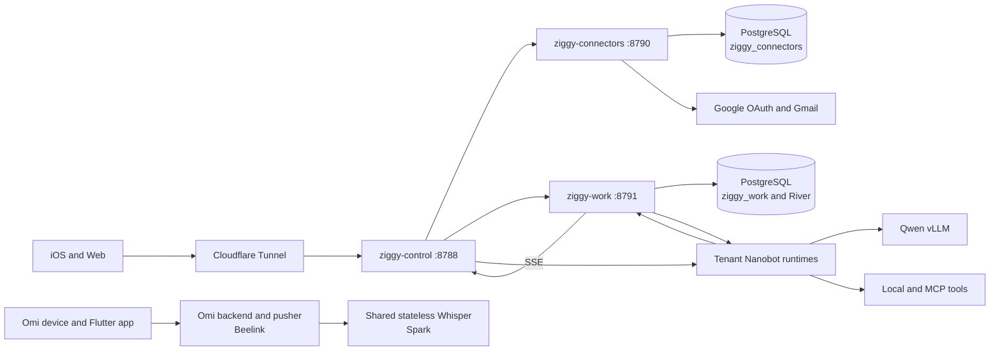

# Ziggy Chat And Work On Spark

Status: the Ziggy chat, Work, connector, model, and tenant-runtime path is in
production on `spark-094a` as of 2026-07-22. Omi and mOmi remain a separate
project on Beelink. Their transcript-ingest bridge into Ziggy memory is
disabled.

## Decision

Run the complete Ziggy chat and Work production path on Spark, but preserve
process and credential boundaries. Consolidating placement removes a machine
and network hop from every authenticated request. Combining the services into
one binary would save only a few megabytes while widening the
public-front-door, connector-token, queue, and database failure domains.

Spark currently runs the model and every Nanobot runtime, so keeping the
control plane on Beelink did not provide useful application availability when
Spark was unavailable. Beelink remains a disabled rollback target and
off-host backup location.

## Runtime Data Flow



All control-plane HTTP listeners and PostgreSQL are local to Spark. Cloudflare
is the only public ingress for Ziggy chat and Work. The public hostname and
Google OAuth callback remain `chat.mihaichiorean.com`. Several model,
transcription, ingest, and observability ports remain directly reachable on
the LAN or Tailscale; they are not Internet ingress, but they still require
host-level filtering or tighter listener bindings.

## River

River is a Go job-queue library embedded in `ziggy-work`; it is not another
daemon. It persists jobs in the same PostgreSQL transaction as the Work task
and idempotency record. Workers inside `ziggy-work` claim jobs, retry failed
attempts, and drive the tenant's Nanobot runtime over WebSocket.

River owns durable dispatch and retries. Nanobot still owns the agent loop,
model interaction, and tool execution. The current legacy Nanobot scheduler is
mirrored into the Go Work database by `ziggy-work-reconcile.timer`; durable
schedule creation has not yet moved to River/Go.

The first production River-owned task after migration completed on its first
attempt with 25 durable events and a result summary.

## Process Boundaries

| Component | Boundary | Reason |
| --- | --- | --- |
| `ziggy-control` | Separate system service | Public ingress; no Google refresh-token decryption |
| `ziggy-connectors` | Separate system service and OS account | Sole owner of Google OAuth and token-encryption credentials |
| `ziggy-work` | Separate system service and OS account | Durable queue, Work state, artifacts, and tenant runtime dispatch |
| PostgreSQL 16 | One server, separate databases and roles | Consolidated operations without cross-service database authority |
| Tenant Nanobot | One process and workspace per tenant | Application-level memory, files, sessions, tools, and failure isolation |
| Qwen vLLM | Separate container | GPU lifecycle and dependency isolation |
| Whisper and ingest | Separate services | Independent protocols, scaling, and restart behavior |
| Cloudflare Tunnel | Separate system service | Independent public transport lifecycle |

Do not merge the `ziggy-connectors` process into the front door. Its restricted
Gmail credential and egress boundary is materially more important than its
small memory footprint. Lab should deploy control and connectors as one logical
`ziggy-edge` release while preserving separate processes, OS accounts,
environment files, and database roles. See
[`ziggy-tenant-state-and-deployments.md`](./ziggy-tenant-state-and-deployments.md).

The current Nanobot units share the `mihai` OS account. Workspace routing and
systemd write restrictions prevent accidental cross-tenant writes, but they
do not provide a confidentiality boundary against arbitrary local or MCP code.
Before untrusted testers receive tool execution, move tenant runtimes to
per-tenant UIDs, rootless containers, or an equivalent mount/user namespace.

## Spark Services

System services:

- `postgresql@16-main.service`, native PostgreSQL on port `5433`
- `ziggy-connectors.service`, loopback `8790`
- `ziggy-work.service`, loopback `8791`
- `ziggy-work-reconcile.timer`
- `ziggy-backup.timer`
- `ziggy-control.service`, loopback `8788`
- `ziggy-cloudflared.service`

Spark uses `8788` because `linear-agent-host` already owns loopback port
`8787`. The Spark-specific environment override and tunnel unit are checked in
under `services/ziggy-control/deploy/systemd/spark/`.

Model and tenant runtimes remain user services or containers until Lab assumes
their lifecycle. Keep static Go binaries and PostgreSQL under systemd; moving
them into Docker or Kubernetes would add overhead without improving the
single-host failure model.

The Omi backend, pusher, and Redis remain on Beelink. An ARM64 build attempted
on Spark fails because the pinned `onnxruntime` and `lc3py` releases do not
provide compatible wheels. The Flutter dev build also points at
`edge-builder-1:8088`. Complete that dependency and endpoint migration before
calling the wearable ingestion path single-hosted.

## Rollback And Backups

Beelink's Ziggy control, Work, connector, reconciliation, and Cloudflare units
are disabled and stopped, but their binaries, configuration, databases, and
artifacts remain present. The migration snapshot is stored at:

```text
/var/backups/ziggy/migration-204c6d8-20260723T0454Z
```

Spark creates daily mode-`0700` snapshots under `/var/backups/ziggy` with
14-day retention. Each snapshot includes both PostgreSQL databases, Work
artifacts, control binding state, the tenant manifest, the owner workspace,
all tenant workspaces, runtime configs, runtime credential sources, user
systemd units, `/etc/ziggy` application configuration and credentials, and
checksums. It also captures the active Nanobot release, deployed Ziggy
binaries, and Ziggy system units so application rollback does not depend on a
network fetch or rebuild.

Rollback requires stopping Spark ingress and writers, copying the latest
snapshot to the rollback host, and restoring it before starting Beelink.
Never run both Work/connector writer sets against independent databases. The
local timer protects application rollback but not Spark disk loss; copy
snapshots to an encrypted off-host target and perform restore drills before
calling the installation recoverable.

For an application rollback on Spark, stop `ziggy-cloudflared`,
`ziggy-control`, `ziggy-connectors`, and `ziggy-work` plus the user Nanobot
units, then verify `sha256sum -c SHA256SUMS` inside the selected snapshot.
Restore `ziggy-binaries.tgz` below `/usr/local/bin`,
`ziggy-system-units.tgz` below `/etc/systemd/system`, the Nanobot release
archive below `/home/mihai/workspace/ziggy/releases`, `ziggy-etc.tgz` below
`/`, and `ziggy-user-systemd.tgz` below
`/home/mihai/.config/systemd`, `ziggy-runtime-credentials.tgz` below
`/home/mihai/.config/credstore`, `ziggy-owner-config.json` to
`/home/mihai/.nanobot/config.json`, and the tenant runtime-config archive below
the tenant root. Atomically repoint
`/home/mihai/workspace/ziggy/current-nanobot` to the restored
`releases/nanobot-release` directory and verify that
`current-nanobot/nanobot/__init__.py` exists before starting a runtime.
Restore the two database dumps with `pg_restore --clean
--if-exists` while all writers remain stopped. Reload both systemd managers,
start PostgreSQL and the application services in dependency order, then run
the readiness and Gmail MCP smoke checks before re-enabling ingress. Preserve
the mode and ownership recorded by the root-only snapshot.

OpenTelemetry remains disabled for the Go services on Spark until the local
collector and credentials are installed. Journal and systemd health checks are
the current operational fallback, not the intended final observability state.

## Remaining Product Work

The iOS **Integrations** tab uses a fresh Clerk identity token for authenticated
`/connectors/*` routes, shows tenant-scoped Google account status, and starts
Google OAuth. Chat and Work continue to use short-lived Ziggy transport
credentials.

1. Add disconnect/revoke and retained-data deletion APIs before external
   testers use Gmail.
2. Implement bounded read-only Gmail retrieval and scheduled newsletter
   digests.
3. Expose approved connector operations through tenant- and
   runtime-generation-scoped MCP capabilities.
4. Move legacy schedule ownership into the Go Work service and make approvals,
   runs, and schedules first-class mobile views.

Lab should eventually deploy this topology declaratively, manage systemd and
container releases, run health gates, and perform rollback. It does not need to
merge the processes to manage them as one application.
