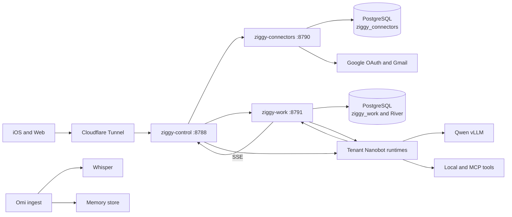

# Ziggy Spark Single-Host Topology

Status: production on `spark-094a` as of 2026-07-22.

## Decision

Run the complete Ziggy production path on Spark, but preserve process and
credential boundaries. Consolidating placement removes a machine and network
hop from every authenticated request. Combining the services into one binary
would save only a few megabytes while widening the public-front-door,
connector-token, queue, and database failure domains.

Spark currently runs the model and every Nanobot runtime, so keeping the
control plane on Beelink did not provide useful application availability when
Spark was unavailable. Beelink remains a disabled rollback target and
off-host backup location.

## Runtime Data Flow



All control-plane HTTP listeners and PostgreSQL are local to Spark. Cloudflare
is the only public ingress. The public hostname and Google OAuth callback
remain `chat.mihaichiorean.com`.

## River

River is a Go job-queue library embedded in `ziggy-work`; it is not another
daemon. It persists jobs in the same PostgreSQL transaction as the Work task
and idempotency record. Workers inside `ziggy-work` claim jobs, retry failed
attempts, and drive the tenant's Nanobot runtime over WebSocket.

River owns durable dispatch and retries. Nanobot still owns the agent loop,
model interaction, and tool execution. The current legacy Nanobot scheduler is
mirrored into the Go Work database by `ziggy-work-reconcile.timer`; durable
schedule creation has not yet moved to River/Go.

The first production River-owned task after migration completed on its first
attempt with 25 durable events and a result summary.

## Process Boundaries

| Component | Boundary | Reason |
| --- | --- | --- |
| `ziggy-control` | Separate system service | Public ingress; no Google refresh-token decryption |
| `ziggy-connectors` | Separate system service and OS account | Sole owner of Google OAuth and token-encryption credentials |
| `ziggy-work` | Separate system service and OS account | Durable queue, Work state, artifacts, and tenant runtime dispatch |
| PostgreSQL 16 | One server, separate databases and roles | Consolidated operations without cross-service database authority |
| Tenant Nanobot | One process and workspace per tenant | Memory, files, sessions, tools, and failure isolation |
| Qwen vLLM | Separate container | GPU lifecycle and dependency isolation |
| Whisper and ingest | Separate services | Independent protocols, scaling, and restart behavior |
| Cloudflare Tunnel | Separate system service | Independent public transport lifecycle |

Do not merge `ziggy-connectors` into the front door. Its restricted Gmail
credential and egress boundary is materially more important than its small
memory footprint. Revisit merging `ziggy-control` and `ziggy-work` only if
operational evidence shows that two static binaries are a meaningful burden.

## Spark Services

System services:

- `postgresql@16-main.service`, native PostgreSQL on port `5433`
- `ziggy-connectors.service`, loopback `8790`
- `ziggy-work.service`, loopback `8791`
- `ziggy-work-reconcile.timer`
- `ziggy-control.service`, loopback `8788`
- `ziggy-cloudflared.service`

Spark uses `8788` because `linear-agent-host` already owns loopback port
`8787`. The Spark-specific environment override and tunnel unit are checked in
under `services/ziggy-control/deploy/systemd/spark/`.

Model and tenant runtimes remain user services or containers until Lab assumes
their lifecycle. Keep static Go binaries and PostgreSQL under systemd; moving
them into Docker or Kubernetes would add overhead without improving the
single-host failure model.

## Rollback And Backups

Beelink's Ziggy control, Work, connector, reconciliation, and Cloudflare units
are disabled and stopped, but their binaries, configuration, databases, and
artifacts remain present. The migration snapshot is stored at:

```text
/var/backups/ziggy/migration-204c6d8-20260723T0454Z
```

Rollback requires stopping Spark ingress and writers before restoring or
starting Beelink. Never run both Work/connector writer sets against independent
databases. Keep encrypted periodic PostgreSQL dumps and artifact backups
off-host; a single Spark installation is intentionally not highly available.

## Remaining Product Work

The iOS **Integrations** tab uses a fresh Clerk identity token for authenticated
`/connectors/*` routes, shows tenant-scoped Google account status, and starts
Google OAuth. Chat and Work continue to use short-lived Ziggy transport
credentials.

1. Add disconnect/revoke and retained-data deletion APIs before external
   testers use Gmail.
2. Implement bounded read-only Gmail retrieval and scheduled newsletter
   digests.
3. Expose approved connector operations through tenant- and
   runtime-generation-scoped MCP capabilities.
4. Move legacy schedule ownership into the Go Work service and make approvals,
   runs, and schedules first-class mobile views.

Lab should eventually deploy this topology declaratively, manage systemd and
container releases, run health gates, and perform rollback. It does not need to
merge the processes to manage them as one application.
