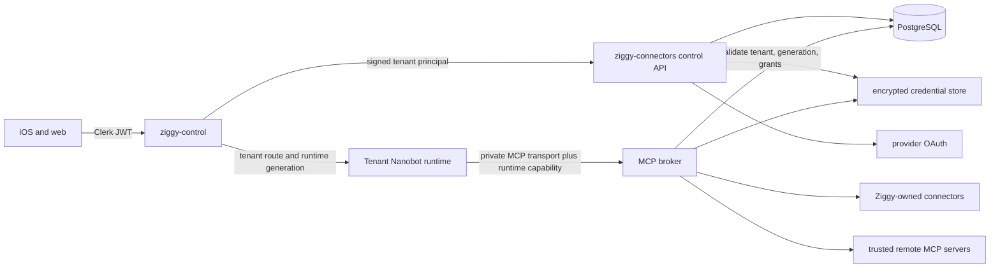

# Ziggy Tenant-Scoped MCP Architecture

Status: queued design

This design adds a Claude-like MCP catalog and connection experience without
putting tenant credentials or product policy inside Nanobot. It reuses
Nanobot's existing MCP client and extends `ziggy-connectors` as the product
control plane for discovery, authorization, policy, and audit.

## Goals

- Let a signed-in user browse supported MCP integrations and connect one to a
  workspace.
- Scope every connection, credential, grant, invocation, and audit record to
  the server-resolved `(user_id, workspace_id)` tenant.
- Keep OAuth tokens, API keys, and private MCP headers outside Nanobot config,
  workspace files, prompts, and model context.
- Preserve stock Nanobot's MCP client so upstream updates remain cheap.
- Support Ziggy-owned connectors, trusted remote MCP servers, and later a
  reviewed catalog of installable integrations.
- Make connect, test, disable, revoke, and offboard operations explicit and
  observable.

## Non-Goals

- Running arbitrary user-supplied local commands on Ziggy hosts.
- Copying a marketplace server's secret configuration into every tenant
  runtime.
- Treating an MCP server's advertised tools as authorization policy.
- Giving a model unrestricted access to every tool exposed by a connection.
- Making Nanobot the source of truth for connection or credential state.

## System Boundary



The public clients use only `ziggy-control`. The MCP broker and upstream MCP
servers are private from the clients. A runtime never receives an OAuth refresh
token or durable API key; it receives a short-lived capability for its own
workspace and runtime generation.

## Reuse Versus Product-Owned Code

Reuse from Nanobot:

- MCP streamable HTTP client, tool/resource/prompt discovery, tool wrapping,
  invocation, retry, timeout, and cleanup.
- Existing `enabledTools` filtering as a final runtime-side defense.
- Existing tool-call events rendered by the Ziggy clients.

Own in Go:

- catalog metadata and support status;
- OAuth and API-key enrollment;
- encrypted credential storage and rotation;
- tenant connection records and capability grants;
- remote endpoint validation and egress policy;
- runtime capability issuance and validation;
- brokered tool/resource/prompt requests;
- usage limits, audit events, health, and revocation.

This keeps Nanobot configuration mechanical. The runtime gets one or a small
number of private broker endpoints, not arbitrary tenant secrets.

## Catalog And Connection Model

The catalog is curated product metadata, not a live directory that can silently
change a tenant's authority.

```text
mcp_catalog_entries
  catalog_id, slug, display_name, description, icon_ref
  transport_kind, upstream_url_template, publisher
  auth_kind, risk_class, support_status, manifest_version
  declared_tools, declared_resources, declared_prompts
  created_at, updated_at

mcp_connections
  user_id, workspace_id, connection_id, catalog_id
  display_name, status, credential_ref, upstream_subject
  endpoint_ref, manifest_version, last_health_at, last_error_class
  created_at, updated_at, revoked_at

mcp_grants
  user_id, workspace_id, connection_id, capability_kind, capability_name
  access_mode, approval_policy, enabled, limits_json
  created_at, updated_at

mcp_runtime_capabilities
  user_id, workspace_id, runtime_id, runtime_generation, capability_id
  connection_ids, grant_version, expires_at, revoked_at

mcp_audit_events
  user_id, workspace_id, connection_id, runtime_id, invocation_id
  capability_name, decision, duration_ms, result_class, bytes_in, bytes_out
  created_at
```

Every primary key, unique constraint, lookup, update, and delete includes the
tenant pair. Globally unique IDs are identifiers, not authorization.

## Enrollment And Use

### Connecting

1. The user opens Integrations and requests the catalog through
   `ziggy-control`.
2. `ziggy-control` resolves the Clerk subject to a tenant and signs the existing
   one-minute internal principal.
3. `ziggy-connectors` creates an OAuth transaction or one-time secret intake
   transaction bound to that tenant and catalog entry.
4. The provider callback consumes the transaction once, encrypts the durable
   credential, and records the provider identity and scopes.
5. The service fetches the MCP manifest through the broker's restricted egress
   path, computes a manifest version, and presents the proposed grants.
6. The user enables an explicit set of tools, resources, and prompts. Risky
   write actions default to per-invocation approval.

### Runtime activation

1. The runtime supervisor starts a tenant Nanobot process with a new fenced
   runtime generation.
2. It obtains a short-lived MCP capability containing that exact tenant,
   runtime ID, generation, connection set, and grant version.
3. The generated Nanobot config contains a private broker URL, the capability
   as an ephemeral header, and an `enabledTools` allowlist. No durable secret is
   written to the workspace.
4. Nanobot performs normal MCP discovery against the broker. The broker exposes
   only currently granted capabilities.
5. Each invocation revalidates capability expiry, runtime generation,
   connection state, and grant state before accessing credentials or forwarding
   the request.

### Changes and revocation

- Grant changes increment `grant_version`; the broker rejects stale runtime
  capabilities and the supervisor refreshes the runtime config or connection.
- Disabling a connection immediately blocks new calls. In-flight calls receive
  a bounded cancellation window.
- Revocation deletes or tombstones the encrypted credential according to the
  provider's requirements, invalidates capabilities, and records an audit
  event.
- Tenant deletion revokes all provider grants before deleting product records.

## Transport Policy

Prefer streamable HTTP through the private broker. Do not support tenant-defined
stdio commands in the hosted product. Stdio MCP servers may be packaged as
reviewed Ziggy-owned sidecars and exposed to the broker over a private transport.

Remote endpoints must pass all of these controls:

- HTTPS only outside loopback development;
- no URL credentials, fragments, redirects to unapproved hosts, or DNS names
  resolving to private, loopback, link-local, or metadata ranges;
- DNS resolution checked at connect time, with redirect and rebinding defenses;
- explicit host/port allowlists per catalog entry;
- bounded request and response sizes, deadlines, connection pools, and
  concurrency;
- sanitized logs with no credentials, arguments, result bodies, or provider
  response bodies by default.

## Authorization And Approvals

MCP discovery is not permission. The effective decision is the intersection of:

```text
catalog support policy
AND tenant connection status
AND tenant grant
AND runtime capability and generation
AND deployment egress policy
AND per-tool quota/approval policy
```

Initial access modes:

- `read`: callable without a prompt when explicitly granted;
- `write_with_approval`: requires a user approval token for each invocation;
- `scheduled_read`: callable by a Work run with a schedule-scoped capability;
- `scheduled_write_with_approval`: Work may prepare an action but cannot commit
  it without an approval bound to the run and proposed arguments.

Approval tokens include tenant, connection, capability, normalized argument
hash, Work run or chat turn, expiry, and one-use nonce. This prevents an
approval for one email or calendar event from authorizing another.

## Client Experience

The Integrations view should provide:

- searchable catalog grouped by provider and purpose;
- support and risk labels;
- connect/reconnect, test, disable, and revoke actions;
- account identity and granted scopes without token material;
- tool/resource/prompt grant controls;
- clear approval mode for write operations;
- last successful check, current health, and a sanitized error;
- per-connection recent activity and usage.

The UI must not offer arbitrary endpoint entry in the pilot. A later developer
mode can support reviewed custom remote servers with stronger warnings and
administrator approval.

## Observability

Metrics use bounded labels: service, catalog slug, capability class, decision,
result class, and deployment. Tenant and connection IDs belong in secured logs
and traces, not metric labels.

Required signals:

- connection counts and health by catalog/status;
- OAuth starts, completions, failures, and replay rejections;
- active broker sessions and runtime capability refresh failures;
- invocation count, duration, timeout, cancellation, denial, and result size;
- per-tenant usage records in PostgreSQL for product reporting;
- credential decrypt/refresh failures by error class;
- manifest drift and grant-version refreshes;
- egress-policy denials and circuit-breaker state.

Trace context flows from `ziggy-control` through the runtime and broker, but
arguments, result bodies, email content, document content, and secrets are
excluded from telemetry.

## Delivery Phases

### Phase 1: Ziggy-owned Gmail MCP

- Expose the existing tenant-linked Gmail account through one private broker
  endpoint.
- Implement read-only tools with explicit bounds and tenant audit records.
- Generate a short-lived runtime capability and a fixed allowlist.
- Add Integrations status, test, disable, and revoke controls.
- Prove two-account isolation and revocation during an active runtime.

### Phase 2: Curated remote catalog

- Add catalog persistence, manifest snapshots, health checks, and OAuth/API-key
  auth adapters.
- Add grant selection and per-call approvals.
- Add endpoint egress controls, quotas, circuit breakers, and connection usage.
- Pilot a small reviewed set of remote MCP servers.

### Phase 3: Work integration

- Issue schedule/run-scoped capabilities to `ziggy-work` workers.
- Keep read results tenant-local and pass only bounded, sanitized context to the
  runtime.
- Add approval inboxes for prepared write actions and immutable execution audit.

### Phase 4: Developer catalog

- Add administrator-reviewed custom remote endpoints and publisher metadata.
- Add manifest drift review, signing/attestation where available, and automated
  security checks.
- Do not add hosted arbitrary stdio execution.

## Pilot Exit Gates

- Cross-tenant connection, grant, capability, and credential tests pass.
- A stopped or replaced runtime cannot reuse an old capability.
- Revocation blocks a live runtime without requiring process restart.
- No provider token appears in Nanobot config, workspace files, logs, traces, or
  tool results.
- SSRF, redirect, DNS rebinding, oversized payload, timeout, and concurrency
  tests pass.
- Every tool invocation has a tenant usage record and a redacted audit event.
- Stock Nanobot consumes the broker through supported MCP configuration with no
  Ziggy-only patch to its MCP client.
