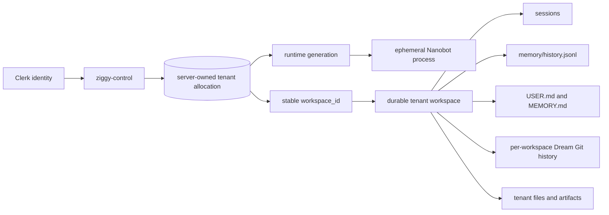
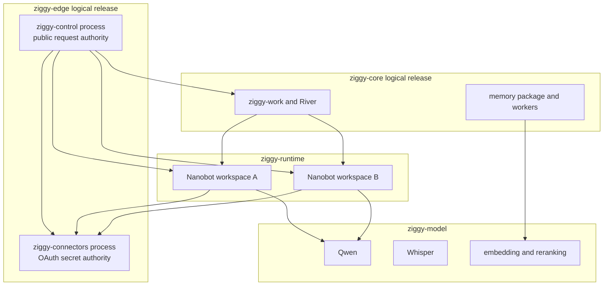

# Ziggy Tenant State And Logical Deployments

Status: accepted transition design for the Spark pilot

## Project Boundary

Omi and mOmi are a separate product and data plane. Omi audio, transcripts,
conversations, and device metadata must not be written into a Ziggy workspace
or returned by Ziggy recall unless a user explicitly imports an artifact.

The legacy `ziggy-ingest` bridge violated that boundary by writing Omi
transcripts into the owner Ziggy Chroma directory. It is disabled. Its existing
database is preserved as Omi-owned archival data, not Ziggy memory.

Whisper may remain shared infrastructure because it is a stateless inference
endpoint. Sharing a model process does not imply sharing prompts, transcripts,
or durable storage.

## Tenant-Owned Runtime State

A Nanobot process is disposable. Its workspace is not.

The server derives `workspace_id` from the authenticated identity. A request,
prompt, tool, or model output never chooses a filesystem path or tenant ID.
Starting, stopping, upgrading, or moving a runtime must remount the same
workspace for that allocation.

For the pilot:

1. Every tenant has one mode-`0700` durable root under
   `/home/mihai/.local/share/ziggy/tenants/<workspace_id>/workspace`.
2. The legacy owner workspace remains `/home/mihai/.nanobot/workspace` until it
   is migrated into the same allocation layout.
3. Each workspace may contain its own `.git` directory for Dream revisions.
   There is no shared repository, object store, alternate, or worktree across
   tenants.
4. Runtime configuration and connector capabilities remain outside the
   workspace and are not included in tenant workspace archives.
5. Only one runtime may write a workspace at a time. The pilot enforces this
   operationally through one systemd unit per allocation; database-backed
   generation leases and write fencing are still required before automatic
   relocation.
6. Daily backups include the owner workspace, all tenant workspaces, the
   tenant-allocation manifest, Work state, and PostgreSQL dumps.
7. A tenant move is stop, archive, checksum, restore, then start. It is never
   two live writers against a copied directory.

Owner archives exclude reproducible package environments and caches, plus the
separated Omi Chroma archive. They retain Dream's `.git`, sessions, memory,
skills, Work files, and user-authored artifacts. Tenant archives omit runtime
configuration and capabilities but otherwise preserve the tenant workspace.
These live archives are crash-consistent best efforts, not point-in-time
filesystem snapshots. A file changing during `tar` fails the backup rather
than publishing a known-partial snapshot. Quiesced or filesystem-level
snapshots and a restore drill remain production hardening work.

The current systemd runtimes still share one Unix account. Directory isolation
prevents accidental mixing, not malicious cross-tenant reads by arbitrary
code. Keep shell execution disabled until runtimes receive separate UIDs or
container/mount namespaces.

## Git Is Transitional

Per-workspace Git is acceptable as a short-term undo log. It is not the
long-term multi-tenant memory database:

- it has no database-enforced tenant or row-level policy;
- facts, evidence, supersession, retention, and deletion are Markdown
  conventions rather than typed records;
- usage and memory quality are difficult to query across the product;
- agent-writable repository metadata is not an authoritative audit log; and
- filesystem backup and runtime lifecycle are coupled.

Today that Git history covers `SOUL.md`, `USER.md`, and `memory/MEMORY.md`.
Dream-created skills are retained by workspace backups but are not included in
`/dream-restore`.

The target memory design stores typed records and revisions in PostgreSQL,
keyed by server-derived `tenant_id` and `workspace_id`, with RLS and evidence.
`USER.md` and `MEMORY.md` become bounded per-tenant projections generated from
that store. `SOUL.md` remains product-owned behavior. Dream's file-editing mode
is disabled after cutover, while Nanobot's token consolidation remains.

Do not add a standalone memory deployment initially. Implement memory as a Go
package and River worker inside `ziggy-work` (later named `ziggy-core`) using
the existing PostgreSQL server. Split it only when independent scaling,
resource isolation, or failure data justifies another process.

## Logical Deployments

Code packaging, release grouping, process boundaries, and machine placement are
different decisions.

`ziggy-control` and `ziggy-connectors` should be one logical `ziggy-edge`
release in Lab: one version, placement decision, health gate, rollback action,
and operator view. They remain separate Go processes, OS accounts, environment
files, and database roles.

That distinction keeps Google refresh-token encryption material out of the
public process and narrows accidental credential exposure. It is defense in
depth, not complete authorization isolation: control currently holds the HMAC
signing authority used to call connectors for a routed tenant, so a compromised
control process can impersonate a tenant to connector APIs. Connector-side
authorization must eventually verify an independently issued, short-lived,
scope- and runtime-generation-bound capability. Even before that hardening,
merging both into one process would expose raw token material for negligible
resource savings.

`ziggy-work` has a different lifecycle. It owns durable jobs, long-running
workers, retries, approvals, artifacts, and eventually memory maintenance.
Keep it in `ziggy-core`, not `ziggy-edge`, so edge restarts and releases do not
interrupt background execution.

| Logical deployment | Processes | Release behavior | Placement |
| --- | --- | --- | --- |
| `ziggy-edge` | control, connectors | Deploy and roll back together; credentials remain separate | Any CPU node with public ingress and provider egress |
| `ziggy-core` | Work/River; memory initially in-process | Drain workers before rollback; migrate schema once | State-capable CPU node near PostgreSQL |
| `ziggy-runtime` | one active Nanobot per workspace | Start on demand; remount stable workspace | Sandboxed CPU node |
| `ziggy-model` | Qwen, Whisper, embeddings | Model-specific health and admission gates | GPU node |

Lab should model a logical deployment as a release graph containing multiple
processes and credentials. Co-deployment must not require co-location forever:
moving connectors or Work later is a placement change, not an API or client
change.
