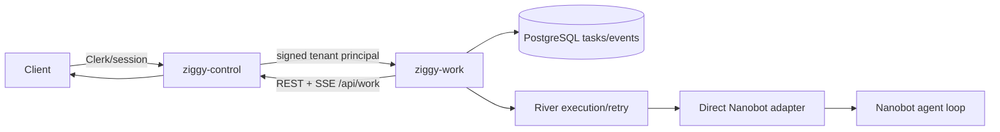
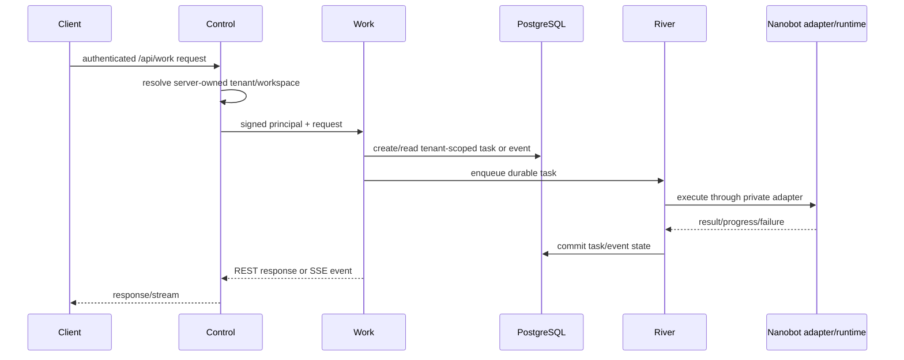
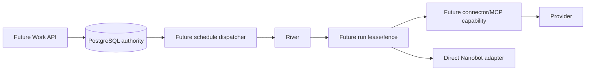

# Ziggy Work Durable Architecture

Status: Phase 1 implementation authority and target-state boundary

## Phase 1 Landed

Phase 1 is product-owned, tenant-scoped durable work. It implements:

- a Ziggy Control boundary that signs a one-minute tenant principal in
  `X-Ziggy-Principal` and `X-Ziggy-Principal-Signature`; the base64url JSON
  payload contains `user_id`, `workspace_id`, and `expires_at`, and the
  signature is HMAC-SHA256 using `work-trust-key`;
- PostgreSQL-backed tenant-scoped tasks and events, with River execution and
  retry as the queue/executor;
- tenant-scoped idempotency records committed atomically with mutating API
  state and River enqueue;
- the existing `/api/work` and `/api/work/` REST surface plus SSE task/event
  delivery;
- cancellation and follow-up operations for Phase 1 tasks;
- a private direct Nanobot adapter; Nanobot remains an execution dependency,
  not the Work database or API authority;
- import of existing per-tenant SQLite exports, with tenant mapping and
  idempotent conflict handling.

The release contains the `ziggy-work`, `migrate-river`, `import-nanobot`, and
`reconcile-runtimes` commands. Application migration remains explicit and is
not performed by the service process. River is pinned to v0.35.1.

### Production Topology

The production instance runs on `edge-builder-1`. `ziggy-work` binds only to
`127.0.0.1:8791` and is reached locally by `ziggy-control`; it is not a public
listener. Native PostgreSQL 16 listens on port `5433` and is reached through
the Unix socket `/var/run/postgresql` using this peer-auth DSN:

`postgresql:///ziggy_work?host=/var/run/postgresql&port=5433&sslmode=disable`

The service OS account and quoted PostgreSQL role are both `"ziggy-work"`,
and the database is `ziggy_work`. The release binaries are installed under
`/usr/local/bin`. Root-owned secrets are provisioned under
`/etc/ziggy/secrets/work-database-url`, `work-trust-key`, and
`work-runtimes.json`; systemd loads them into the service credential directory.
Artifacts are persisted at `/var/lib/ziggy-work/artifacts`.

The unit permits `AF_UNIX` for the PostgreSQL socket and grants write access
to the artifact directory despite systemd filesystem hardening. No production
operation should use `go run`.

The current migration data set is expected to reconcile to 14 owner tasks,
743 owner events, 1 owner step, and 9 owner artifacts. The tester is empty.
Imported scheduled plans are preserved as data, but Phase 1 does not
automatically reschedule or backfill them.

### Phase 1 Boundary

Nanobot owns conversation turns, model/tool orchestration, sessions, and
runtime-local behavior. It does not own durable Work tasks/events, tenant
authorization, queue retry, cancellation state, or follow-up state. The
adapter is private and transitional: it cannot grant Work authority, choose a
tenant, or write PostgreSQL directly.

Phase 1 data flow is:

Phase 1 failures are handled as follows: invalid principals are rejected;
PostgreSQL failure prevents authoritative state changes; River retries failed
execution; Nanobot failure leaves a durable failed/interrupted task rather
than claiming success; cancellation is cooperative; and an SSE disconnect
does not erase committed task/event state. Exact retry ceilings and SSE
cursor retention are implementation settings, not new client authority.
SSE admission is bounded globally and per tenant in both Control and Work.

The API-to-River boundary is replay-safe. The transitional Nanobot adapter is
at-least-once across the narrow crash window between an accepted Nanobot bus
publication and its SQLite dispatched marker. The future Nanobot
transactional outbox listed below is required before claiming end-to-end
exactly-once command delivery.

## Target State, Not Phase 1 Behavior

The following are architecture and schema direction only. They must not be
described or operated as completed Phase 1 features:

- schedules and durable run records;
- approvals, plan hashes, expiry, and one-use approval state;
- worker leases, generation/fence checks, stale-worker rejection, and provider
  mutation fencing;
- connector and MCP capability issuance, tool allowlists, and provider-token
  custody outside Nanobot;
- transactional schedule dispatch, outbox publication, runtime generations,
  and cross-service audit/usage records.

When these milestones land, PostgreSQL remains authoritative and River remains
the executor. Every product row must carry server-derived tenant/workspace
scope. A future capability must bind tenant, workspace, operation, run/fence,
expiry, and connector scope; it must never be derived from client IDs or
content. Approval must remain a direct authenticated Work API operation, not
an MCP tool or Nanobot text instruction.

The target scheduler must preserve the Phase 1 rule for imported plans:
preservation is not automatic rescheduling. A later product decision may
explicitly enable schedules or backfill, but that is a separate migration and
user-visible behavior change.

## Privacy And Verification Boundary

Logs, traces, metrics, River metadata, errors, and SSE diagnostics must not
contain tenant IDs, emails, Clerk subjects, workspace IDs, task/event IDs,
provider IDs, URLs, prompts, message content, tokens, credentials, paths, or
arbitrary error text. Use bounded route, operation, status class, failure
class, queue state, duration, and aggregate counts. Tenant/content telemetry
is out of scope; internal database records may retain the minimum references
needed for authorization and product support.

Phase 1 release verification is limited to implemented behavior:

- two synthetic tenants can create/read their own tasks and events through
  REST and SSE, cancel a task, and create a follow-up;
- changing a client-visible task/event identifier cannot cross tenant scope;
- duplicate delivery, River retry, Nanobot failure, cancellation, restart,
  SSE reconnect, and SQLite import conflict cases are covered;
- owner import counts reconcile to 14 tasks, 743 events, 1 step, and 9
  artifacts, while tester import counts remain zero;
- telemetry privacy checks reject tenant and content values.

Schedule, run, approval, fence, connector, and MCP capability verification is
deferred until those target-state components have landed.
