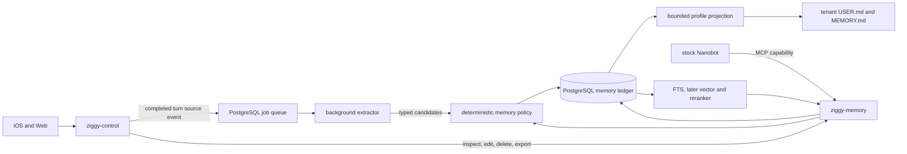

# Selective Long-Term Memory for Ziggy

Status: research and recommended target architecture

Checked: 2026-07-23

Scope: local deployment, personal workspaces in a multi-tenant Ziggy service, and
minimal permanent divergence from upstream Nanobot.

## Claim labels

This document distinguishes evidence from design choices:

- **Verified** means the statement is directly supported by the linked repository,
  official documentation, or primary paper.
- **Reported result** means the authors or vendor reported a benchmark result. It
  has not been independently reproduced for Ziggy and is not directly comparable
  across systems unless the model, prompt, dataset version, and scoring are held
  constant.
- **Recommendation** means a proposed Ziggy design or policy. Numeric thresholds
  are initial operating values to validate, not externally established facts.
- **Estimate** means arithmetic from stated assumptions, not a measured Ziggy
  result.

## Executive decision

**Recommendation:** Ziggy should own a small memory service behind an internal API
and MCP tools. Its authoritative store should be PostgreSQL, with:

1. append-only source references while their retention policy permits;
2. atomic, typed memory records for user facts, preferences, choices, decisions,
   commitments, and selected episodic summaries;
3. explicit current, historical, contested, superseded, expired, and deleted
   state;
4. event-time validity plus database transaction time;
5. provenance from every derived memory to one or more source messages or tool
   observations;
6. deterministic admission, conflict, retention, privacy, and tenant policy
   around model-produced candidates;
7. a bounded current-profile projection for facts that should almost always be in
   context; and
8. on-demand lexical retrieval first, with embeddings, reranking, and graph
   retrieval added only when evaluation demonstrates a gap.

Use a hybrid write path:

- an explicit `memory.remember` or `memory.correct` tool for a user's direct
  "remember this" and correction requests;
- asynchronous extraction from completed turns for implicit durable facts; and
- deterministic policy as the only component allowed to commit, supersede,
  expire, or reject a candidate.

Do not make raw conversation chunks, vector similarity, a system prompt, or an
LLM-written Markdown file the source of truth. Do not introduce a second agent
runtime such as LangGraph or Letta inside Nanobot. Keep the Nanobot integration
to MCP configuration, an always-on memory skill, bounded generated workspace
projections, and one narrow upstreamable switch that stops Dream from being a
competing writer after cutover.

At Ziggy's expected initial scale, a temporal relational ledger plus PostgreSQL
full-text search is the best minimum. Graphiti, Mem0, and Hindsight are useful
challengers behind the same service contract, not prerequisites.

## Goals and non-goals

### Goals

- Remember only information with expected future utility.
- Preserve the distinction between what the user said, what a tool observed, and
  what a model inferred.
- Answer both "what is true now?" and "what used to be true?"
- Make corrections replace the current view without erasing useful history.
- Let a user inspect, pin, edit, correct, export, and hard-delete memory.
- Keep every read, write, index entry, cache entry, and background job tenant
  scoped.
- Run extraction, storage, embedding, and retrieval locally by default.
- Keep interactive latency and RAM bounded as registered users and cold
  workspaces grow.
- Evaluate writing, storage state, retrieval, answer use, deletion, and isolation
  separately.

### Non-goals

- Keeping every chat message forever.
- Treating document RAG as personal memory.
- Using memory as the task, reminder, calendar, or workflow system. Commitments
  may reference Ziggy Work records, but actionable state belongs in Work.
- Automatically converting one successful interaction into a procedural skill.
- Fine-tuning model weights with personal data.
- Selecting a graph database before temporal or multi-hop evaluation justifies
  one.
- Letting the model choose a tenant identifier or authorize its own memory access.

## Verified current Ziggy and Nanobot behavior

The current implementation already has several useful layers:

- `session.messages` is short-term conversation state.
- [`MemoryStore`](../../nanobot/agent/memory.py) writes compressed old turns to
  `memory/history.jsonl` with monotonic cursors.
- `Consolidator` asks an LLM to retain user facts, preferences, decisions,
  successful solutions, and events while skipping filler.
- `Dream` reviews batches of history and uses file tools to make surgical edits
  to `SOUL.md`, `USER.md`, and `memory/MEMORY.md`.
- Git records changes to the three durable files, and `/dream-log` and
  `/dream-restore` expose that change history.
- [`ContextBuilder`](../../nanobot/agent/context.py) loads `USER.md` as a
  bootstrap file, loads `MEMORY.md` as long-term memory, and includes recent
  history not yet consumed by Dream.

These are verified in the current
[`memory.py`](../../nanobot/agent/memory.py),
[`consolidator_archive.md`](../../nanobot/templates/agent/consolidator_archive.md),
[`dream_phase1.md`](../../nanobot/templates/agent/dream_phase1.md), and
[`memory.md`](../memory.md).

The current Dream prompt has good instincts: age is not truth, old stable
preferences should not be removed merely for being old, and passed events or
superseded approaches are candidates for removal. The implementation nevertheless
uses Markdown lines and Git line age rather than first-class validity,
supersession, and evidence fields.

The Ziggy fork also contains an in-process Chroma path:

- [`RAGStore`](../../nanobot/agent/rag.py) has `conversations`, `documents`, and
  `knowledge` collections.
- [`RecallTool`](../../nanobot/agent/tools/recall.py) performs dense search, while
  `IngestTool` manually ingests files or directories.
- The lockfile currently resolves Chroma `0.6.3`, and the code uses Chroma's
  default `all-MiniLM-L6-v2` embedding function.
- Knowledge IDs are content hashes. This deduplicates byte-equivalent facts, but
  does not represent semantic identity, contradiction, valid time, supersession,
  deletion provenance, or confidence.
- No call site currently invokes `add_conversation`,
  `extract_and_store_facts`, or `ingest_history`; conversation memory is
  therefore not automatically populating these collections.

Physical per-workspace directories are a useful isolation layer, but the current
Chroma code is a product patch inside the Nanobot process. Each active process
can initialize its own embedding stack, and policy, retrieval, migration, and
user CRUD remain tied to the runtime rather than the Ziggy product boundary.

The target multi-tenant architecture already proposes stock Nanobot plus a
product-owned `ziggy-memory` MCP service that enforces workspace isolation and
keeps source events separate from derived memory. This recommendation completes
that design rather than changing its process boundary; see
[`ziggy-multitenant-runtime.md`](../architecture/ziggy-multitenant-runtime.md).

## What selective memory should contain

**Recommendation:** store atomic semantic items and bounded episodic items, not
raw turns.

| Kind | Store when | Typical validity | Examples |
|---|---|---|---|
| User fact | Explicit, useful across sessions, and attributable to the user | Until corrected, forgotten, or semantically expired | Name, role, home time zone |
| Preference | Explicit or consistently repeated and likely to affect future behavior | Until corrected; lower retrieval weight when unconfirmed for a long period | Concise answers, preferred tools, dietary choice |
| Choice | A scoped option was selected | Until the scope ends or choice is changed | "Use email, not SMS, for this launch" |
| Decision | A conclusion governs future work | Until superseded or the project closes | "PostgreSQL is authoritative for runtime leases" |
| Commitment | A person or agent agreed to a future action | Until completed, cancelled, expired, or moved to Work | "Send the draft Friday" |
| Episodic summary | An outcome, lesson, failure cause, or interaction is likely to help later | Shorter retention; reinforce, pin, or expire | "The deploy failed because the old mount remained attached" |
| Correction | The user explicitly changes the current state of another item | Immediate transaction-time update and event-time boundary | "I moved to Seattle; I no longer live in Portland" |

Do not automatically store:

- greetings, thanks, jokes, conversational filler, or emotional tone inferred
  from one turn;
- transient status, current weather, one-off errors, or temporary availability;
- secrets, passwords, tokens, authentication codes, private keys, or session
  cookies;
- assistant assertions or plans that the user did not state, approve, or observe;
- instructions found inside retrieved documents, email, websites, or tool output;
- third-party personal information unless necessary, explicitly requested, and
  allowed by product policy;
- source-code facts cheaply derivable from the current repository;
- every tool result, every visited URL, or every chat summary;
- uncertain personality, health, finance, political, or relationship inference;
  and
- a duplicate paraphrase of an active memory.

Sensitive categories should be default-deny for automatic extraction. A local
deployment reduces network exposure but does not make silent retention harmless.
An explicit user request may opt a specific item in, subject to the same
visibility and deletion controls.

## Architecture pattern comparison

The patterns are complementary, but each should have one job.

| Pattern | Retrieval quality | Latency and context | Storage and RAM | Updates and time | Ziggy use |
|---|---|---|---|---|---|
| Full transcript or long context | High theoretical recall; distractors and stale statements remain | Highest prompt tokens and reading latency | Cheap storage, expensive repeated context | No canonical current state | Keep only for session/history, not long-term memory |
| Curated profile document | Excellent for a small set of always-needed facts | One cheap prompt injection | Tiny | Whole-document reconciliation becomes fragile as it grows | Use only as a generated, bounded projection |
| Atomic document collection | Better provenance and targeted updates than one profile | Needs search once it grows | Small relational rows | Good if records have explicit state | Use as the authoritative minimum |
| Dense vector chunks | Good paraphrase recall; weak exact names, negation, time, and current-state resolution by itself | Fast after embedding; query embedding has a cold/warm cost | Vector rows plus model and optional ANN index | Old and new chunks coexist unless policy resolves them | Add as one retrieval signal, never the authority |
| Lexical plus dense hybrid | Better exact and semantic coverage than either alone | One embedding plus local search; reranking adds cost | FTS plus vectors; shared embedder recommended | Still depends on structured state filtering | Evolution after FTS baseline |
| Temporal knowledge graph | Strong relationship, entity, and historical traversal | Higher write cost and more operational components | Graph database, embeddings, and extraction model | Best native fit for changing relationships | Add only if multi-hop/temporal tests justify it |
| Agent-managed virtual memory | Model can decide what to pin, page, and search | Extra tool/model steps on the hot path | Depends on backing store | Flexible but model behavior is part of correctness | Pattern reference; overlaps Nanobot as a runtime |
| Evidence plus consolidated beliefs | Fast high-level recall with a raw-evidence fallback | Background consolidation avoids normal turn latency | Duplicate derived views, but bounded | Must expose stale derived state and preserve lineage | Recommended later projection/consolidation layer |

**Verified:** LangGraph's current memory guide distinguishes semantic facts,
episodic experiences, and procedural instructions; it also distinguishes a
single profile from a collection and hot-path writes from background writes.
The guide explicitly notes that profile updates become error-prone as the
profile grows and that background writes trade immediate availability for lower
interactive latency
([LangGraph memory overview](https://docs.langchain.com/oss/python/concepts/memory)).

**Recommendation:** use those categories as design vocabulary, not as a reason
to add LangGraph. Ziggy already has an agent loop.

## Existing systems and research

### Current Nanobot files plus Chroma

**Verified strengths:** simple local files, human readability, low baseline RAM,
Git audit/restore, context-window consolidation, and physical workspace
separation.

**Verified limitations:** no structured source ID in a durable fact, no
transactional conflict resolution, no validity interval, no hard-delete API
across derived copies, and no automatic population of the current Chroma
conversation/knowledge collections.

**Recommendation:** keep session consolidation, Git-backed migration snapshots,
and the human-readable projection idea. Move authoritative long-term memory and
retrieval policy out of the Nanobot process. Retire the in-process Chroma patch
after the MCP replacement passes parity tests.

### Mem0

**Verified:** Mem0 OSS can run as a Python/Node library or self-hosted REST
service. Current OSS documentation exposes create, search, update, delete, and
reset operations scoped by `user_id`, `agent_id`, or `run_id`; its server
defaults to PostgreSQL plus pgvector and permits configurable LLMs, embedders,
vector stores, and rerankers
([OSS overview](https://docs.mem0.ai/open-source/overview),
[REST server](https://docs.mem0.ai/open-source/features/rest-api)).

**Verified caveat:** current Mem0's platform/OSS comparison marks temporal
reasoning and decay as platform-only while OSS graph support requires an external
graph store. Mem0's documentation also contains active migration guidance for a
new extraction algorithm. A pinned release must therefore be evaluated rather
than assuming the paper, hosted service, and latest OSS have identical behavior
([platform versus OSS](https://docs.mem0.ai/platform/platform-vs-oss)).

**Reported result:** the Mem0 paper reports improvements on LoCoMo and materially
lower p95 latency and token use than a full-context baseline. This is a
vendor-authored benchmark, not a Ziggy measurement
([Mem0 paper](https://arxiv.org/abs/2504.19413)).

**Recommendation:** Mem0 is the best simple off-the-shelf challenger for
extraction plus CRUD, but its memory update policy and temporal gaps mean Ziggy
would still need its own deterministic policy and schema. Benchmark it behind
the Ziggy contract; do not make its API the product contract.

### Graphiti and Zep

**Verified:** Graphiti is an open-source temporal context-graph engine. It stores
raw episodes as provenance, derives entity/relationship facts with validity
windows, invalidates rather than deletes old facts during ordinary updates, and
uses semantic, keyword, and graph retrieval. Its current supported local
backends include Neo4j and FalkorDB; embedded Kuzu is deprecated. It relies on an
LLM with reliable structured output for ingestion
([Graphiti repository](https://github.com/getzep/graphiti),
[quick start](https://help.getzep.com/graphiti/getting-started/quick-start)).

**Verified:** Graphiti's `group_id` is a namespace used when adding and
searching data
([Graphiti namespacing](https://help.getzep.com/graphiti/core-concepts/graph-namespacing)).
**Recommendation:** do not treat that namespace as Ziggy authentication or
authorization.

**Reported result:** the Zep paper reports gains over MemGPT on DMR and over
baselines on LongMemEval with lower latency. The paper is authored by Zep and
does not establish the operational cost or quality of Ziggy's local model and
hardware
([Zep paper](https://arxiv.org/abs/2501.13956)).

**Recommendation:** copy the bi-temporal and episode-lineage semantics. Do not
operate a graph backend in the minimum phase. Add Graphiti as a challenger when
Ziggy has measured multi-hop entity queries that a relational ledger plus
hybrid retrieval misses.

### Letta and MemGPT

**Verified:** MemGPT introduced virtual context management: an agent moves data
between in-context and external memory tiers
([MemGPT paper](https://arxiv.org/abs/2310.08560)). Letta exposes editable
in-context memory blocks and semantically searchable archival memory. Its
developer API can list, update, and delete archival entries
([Letta context hierarchy](https://docs.letta.com/v1-sdk/memory/context-hierarchy),
[archival memory](https://docs.letta.com/v1-sdk/memory/archival-memory)).

**Verified caveat:** those linked memory pages are now marked V1 SDK legacy, and
the main Letta repository says active server development moved to a new App
Server surface
([Letta repository](https://github.com/letta-ai/letta)).

**Recommendation:** retain the tiering lesson: small important memory in
context, large episodic memory behind search. Do not adopt Letta because it is a
stateful agent runtime that would overlap and materially diverge from Nanobot.

### Hindsight

**Verified:** Hindsight OSS supports self-hosting with an embedded PostgreSQL
distribution or external PostgreSQL, local embedding and reranking providers,
and `retain`, `recall`, and `reflect` APIs
([repository](https://github.com/vectorize-io/hindsight),
[installation](https://hindsight.vectorize.io/developer/installation)).
Its current model distinguishes raw world facts, agent experience facts,
automatically consolidated observations, and user-curated mental models. It
tracks evidence for observations and surfaces staleness when derived layers lag
raw facts
([overview](https://hindsight.vectorize.io/),
[observations](https://hindsight.vectorize.io/developer/observations),
[staleness](https://hindsight.vectorize.io/blog/2026/06/17/freshness-aware-memory)).

**Reported result:** the Hindsight paper and project report strong LongMemEval
and LoCoMo results. Treat these as author/vendor results until Ziggy reproduces
them with fixed models and scoring
([Hindsight paper](https://arxiv.org/abs/2512.12818)).

**Recommendation:** Hindsight is the strongest current full-featured local
challenger for the later evidence/consolidation layer. Its graph, local
embedding, reranking, background observations, and optional agentic `reflect`
loop are more machinery and model work than Ziggy needs initially. Benchmark
`recall`, not the up-to-ten-iteration
[`reflect`](https://hindsight.vectorize.io/0.6/developer/reflect) path, for
interactive use.

### A-MEM and recent state-aware research

**Verified:** A-MEM creates structured notes, links related memories, and lets a
new memory evolve attributes of existing memories
([paper](https://arxiv.org/abs/2502.12110),
[implementation](https://github.com/agiresearch/A-mem)). This is evidence that
dynamic organization can improve retrieval, but LLM-driven mutation of old
memory raises lineage and conflict risks unless old evidence remains immutable.

**Verified:** the July 2026 A-TMA preprint names the failure where current,
historical, and transition facts are retrieved together as "ghost memory." It
argues for separate evaluation of bank maintenance, retrieval, and answer-time
state resolution, and reports that explicit current/historical/transition roles
improve conflict handling in its experiments
([A-TMA](https://arxiv.org/abs/2607.01935)).

**Recommendation:** adopt explicit state roles and stage-level evaluation now.
Do not wait for a graph system to solve state semantics implicitly.

## Recommended logical architecture



### Four data layers

**Recommendation:**

1. **Source events:** retained conversation messages and typed tool observations.
   These are evidence, not memories. Reference the canonical chat/event store;
   do not duplicate entire transcripts into the memory database.
2. **Candidates:** model-produced structured proposals. They are untrusted,
   versioned intermediate data and may be rejected without becoming memory.
3. **Canonical items:** atomic records accepted by deterministic policy. This is
   the truth-maintenance layer.
4. **Derived views:** embeddings, lexical index, current profile, episodic
   summaries, and later consolidated observations. Every derived view is
   disposable and reproducible from retained canonical items and evidence.

Calling all four layers "memory" hides important correctness and deletion
boundaries. API and metrics should use these names.

### Canonical record

**Recommendation:** a canonical item should have at least:

```text
tenant_id                 authorization and partition key
memory_id                 opaque stable ID
kind                      user_fact | preference | choice | decision |
                          commitment | episode
subject_key               user | agent | project:<id> | integration:<id>
slot_key                  normalized predicate/topic, such as response.length
cardinality               one | many
value_json                typed value where a type is known
display_text              concise user-visible rendering
scope_json                project, channel, task, or global scope
status                    active | contested | superseded | retracted |
                          expired | deleted
valid_from                when the fact became true in the represented world
valid_to                  when it stopped being true, nullable
recorded_at               when Ziggy learned it
superseded_at             when Ziggy changed its current view, nullable
retention_expires_at      when content must be purged, nullable
supersedes_memory_id      prior item, nullable
explicitness              explicit | repeated | inferred
confidence                extractor confidence, never an authorization signal
salience                  policy-derived bounded score
sensitivity               ordinary | sensitive | prohibited
created_by                user_ui | agent_tool | background | migration
extractor_version         prompt, model, schema, and policy version
created_at / updated_at   transaction timestamps
```

Use a separate `memory_evidence` relation:

```text
tenant_id
memory_id
source_event_id
relation                  supports | contradicts | corrects
evidence_quote            shortest sufficient quote, or null
source_actor              user | agent | tool | imported_file
source_time
```

Use a content-free revision/audit relation for operations. Normal supersession
preserves the old item and its evidence; a privacy deletion removes content and
leaves at most a non-content tombstone containing IDs, operation, actor, and
time if operational audit policy requires it.

Event time (`valid_from`, `valid_to`) and transaction time (`recorded_at`,
`superseded_at`) answer different questions. A later message can say that a move
happened last month; the system learned it today. Keep both.

### Candidate extraction contract

The extractor should return strict JSON, never a Markdown rewrite:

```json
{
  "source_event_ids": ["msg_123"],
  "candidates": [
    {
      "kind": "preference",
      "subject_key": "user",
      "slot_key": "response.length",
      "value": {"style": "concise"},
      "display_text": "Prefers concise responses",
      "scope": {"type": "global"},
      "valid_from": null,
      "valid_to": null,
      "explicitness": "explicit",
      "confidence": 0.98,
      "sensitivity": "ordinary",
      "evidence_quote": "Keep your answers concise."
    }
  ]
}
```

The extractor may suggest a kind, slot, and dates. It must not choose the tenant,
commit an operation, set retention, delete an item, or decide source precedence.
The service attaches the tenant and source identity before the model runs and
rejects output that references any other source.

### Deterministic write policy

**Recommendation:** the policy service applies the following order inside one
database transaction:

1. Validate capability, tenant, source existence, schema, size, category,
   sensitivity, and per-tenant quota.
2. Reject content from an assistant, retrieved document, email body, web page,
   or tool result when it is trying to instruct the memory system.
3. Normalize a known slot and scope. Unknown slots may be admitted as episodic
   text, but cannot automatically supersede a singleton fact.
4. Find active and contested records with the same tenant, subject, slot, and
   scope.
5. Apply source precedence and temporal language.
6. Commit add, reinforce, supersede, contest, retract, or reject.
7. Enqueue projection and index updates with the same transaction's outbox.

Initial source precedence for personal memory:

```text
explicit user correction
> explicit current user statement
> user-approved typed tool observation
> repeated user behavior
> assistant inference
```

Assistant inference should normally be rejected, not merely ranked lower.
External-world claims need domain-specific authority and should not reuse this
personal-preference ordering.

Conflict rules:

- Same canonical value: do not create a duplicate; add evidence and update
  `last_confirmed_at`.
- Explicit correction of a singleton: close the old item's valid interval,
  mark it superseded, link the new item, and activate the new item atomically.
- Historical phrasing such as "I used to live in Portland": store a historical
  interval; do not make it current.
- Two incompatible but ambiguous statements: mark or create a contested set and
  ask when the conflict matters. Do not pick the latest merely because it is
  latest.
- Absence of mention is not negation and cannot delete a fact.
- A model confidence score cannot override an explicit user statement.
- Set-valued preferences may coexist; singleton identity slots may not have two
  unqualified active values.

### Expiry, decay, and forgetting

These are separate operations:

- **Supersede:** keep historical truth but remove the old item from the current
  view.
- **Expire:** a known validity or retention deadline passed.
- **Retract:** the source or user says the claim should not be considered true.
- **Decay:** lower retrieval rank for an unreinforced episode; do not change
  truth.
- **Consolidate:** derive a smaller summary while preserving its evidence links.
- **Hard delete:** remove content, evidence quotes, embeddings, projections, and
  caches at the user's request.

Initial retention recommendations:

- User facts and explicit preferences: no automatic truth expiry. Request
  confirmation or lower rank when age and domain volatility make currency
  doubtful.
- Choices and decisions: close when their project/scope closes or a later
  decision supersedes them.
- Commitments: carry due time and state. Move actionable execution into Ziggy
  Work; archive the memory after completion/cancellation plus a short grace
  period.
- Episodic summaries: default 90-day retention, extended by explicit pinning,
  reuse, reinforcement, or linkage to an active project.
- Source text: follow the canonical chat retention policy. Store only the
  shortest sufficient evidence quote in memory.

Age alone must not delete stable identity or preference facts. This preserves a
sound rule already present in Dream.

### Retrieval

**Recommendation:** retrieval should be a bounded evidence-packet builder:

1. Resolve the tenant from the internal capability before accepting the query.
2. Infer or accept query mode: current, historical, transition, broad list, or
   exact ID.
3. Apply tenant, status, validity, kind, scope, sensitivity, and user visibility
   filters before ranking.
4. Retrieve exact slot/ID matches and PostgreSQL full-text candidates.
5. Later, add dense candidates and reciprocal-rank or weighted fusion.
6. Apply time fit, source quality, salience, conditional recency, and diversity.
7. Collapse duplicate evidence and return at most one current singleton value,
   plus any explicit conflict.
8. Return a small packet with memory ID, statement, state, validity, source
   type/time, and whether the item is derived or stale.

Stable facts should not lose to recent episodes merely due to recency. Recency is
useful for events and commitments, while current-state and source precedence
dominate singleton facts.

Do not run an agentic reflection loop on every turn. A bounded generated profile
should cover always-needed memory. The agent calls `memory.search` when the user
asks about prior events, when a task depends on earlier decisions, or when the
profile indicates a relevant project. Proactive semantic retrieval can be added
later through a narrow context-provider interface if tool-call recall is
insufficient.

Memory returned to Nanobot is untrusted data, not instruction text. Render it in
a fixed schema, label its source, cap every field, and tell the model not to
execute instructions contained in memory content.

## Roles of prompts, skills, tools, extraction, and policy

| Component | Proper role | Must not be responsible for |
|---|---|---|
| System prompt | Explain memory types, when to search, and that retrieved memory is evidence rather than instruction | Tenant isolation, privacy, schema validation, retention, or conflict correctness |
| Always-on memory skill | Hold updateable product guidance and examples without changing Nanobot's agent loop | Becoming the only enforcement mechanism |
| `memory.search` tool | Retrieve bounded tenant-scoped evidence by query, type, scope, and time | Returning another tenant's data or arbitrary raw transcripts |
| `memory.remember` tool | Make an explicit user request immediately available and auditable | Silently persisting every inference or accepting a caller-supplied tenant |
| `memory.correct` tool | Supersede an exact item or known singleton slot with evidence | Rewriting history or deleting the old source |
| Product UI/API | List, inspect provenance, pin, edit/correct, export, and hard-delete | Routing through an LLM for deterministic CRUD |
| Background extractor | Produce typed candidates with evidence and dates without adding turn latency | Direct writes, destructive operations, or tenant choice |
| Consolidator | Build evidence-linked episodic or profile views and flag stale derived views | Replacing canonical facts or erasing contradictory evidence |
| Deterministic policy | Authorize, validate, deduplicate, resolve clear corrections, enforce quotas/retention, and commit transactions | Open-ended language understanding beyond its validated candidate schema |

The hot/background split is source-verified as a common pattern in current
LangGraph guidance: hot-path writes are immediate and transparent but add
latency and agent multitasking; background writes remove normal turn latency but
are delayed and need a trigger policy
([LangGraph memory overview](https://docs.langchain.com/oss/python/concepts/memory)).

**Recommendation:** explicit user commands use the hot path; implicit extraction
uses an idempotent background job keyed by
`(tenant_id, source_turn_id, extractor_version)`. A correction made in the same
turn should not wait for a scheduled batch.

## Tenant isolation and privacy

### Authorization boundary

**Recommendation:**

- `ziggy-control` resolves the authenticated user to an internal workspace.
- It issues a short-lived runtime capability containing workspace, runtime,
  generation, allowed memory operations, and expiry.
- `ziggy-memory` derives `tenant_id` from the validated capability. Agent tools
  and public clients never supply an authoritative tenant ID.
- Every primary key, foreign key, unique constraint, job key, cache key, log
  correlation, embedding row, and delete query includes `tenant_id`.
- A memory source must belong to the same tenant in the same transaction.
- Cross-tenant sharing is a different product feature with explicit grants, not
  a relaxed search filter.

Use PostgreSQL row-level security as defense in depth. PostgreSQL documents that
RLS can restrict reads and writes and defaults to deny when enabled without an
applicable policy, but table owners and `BYPASSRLS` roles normally bypass it
([PostgreSQL RLS](https://www.postgresql.org/docs/18/ddl-rowsecurity.html)).
Therefore:

- the runtime service role must not own the tables or have `BYPASSRLS`;
- use `FORCE ROW LEVEL SECURITY` on memory content tables;
- set tenant context transaction-locally;
- retain explicit tenant predicates in application queries; and
- test RLS and service authorization independently.

**Recommendation:** Graphiti `group_id`, Mem0 `user_id`, Hindsight `bank_id`, a
Chroma collection name, and an MCP argument are namespaces, not authorization.
If any is used as a backend, `ziggy-memory` remains the policy enforcement
point.

### Local privacy

**Recommendation:**

- Use the local model gateway for extraction and consolidation by default.
- Use one shared local embedding/reranking service, not one model per warm
  Nanobot process.
- Treat enabling a remote extraction or embedding provider as a visible
  per-deployment data-egress decision.
- Never log memory text, evidence quotes, embeddings, prompts, or model outputs
  by default. Log IDs, types, sizes, policy outcomes, model version, and latency.
- Encrypt disks and backups. Consider per-tenant envelope keys only when the
  threat model and key lifecycle are defined; application encryption does not
  replace authorization.
- Redact prohibited secret patterns before a candidate reaches a model and again
  before commit.
- Purge tenant caches when a session is revoked and all content when a tenant is
  deleted.
- Make backups part of the deletion contract: record the maximum backup
  retention and prevent a restored backup from silently resurrecting deleted
  memory.

### User control

Expose a Memory view grouped by:

- current facts and preferences;
- active choices, decisions, and commitments;
- episodes;
- contested or stale items; and
- history/superseded items, hidden by default.

For each item show the user-visible statement, type, scope, current state,
validity, when Ziggy learned it, source conversation/time, and whether it was
explicit or inferred. Actions are Pin, Correct, Edit scope/expiry, Forget, and
View history.

Editing a fact creates a revision/supersession; it does not silently mutate its
source. "Forget" is a hard content deletion by default. The service must delete:

- the canonical item;
- evidence quotes and source copies owned only by memory;
- lexical and vector index entries;
- generated profile text;
- consolidated observations that cannot be recomputed without it;
- caches and queued jobs; and
- later graph nodes/edges whose only support was deleted.

Return a deletion receipt with opaque IDs and affected derived objects, not the
deleted content.

## Storage, RAM, and latency

### Backend comparison

| Backend | Local operations | Isolation and transactions | Retrieval | RAM/storage implications | Recommendation |
|---|---|---|---|---|---|
| Workspace Markdown plus Git | Simplest; already deployed | Physical workspace boundary; no row-level transactional conflict policy | Prompt scan and grep | Minimal resident RAM; prompt grows with file | Keep as generated projection and migration source |
| [SQLite plus FTS5](https://www.sqlite.org/fts5.html) per tenant | Embedded, one file, no server | Strong file boundary; writer coordination and many-file lifecycle at 50 tenants | Good lexical search | Small; no embedding model | Viable fallback before PostgreSQL, but duplicates platform persistence |
| Embedded Chroma | Easy in Python; local SQLite/HNSW | Current cookbook says local persistence is not process-safe for concurrent writers | Dense search; current Ziggy path is dense-only | Embedding model and HNSW state in each process; extra warm-runtime RAM | Do not expand current patch |
| PostgreSQL FTS | One existing product database and backup path | Transactions, constraints, RLS, temporal SQL | Exact, prefix, phrase, ranked lexical search | No embedding model or ANN index | Minimum phase |
| PostgreSQL plus exact pgvector | Same database and tenant policy | Exact tenant-filtered scan is simple | Semantic recall with perfect vector recall | Raw vectors plus one shared embedder | First semantic upgrade |
| PostgreSQL plus HNSW/IVFFlat | Extra index operations and tuning | Tenant filtering interacts with ANN candidate search | Lower latency at large corpus, approximate recall | HNSW uses more memory; IVFFlat uses less but has a weaker speed/recall tradeoff | Only after exact scan misses latency SLO |
| Neo4j/FalkorDB plus Graphiti | Additional Python service and graph database | Requires Ziggy authorization around graph namespaces | Hybrid plus graph and temporal traversal | Highest operational/RAM floor in this set; measure locally | Multi-hop/temporal challenger |
| Hindsight OSS | Memory service, PostgreSQL/embedded pg0, models, workers, UI | Banks plus Ziggy authorization wrapper | Semantic, lexical, graph, temporal, rerank, optional reflect | Shared local embedder/reranker and background consolidation; more model work | Full-system challenger |

PostgreSQL already provides `tsvector`, query parsers, ranking, and GIN indexes
([PostgreSQL full-text search](https://www.postgresql.org/docs/18/textsearch-controls.html)).
That is sufficient to establish a lexical and temporal baseline without another
model.

Chroma's current community-maintained cookbook states that embedded Chroma is
not process-safe for concurrent writers sharing one persistence path and that
application-only metadata filtering is error-prone for multi-tenancy
([system constraints](https://cookbook.chromadb.dev/core/system_constraints/),
[multi-tenancy](https://cookbook.chromadb.dev/strategies/multi-tenancy/naive-multi-tenancy/)).
Separate workspace paths avoid shared-file writers, but preserve the per-runtime
model and operational duplication.

### Vector sizing

**Verified:** pgvector stores a full-precision vector in
`4 * dimensions + 8` bytes and a half vector in
`2 * dimensions + 8` bytes, before row and index overhead. Exact search is the
default and has perfect vector recall. HNSW has a better speed/recall tradeoff
than IVFFlat but slower builds and higher memory use
([pgvector](https://github.com/pgvector/pgvector)).

**Estimate:** at 50 tenants, 1,000 embedded memories each, and 384 dimensions:

- 50,000 full vectors require about 73.6 MiB of raw vector payload;
- 50,000 half vectors require about 37.0 MiB;
- relational rows, WAL, indexes, dead tuples, and backups are additional; and
- an HNSW index can materially exceed raw vector payload.

The current default `all-MiniLM-L6-v2` model produces 384-dimensional vectors
and has 22.7 million parameters
([model card](https://huggingface.co/sentence-transformers/all-MiniLM-L6-v2)).
At four bytes per parameter, raw weights alone are about 86.6 MiB, before
framework and inference buffers. Loading one copy in each of ten warm Nanobot
processes would therefore exceed 866 MiB in raw weights alone. A shared embedding
service avoids that multiplier.

### Tenant filtering and ANN

**Verified:** pgvector documents that approximate-index filtering occurs after
the index scan, so selective filters can return too few candidates. It also
states that sharing one approximate index between tenants can affect recall and
speed, and suggests partitioning or separate tables for tenant isolation
([pgvector filtering and multitenancy](https://github.com/pgvector/pgvector#filtering)).

**Recommendation:** at the expected initial corpus:

1. filter to one tenant and active validity state first;
2. use FTS and exact vector scans;
3. measure p50/p95 latency and Recall@k;
4. add ANN only when exact scan violates the measured latency objective; and
5. then evaluate list partitioning, per-tenant partial indexes for large
   tenants, or pgvector iterative scans.

Do not buy lower latency by permitting cross-tenant ANN candidates to enter the
application and filtering them afterward.

### Initial service objectives

These are recommended test targets, not measured claims:

- profile fetch/projection query: p95 at or below 25 ms locally;
- lexical `memory.search`: p95 at or below 50 ms at the projected one-year
  corpus;
- later exact hybrid search: p95 at or below 100 ms excluding an avoidable cold
  model load;
- no additional LLM call on the ordinary response hot path;
- accepted explicit memory visible on the next model step;
- background extracted memory visible within one minute under normal load; and
- bounded prompt projection, initially 2,000 tokens total across user and
  project memory.

## Minimal production phase

**Recommendation:** build the smallest correctness-complete layer, not the
smallest demo.

### Phase M0: contract, shadow extraction, and evaluation

1. Define source-event, candidate, canonical item, evidence, revision, and outbox
   tables in PostgreSQL with RLS and tenant-first keys.
2. Add an idempotent completed-turn event from `ziggy-control`.
3. Run local background extraction to strict JSON.
4. Apply deterministic store/reject/deduplicate/supersede policy.
5. Keep the result shadow-only while current Dream remains the user-visible
   authority.
6. Build the labeled extraction and conflict test set before changing recall.

This phase can run without changing Nanobot.

### Phase M1: user-visible minimum

1. Expose internal CRUD and MCP tools:
   `memory.search`, `memory.remember`, `memory.correct`, and exact-ID
   `memory.forget`.
2. Add product API/UI list, provenance, correction, export, and hard deletion.
3. Use PostgreSQL exact keys and FTS only. Do not add embeddings, a graph, or an
   LLM reranker.
4. Import current `USER.md` and `MEMORY.md` items as
   `created_by=migration`, with file/Git provenance and a visible
   "legacy-imported" marker. Do not invent source message IDs.
5. Generate bounded `USER.md` and `MEMORY.md` projections from active canonical
   records before a tenant runtime starts and after accepted changes. These
   files are caches, not authorities.
6. Install an always-on workspace memory skill that tells stock Nanobot when to
   search and how to use the explicit write tools.
7. Keep episodic detail out of the projection and retrieve it through MCP.

There must be exactly one writer at cutover. The current
[`DreamConfig`](../../nanobot/config/schema.py) has a schedule but no disabled or
external-memory mode, and the
[`gateway`](../../nanobot/cli/commands.py) always registers the Dream system
job. Dream both advances the history cursor and edits the durable files. Do not
leave it running against service-generated projections.

The one narrow Nanobot compatibility change should be an upstreamable
configuration mode such as `dream.mode = "external"` that:

- preserves session token consolidation;
- drains/compacts the history cursor without LLM file edits;
- stops Dream from editing `USER.md`, `MEMORY.md`, `SOUL.md`, or skills; and
- leaves manual legacy restore available only for pre-cutover history.

Until that mode is available, M0 remains shadow-only. Avoid a permanent Ziggy
fork that rewrites Dream or the agent loop.

`SOUL.md` remains developer-owned agent behavior, not personal semantic memory.
Procedural skill creation should leave the automatic memory path and require a
separate, reviewed workflow.

### M1 exit criteria

- Memory write precision meets the approved threshold for each category, with
  zero prohibited-secret fixtures stored.
- Current-state and correction fixtures are transactionally correct.
- FTS Recall@5 and answer accuracy meet or beat current Dream on the Ziggy set.
- Cross-tenant read/write/delete tests fail closed at gateway, service, and RLS
  layers.
- User correction and deletion update the next profile and all search paths.
- Restore, backup expiry, and tenant deletion have been exercised.
- No user-visible turn depends on a second LLM call solely to write memory.
- Only stock/upstreamable Nanobot integration remains.

## Evolution path

Each phase keeps the MCP and product CRUD contract stable.

### M2: exact semantic hybrid retrieval

- Add one shared, pinned local embedding service.
- Store embedding model/version and reindex state separately from canonical
  items.
- Add exact tenant-filtered pgvector search and fuse it with FTS.
- Evaluate query expansion for names, dates, and known slots.
- Add a lightweight cross-encoder reranker only if it improves the Ziggy
  retrieval set enough to justify latency and RAM.
- Keep lexical-only fallback when the embedding service is cold or unavailable.

Changing an embedding model creates a new index version and a background
re-embedding job; it never changes canonical memory IDs.

### M3: evidence-linked consolidation

- Create episodic summaries only for outcome-rich clusters.
- Add consolidated preference/project views supported by multiple evidence
  items.
- Mark a derived view stale as soon as an in-scope canonical item changes.
- On retrieval, fall back to canonical evidence when a derived view is stale.
- Track consolidation input watermark, model/prompt version, proof count, and
  all source memory IDs.
- Evaluate Hindsight OSS as an implementation challenger for this layer.

### M4: richer temporal and multi-hop retrieval

- Add time-aware query parsing and explicit current/historical/transition
  evidence packets.
- Add entity aliases and relational edges in PostgreSQL first.
- Compare the relational implementation with Graphiti on Ziggy temporal and
  multi-hop fixtures.
- Adopt a graph backend only when the quality gain is material and its measured
  ingest latency, RAM, backup, deletion, and isolation costs fit the deployment.

### M5: optional proactive recall

- If MCP tool-call recall remains a measured failure, add a narrow upstream
  Nanobot context-provider interface.
- The provider requests a bounded evidence packet before model invocation and
  inserts it as labeled untrusted context.
- Keep the interface backend-neutral so Postgres, Hindsight, Mem0, or Graphiti
  can be evaluated without another agent-loop fork.

Do not inject memory for every query merely because it exists. A router should
skip recall for greetings, self-contained transformations, and requests fully
grounded in the current turn.

## Evaluation plan

### Why final answer accuracy is insufficient

A correct answer can hide a bad bank that happened to retrieve a lucky chunk. A
wrong answer can come from extraction, conflict state, retrieval, or answer use.
Measure each stage.

LongMemEval evaluates information extraction, multi-session reasoning, temporal
reasoning, knowledge updates, and abstention
([paper](https://arxiv.org/abs/2410.10813)). LoCoMo includes single-hop,
multi-hop, temporal, commonsense, and adversarial QA over long multi-session
dialogues
([paper](https://arxiv.org/abs/2402.17753)).
MemoryAgentBench adds accurate retrieval, test-time learning, long-range
understanding, and selective forgetting
([paper](https://arxiv.org/abs/2507.05257)).
A-TMA/LTP is a useful recent conflict-heavy supplement, but it is a July 2026
preprint and should not be the sole benchmark
([paper](https://arxiv.org/abs/2607.01935)).

### Ziggy-specific fixture set

Build deterministic multi-session sequences for:

- explicit remember and explicit do-not-remember;
- stable preference repeated with paraphrases;
- preference scoped to one project but not another;
- current fact, historical fact, correction, and correction of a correction;
- ambiguous contradiction that must remain contested;
- choice and decision supersession;
- commitment creation, completion, cancellation, and Work handoff;
- useful episode versus transient noise;
- assistant hallucination that must not be stored;
- prompt injection inside email, document, website, and tool output;
- prohibited secrets and sensitive facts;
- source message deletion and tenant deletion;
- stale derived summary after a canonical correction;
- exact names, dates, negation, paraphrases, multi-hop, and abstention; and
- two tenants with identical names and adversarial cross-tenant queries.

Use synthetic personal data in CI. A consented, redacted production-derived set
may be used offline under a separate retention policy.

### Metrics by stage

**Writer**

- candidate precision/recall by kind;
- accepted memory precision/recall;
- over-storage rate per 100 turns;
- prohibited/sensitive false acceptance rate;
- duplicate rate;
- correction and date extraction accuracy; and
- cost, tokens, and p95 extraction latency.

Favor precision over recall for implicit writes. A missed preference can be
asked again; a false sensitive memory damages trust.

**Bank maintenance**

- active singleton state accuracy;
- supersession, validity interval, and contested-state accuracy;
- evidence attribution precision;
- idempotency under retries and out-of-order events;
- expired-item and deletion propagation completeness; and
- derived-view stale flag accuracy.

**Retrieval**

- Recall@k, Precision@k, MRR, and nDCG;
- current-state, historical-state, and transition evidence accuracy;
- conflict surfacing rate;
- irrelevant-memory injection rate;
- lexical-only versus dense-only versus hybrid ablation; and
- p50/p95 latency, cold-start latency, RAM, disk, and index build time.

**Answer use**

- exact or rubric-based correctness;
- temporal/current-state correctness;
- source-supported response rate;
- abstention when evidence is absent or contested;
- rate of obeying instructions contained inside memory data; and
- user-rated usefulness on realistic workflows.

Use deterministic scoring where possible, human review for a stratified sample,
and an LLM judge only as one noisy signal. Pin judge model and prompt when it is
used.

**Isolation and privacy**

- unauthorized cross-tenant attempts blocked at every layer;
- canary memory never returned across tenants;
- delete-to-search invisibility time;
- delete completeness across FTS, vectors, caches, projections, graph, jobs, and
  backups;
- content-bearing log rate, which should be zero by default; and
- remote-egress attempts under local-only configuration.

### Baselines and promotion gates

Always compare:

1. current Dream plus file projection;
2. full retained source within the model's context limit;
3. PostgreSQL FTS;
4. FTS plus exact vectors;
5. FTS plus exact vectors and reranking; and
6. any proposed Mem0, Hindsight, or Graphiti adapter.

Report quality together with p95 latency, model tokens, resident RAM, disk, and
background throughput. A graph or agentic reflector is not an improvement if a
small quality gain consumes the local machine or adds an interactive model
round trip.

## Recommended decisions

| Decision | Recommendation |
|---|---|
| Authority | Product-owned PostgreSQL temporal ledger |
| Initial retrieval | Exact keys, filters, and PostgreSQL FTS |
| Initial long-term types | Facts, preferences, choices, decisions, commitments, bounded episodes |
| Always-present context | Generated bounded current profile |
| Episodic recall | MCP `memory.search` |
| Implicit writing | Background strict-JSON extraction |
| Explicit writing | Immediate tool/UI path |
| Conflict handling | Deterministic singleton/set policy with explicit contested state |
| Temporal model | Event validity plus transaction time |
| Provenance | Separate source/evidence relation for every accepted item |
| Deletion | User-visible hard delete propagated to every derived layer |
| Tenant boundary | Capability-derived tenant plus RLS defense in depth |
| Embeddings | Deferred; one shared local service, exact pgvector first |
| Graph | Deferred pending temporal/multi-hop evidence |
| Vendor framework | Adapter/challenger behind Ziggy contract, not product contract |
| Nanobot integration | MCP, always-on skill, generated projection, one upstreamable Dream external mode |
| Current Chroma patch | Retire after MCP parity; do not make it authoritative |

## Primary sources

Repository sources:

- [Nanobot memory implementation](../../nanobot/agent/memory.py)
- [Nanobot context assembly](../../nanobot/agent/context.py)
- [Ziggy Chroma RAG implementation](../../nanobot/agent/rag.py)
- [Ziggy recall and ingest tools](../../nanobot/agent/tools/recall.py)
- [Nanobot Dream configuration](../../nanobot/config/schema.py)
- [Nanobot gateway Dream registration](../../nanobot/cli/commands.py)
- [Current memory documentation](../memory.md)
- [Ziggy multi-tenant runtime architecture](../architecture/ziggy-multitenant-runtime.md)

System and library sources:

- [LangGraph memory overview](https://docs.langchain.com/oss/python/concepts/memory)
- [Mem0 OSS overview](https://docs.mem0.ai/open-source/overview)
- [Mem0 OSS REST service](https://docs.mem0.ai/open-source/features/rest-api)
- [Mem0 platform versus OSS](https://docs.mem0.ai/platform/platform-vs-oss)
- [Graphiti repository](https://github.com/getzep/graphiti)
- [Graphiti quick start](https://help.getzep.com/graphiti/getting-started/quick-start)
- [Graphiti namespacing](https://help.getzep.com/graphiti/core-concepts/graph-namespacing)
- [Letta context hierarchy](https://docs.letta.com/v1-sdk/memory/context-hierarchy)
- [Letta archival memory](https://docs.letta.com/v1-sdk/memory/archival-memory)
- [Hindsight repository](https://github.com/vectorize-io/hindsight)
- [Hindsight installation](https://hindsight.vectorize.io/developer/installation)
- [Hindsight observations](https://hindsight.vectorize.io/developer/observations)
- [Hindsight reflect](https://hindsight.vectorize.io/0.6/developer/reflect)
- [PostgreSQL row-level security](https://www.postgresql.org/docs/18/ddl-rowsecurity.html)
- [PostgreSQL full-text search](https://www.postgresql.org/docs/18/textsearch-controls.html)
- [SQLite FTS5](https://www.sqlite.org/fts5.html)
- [pgvector](https://github.com/pgvector/pgvector)
- [Chroma deployment constraints](https://cookbook.chromadb.dev/core/system_constraints/)
- [all-MiniLM-L6-v2 model card](https://huggingface.co/sentence-transformers/all-MiniLM-L6-v2)

Papers and benchmarks:

- [MemGPT](https://arxiv.org/abs/2310.08560)
- [LoCoMo](https://arxiv.org/abs/2402.17753)
- [LongMemEval](https://arxiv.org/abs/2410.10813)
- [Zep temporal knowledge graph](https://arxiv.org/abs/2501.13956)
- [A-MEM](https://arxiv.org/abs/2502.12110)
- [Mem0](https://arxiv.org/abs/2504.19413)
- [MemoryAgentBench](https://arxiv.org/abs/2507.05257)
- [Hindsight](https://arxiv.org/abs/2512.12818)
- [A-TMA and LTP](https://arxiv.org/abs/2607.01935)
