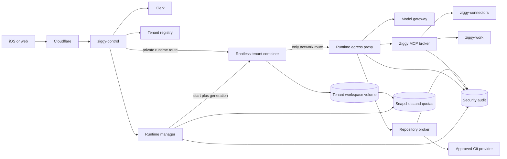

# Tenant Agent Sandboxing And Workspaces

Status: research and phased design recommendation

Date: 2026-07-23

Repository baseline: `2e6af4b9f38b1ba947c681e6a56292a14fcf2d3b`

Scope: per-tenant Nanobot runtimes with shell and repository access on one
bare-metal Spark host, for 1-50 registered users and initially 2-8 concurrent
turns. This document proposes future work; it does not claim that shell access
is safe in the current deployment.

## Executive Decision

Do not enable shell or unreviewed local code for an untrusted tenant in the
current same-UID systemd deployment.

Use one **rootless OCI container per active tenant runtime** as Ziggy's first
production execution boundary. Keep the existing identity and routing model:
`ziggy-control` derives `user_id` and `workspace_id` from Clerk, maps them to one
private runtime, and never trusts a client workspace selector. Put container
lifecycle behind a narrow runtime-manager API; never give `ziggy-control` or a
tenant the Podman/Docker socket.

The required container profile is:

- a unique tenant user namespace and a non-root process;
- one tenant workspace volume read-write and no host/repository bind mount;
- an immutable image and read-only root filesystem;
- all capabilities dropped, `no-new-privileges`, seccomp, and an enforcing host
  LSM where available;
- a private network namespace whose only route is an enforcing egress proxy;
- no raw provider, Git, connector, database, control-plane, or host credential;
- per-runtime and aggregate cgroup, disk, inode, process, and concurrency limits;
- lifecycle, policy, egress, capability, and tool audit written outside the
  tenant workspace; and
- one fenced writable owner for a workspace at a time.

Keep Nanobot stock or upstreamable. The runtime container runs the pinned
Nanobot image, ordinary Nanobot file tools remain restricted to its workspace,
and Ziggy-owned capabilities continue through streamable HTTP MCP. The only
Nanobot change that may be justified is a small, upstreamable external audit
sink if existing hooks cannot emit a trustworthy tool-decision event.

Use gVisor as a measured hardening option after the OCI profile works. Reserve a
Kata/Firecracker/OpenShell microVM tier for workloads that execute materially
more hostile code or require a separate guest kernel. Do not make NVIDIA
OpenShell or NemoClaw a production dependency now: their control patterns are
useful, but both projects identify themselves as alpha, OpenShell describes its
current mode as single-player, and NemoClaw is an opinionated blueprint for
other agent runtimes rather than Nanobot.

## Fact And Recommendation Boundary

Sections through **Primary-Source Findings** are verified observations from the
checked-out code or linked primary sources as of 2026-07-23. **Threat Model** is
the security model used for this analysis. Sections beginning with
**Recommended** are Ziggy-specific design recommendations, not claims about
current behavior.

## Verified Ziggy Baseline

### Tenant identity and routing

The current control boundary is already the right authorization shape:

- `ziggy-control` verifies Clerk identity, resolves a server-owned tenant
  allocation, and maps a unique `user_id`, `workspace_id`, private upstream,
  and bootstrap secret
  ([control README](../../services/ziggy-control/README.md),
  [registry](../../services/ziggy-control/internal/tenant/registry.go)).
- Duplicate user IDs, workspace IDs, emails, subjects, upstreams, and bootstrap
  secrets are rejected. Unknown or expired transport credentials fail rather
  than falling through to the owner's runtime
  ([router](../../services/ziggy-control/internal/routing/router.go)).
- Client-supplied workspace IDs do not select a runtime. Bootstrap selects the
  allocation; a hash of each short-lived transport token remembers that route.
- Every current active allocation has a static private URL. Configuration is
  immutable after `ziggy-control` starts, so automatic cold starts and dynamic
  endpoints are not current behavior.
- Connector and Work requests cross the control boundary with a fresh signed
  one-minute tenant principal. Client `X-Ziggy-*` headers and client credentials
  are stripped before proxying.

This means sandbox work should preserve tenant routing and replace only the
runtime implementation behind each `TenantRoute`. It should not add workspace
selection to Nanobot or the client.

### Current runtime and filesystem boundary

The Spark tenant generator and unit currently establish:

- one Nanobot process, config tree, runtime tree, and workspace per allocation;
- an empty tenant workspace under
  `/home/mihai/.local/share/ziggy/tenants/<workspace>/workspace`;
- `tools.restrictToWorkspace=true`;
- `tools.exec.enable=false` and an empty exec environment allowlist;
- only loopback model providers; inherited non-WebSocket channels and inherited
  MCP servers are removed;
- optional read-only Gmail MCP, disabled by default; and
- no Clerk backend key in the tenant process
  ([provisioner](../../services/ziggy-control/deploy/spark/provision_tenant.py)).

The checked-in systemd user unit uses `NoNewPrivileges`, a private `/tmp`,
read-only home, strict system protection, and one tenant root in
`ReadWritePaths`. It allows only Unix/IPv4/IPv6 address families and sets
`MemoryHigh=768M`, `MemoryMax=1G`, and `TasksMax=256`
([tenant unit](../../services/ziggy-control/deploy/systemd/spark/nanobot-tenant@.service)).

However, every tenant unit runs under the same `mihai` Unix account. The unit
makes most paths read-only, not unreadable. A process that gains arbitrary code
execution as that UID can read files that DAC permits, including another
tenant's mode-`0700` tree because it has the same owner. The existing
operations guide explicitly says this is not a confidentiality boundary and
keeps Gmail MCP away from untrusted tenants for that reason
([pilot operations](../architecture/ziggy-tenant-pilot-operations.md),
[single-host architecture](../architecture/ziggy-spark-single-host.md)).

The unit also has no dedicated network namespace, outbound destination policy,
aggregate tenant slice, CPU quota, I/O control, or tenant disk/inode quota.
`RestrictAddressFamilies` limits socket families; it does not limit which
IPv4/IPv6 destinations or local ports a process can reach.

### Current Nanobot shell controls

Nanobot's `ExecTool` has useful defense-in-depth controls but is not a tenant
security boundary:

- The tool is absent when `tools.exec.enable=false`.
- When enabled, it applies regex guards, a sensitive-command pre-screen,
  internal-URL checks, workspace path checks, a maximum 600-second timeout,
  output truncation, a minimal environment, and process-group cleanup
  ([shell tool](../../nanobot/agent/tools/shell.py)).
- `restrictToWorkspace` constrains the model-provided working directory and
  application file tools. These are in-process path and command checks, so an
  implementation bug or another code execution path can bypass them.
- The optional `bwrap` backend mounts `/usr` and a small system set read-only,
  creates fresh `/proc`, `/dev`, and `/tmp`, masks the workspace parent, mounts
  the workspace read-write, and mounts media read-only
  ([sandbox backend](../../nanobot/agent/tools/sandbox.py)).
- The current `bwrap` command does **not** create a new network namespace,
  enforce destination policy, set cgroup limits, or establish a different host
  UID. It is per-command filesystem containment, not cross-tenant isolation.
- The exec child inherits only `HOME`, `LANG`, `TERM`, and explicitly allowed
  variables on Unix, but it is launched through `bash -l`; the image's login
  profile and the chosen `HOME` therefore remain part of the trusted runtime
  configuration.
- Subagents receive the same exec configuration. Notebook support only edits
  `.ipynb` JSON and does not execute a kernel
  ([subagent](../../nanobot/agent/subagent.py),
  [notebook tool](../../nanobot/agent/tools/notebook.py)).
- Nanobot can launch configured stdio MCP commands. The tenant generator
  currently clears inherited MCP definitions and adds only a reviewed
  streamable HTTP server, which avoids that local-code path
  ([MCP client](../../nanobot/agent/tools/mcp.py)).

The correct operating assumption is therefore: enabling `exec` gives the model
arbitrary code execution as the sandbox process. Regex denial and prompt
instructions reduce mistakes; they do not change that trust decision.

### Current secrets and audit behavior

- The per-runtime bootstrap secret is stored in generated Nanobot config and in
  the `ziggy-control` tenant manifest. When Gmail MCP is enabled, the same
  runtime value is also used as the capability presented to
  `/runtime/connectors/mcp`. The control service replaces it with a one-minute
  signed tenant principal before the connector sees the request.
- Local model providers do not require a cloud provider key in each tenant
  config. Connector refresh/access tokens remain in `ziggy-connectors`, and
  Work/database credentials remain in their own system services
  ([connector boundary](../../services/ziggy-connectors/README.md),
  [Work boundary](../../services/ziggy-work/README.md)).
- Nanobot writes every tool call to `<workspace>/audit.jsonl`. The audit includes
  timestamp, tool, sanitized arguments, result status, session/channel, and
  selected error data
  ([audit logger](../../nanobot/agent/tools/audit.py),
  [tool registry](../../nanobot/agent/tools/registry.py)).
- That file is inside the agent-writable workspace. A shell-enabled tenant can
  truncate, replace, or fabricate it. Key-name redaction does not guarantee
  that a token embedded inside a free-form shell command is removed. It is a
  useful tenant diagnostic, not an authoritative security audit.

## Primary-Source Findings

### NVIDIA OpenShell

OpenShell has the closest published control model to Ziggy's needs:

- Its gateway owns sandbox lifecycle, policy, providers, inference routing, and
  relay coordination; an in-sandbox supervisor applies filesystem, process,
  network, and credential controls
  ([how it works](https://docs.nvidia.com/openshell/latest/about/how-it-works)).
- It supports Docker, rootless Podman, Kubernetes, and an opt-in libkrun
  microVM driver. Linux AMD64 and ARM64 are supported
  ([support matrix](https://docs.nvidia.com/openshell/latest/reference/support-matrix),
  [compute drivers](https://docs.nvidia.com/openshell/latest/reference/sandbox-compute-drivers)).
- Static policy covers read-only/read-write paths, Landlock, and process
  identity. Dynamic network policy is evaluated by an OPA-backed CONNECT/L7
  proxy. The sandbox network namespace forces traffic through that proxy
  ([policy](https://docs.nvidia.com/openshell/latest/sandboxes/policies),
  [security controls](https://docs.nvidia.com/openshell/latest/security/best-practices)).
- Unmatched outbound destinations are denied. For matched L7 endpoints,
  `enforcement` currently defaults to `audit`, which logs a violating method or
  path but still forwards it; production policy must explicitly use
  `enforcement: enforce`.
- Landlock currently defaults to `best_effort`. If the kernel/path setup is
  unsuitable, the sandbox may continue without Landlock and emit a finding;
  `hard_requirement` makes startup fail instead.
- Provider credentials can be represented by placeholders and injected at the
  egress boundary. Managed inference routes through `inference.local`, keeping
  the upstream credential out of agent code.
- OpenShell emits process, network, HTTP, policy/configuration, and security
  events in OCSF-shaped logs
  ([sandbox logging](https://docs.nvidia.com/openshell/latest/observability/logging)).
- Docker and Podman honor per-sandbox `--cpu` and `--memory`. The current VM
  driver accepts those fields but ignores them; VM sizing is gateway-driver
  configuration, which is a material limitation for a mixed-size production
  pool.
- Host bind mounts are disabled by default in the OpenShell Podman driver and
  its documentation warns that they can negate workspace/filesystem isolation.

The current maturity boundary is equally important. The
[OpenShell repository](https://github.com/NVIDIA/OpenShell) calls the software
alpha and "single-player mode: one developer, one environment, one gateway,"
while building toward multi-tenant enterprise deployments. Its Kubernetes path
and GPU support are also described as experimental. These are explicit reasons
to learn from and test OpenShell, not to outsource Ziggy's current production
tenant boundary to it.

### NVIDIA NemoClaw

NemoClaw packages selected agents, an OpenShell sandbox, policy, image,
inference setup, and lifecycle helpers. It does not replace OpenShell or the
agent runtime
([architecture overview](https://docs.nvidia.com/nemoclaw/latest/user-guide/openclaw/about/how-it-works)).

Verified patterns worth adopting are:

- deny-by-default egress with reviewed endpoint, binary, method, and path rules;
- provider credentials held by OpenShell and substituted at egress;
- an image pinned by digest;
- a targeted read-only system/read-write workspace policy;
- removal of unused build/network tools from sensitive runtime images; and
- explicit restricted/balanced/open policy tiers
  ([network policy](https://docs.nvidia.com/nemoclaw/latest/user-guide/openclaw/reference/network-policies),
  [ecosystem comparison](https://docs.nvidia.com/nemoclaw/latest/user-guide/openclaw/about/ecosystem)).

Its current caveats also matter:

- NemoClaw is an alpha project. Its supported packaged agents are OpenClaw,
  Hermes, and LangChain Deep Agents rather than Nanobot
  ([repository](https://github.com/NVIDIA/NemoClaw)).
- The OpenClaw profile keeps `.openclaw` writable by default and intentionally
  makes a gateway token available to interactive sandbox shells. NVIDIA
  recommends locking generated config for sensitive always-on workloads
  ([security controls](https://docs.nvidia.com/nemoclaw/latest/user-guide/openclaw/security/best-practices)).
- Its blueprint defaults, plugin, migration, backup, and channel assumptions are
  agent-specific. Adopting NemoClaw would create more Nanobot divergence and a
  second product control plane without eliminating Ziggy's tenant router.

The useful output for Ziggy is therefore the policy architecture, not the
NemoClaw package.

### Containers, user namespaces, and systemd

- Rootless Docker runs both daemon and containers in a user namespace so a
  daemon/runtime compromise does not begin as host root
  ([Docker rootless mode](https://docs.docker.com/engine/security/rootless/)).
  A rootful Docker API remains highly privileged; exposing it to a public
  service is explicitly dangerous
  ([Docker security](https://docs.docker.com/engine/security/)).
- Rootless Podman creates a user namespace from subordinate UID/GID ranges.
  Podman's default rootless mapping maps the invoking host UID to container
  root, while `--userns=auto` allocates unique subordinate ranges and does not
  map the invoking host UID into the container
  ([Podman rootless](https://docs.podman.io/en/latest/markdown/podman.1.html),
  [user namespace modes](https://docs.podman.io/en/latest/markdown/podman-run.1.html)).
- Podman supports read-only roots, tmpfs mounts, capability drops, seccomp,
  `no-new-privileges`, PID/memory limits, private SELinux labels, and systemd
  Quadlet integration
  ([Podman run](https://docs.podman.io/en/latest/markdown/podman-run.1.html),
  [Quadlet](https://docs.podman.io/en/latest/markdown/podman-systemd.unit.5.html)).
- Containers still share the host kernel. Namespaces, seccomp, capabilities,
  cgroups, and an LSM reduce that kernel attack surface; they do not create a
  separate guest kernel.
- Landlock is an unprivileged, stackable restriction layer inherited by child
  processes. Kernel documentation also lists important limits, including
  pre-opened file descriptors and some file operations not covered by current
  access rights
  ([Landlock userspace API](https://www.kernel.org/doc/html/latest/userspace-api/landlock.html)).
- systemd provides useful process, mount, syscall, capability, namespace, and
  cgroup controls, but a service unit must combine them correctly
  ([systemd execution environment](https://www.freedesktop.org/software/systemd/man/latest/systemd.exec.html),
  [resource control](https://www.freedesktop.org/software/systemd/man/latest/systemd.resource-control.html)).
  A read-only mount is not a confidentiality control, and per-unit maxima do not
  create an aggregate tenant-pool reserve.

### gVisor, Kata, and Firecracker

- gVisor's `runsc` is an OCI runtime that implements a Linux application kernel
  in userspace and intercepts workload system calls rather than passing them
  directly to the host kernel. It narrows the host-kernel interface but has
  compatibility and filesystem/network performance costs
  ([architecture](https://gvisor.dev/docs/architecture_guide/intro/),
  [production guide](https://gvisor.dev/docs/user_guide/production/)).
- gVisor still requires ordinary container mount, network, and cgroup policy. It
  does not protect data deliberately mounted into a sandbox and does not solve
  higher-level authorization or side channels
  ([security model](https://gvisor.dev/docs/architecture_guide/security/)).
- gVisor's documented fully rootless mode currently cannot use its Netstack and
  requires host networking for external connectivity. That conflicts with
  Ziggy's egress goal unless deployment tests establish a different supported
  integration.
- Kata adds a lightweight VM and guest Linux kernel under the OCI/container
  interface, providing a second hardware-virtualized isolation layer
  ([Kata virtualization](https://github.com/kata-containers/kata-containers/blob/main/docs/design/virtualization.md)).
  It is most naturally integrated through containerd/CRI; adopting it on this
  single host adds a runtime stack that Ziggy does not otherwise need.
- Firecracker uses KVM to run one minimalist microVM per VMM process. Its
  production guidance requires the jailer, cgroups/namespaces, privilege drop,
  trusted host paths, host-level egress filtering, and preferably a unique
  host UID/GID per microVM
  ([design](https://github.com/firecracker-microvm/firecracker/blob/main/docs/design.md),
  [production host setup](https://github.com/firecracker-microvm/firecracker/blob/main/docs/prod-host-setup.md)).
- Firecracker's default guest memory is 128 MiB, but a Nanobot Python process
  still needs its normal memory in addition to the guest kernel and services.
  A microVM reduces shared-kernel risk; it does not make the application free.

### Capability tools and repositories

- The current MCP authorization specification requires resource/audience-bound
  access tokens and forbids passing an MCP client token through to a downstream
  API. It recommends short-lived credentials and separate upstream credentials
  ([MCP authorization, 2025-11-25](https://modelcontextprotocol.io/specification/2025-11-25/basic/authorization),
  [MCP security practices](https://modelcontextprotocol.io/docs/tutorials/security/security_best_practices)).
- MCP tools are model-controlled actions. Tool annotations are hints, not a
  trustworthy authorization statement; enforcement belongs in the server
  ([MCP server model](https://modelcontextprotocol.io/specification/2025-11-25/server/index),
  [schema](https://modelcontextprotocol.io/specification/2025-11-25/schema)).
- Git linked worktrees share the repository's common object store, refs, and
  usually repository config. They are convenient disposable views but are not
  isolation between mutually untrusted tenants
  ([Git worktree](https://git-scm.com/docs/git-worktree)).
- Git supports multiple transports and external remote helpers. A workspace
  with repository access also contains code, build scripts, dependency
  manifests, and documents that can prompt-inject the model or intentionally
  execute arbitrary code
  ([Git clone and URL forms](https://git-scm.com/docs/git-clone)).

## Threat Model

### Trust assumptions

Treat these as trusted computing base:

- Spark firmware, host kernel or hypervisor, root/systemd, host firewall, and
  storage encryption;
- `ziggy-control` authentication/routing and its deployment credentials;
- the proposed runtime manager and egress/capability brokers;
- pinned runtime images and the build/signing pipeline;
- `ziggy-connectors`, `ziggy-work`, model gateway, PostgreSQL, and their
  tenant-authorization logic; and
- operators with production root access.

Treat these as untrusted:

- every client field after authentication, including chat/session/workspace IDs;
- model output, tool arguments, generated code, and generated shell commands;
- tenant workspace contents, uploaded files, repository contents and history,
  issues, dependency metadata, and build/test scripts;
- remote web, email, MCP, and model content;
- tenant-installed dependencies, skills, plugins, hooks, and binaries; and
- the complete Nanobot process after it begins handling tenant-controlled
  content.

Tenants are mutually hostile for isolation purposes even when all invited users
are well intentioned. Prompt injection or a dependency exploit can make one
tenant runtime adversarial without the user choosing to attack Ziggy.

### Attacker capabilities

Assume an attacker can:

1. Induce any sequence of allowed file, shell, Git, HTTP, MCP, and subagent
   operations.
2. Execute native or interpreted code inside the tenant boundary.
3. Fork, consume memory/CPU/disk/inodes, open sockets, bind listeners, and keep
   child processes alive until an external limit stops them.
4. Read every path, environment value, process argument, inherited descriptor,
   socket, and device made visible to the runtime.
5. Corrupt or delete all writable same-tenant data and attempt to alter config,
   skills, hooks, Git metadata, logs, and audit.
6. Exfiltrate any readable data through any reachable endpoint, including DNS,
   redirects, WebSocket, package registries, Git remotes, model providers, or
   another local service.
7. Probe host and container-runtime vulnerabilities and race runtime
   stop/start/mount operations.

### Security goals

The boundary must provide:

- **tenant confidentiality:** tenant A cannot read B's workspace, process,
  tokens, logs, backups, repository, connector data, or model context;
- **tenant integrity:** A cannot modify B's data, runtime, routes, capabilities,
  jobs, or audit;
- **host/control integrity:** a tenant cannot administer containers, systemd,
  the host, the model, databases, connectors, Work, or `ziggy-control`;
- **credential non-disclosure:** no reusable provider, Git, OAuth refresh,
  database, signing, host, or control-plane secret is readable in the sandbox;
- **controlled egress:** only reviewed destinations and operations are reachable,
  with direct-IP, redirect, DNS-rebinding, IPv6, UDP, and local-service bypasses
  denied;
- **availability bounds:** one tenant cannot exceed its process, CPU, memory,
  disk, I/O, network, model, tool, or concurrent-turn allocation;
- **single writer and revocation:** a stale runtime cannot keep network authority
  or write the same workspace as its replacement; and
- **external audit:** security decisions remain available even if the tenant
  destroys its workspace and local logs.

### Explicit non-goals

No software sandbox proves safety against every kernel, hypervisor, CPU
side-channel, firmware, or physical-host vulnerability. The first OCI phase
also does not promise to prevent a tenant-authorized agent from damaging its own
writable files. Ziggy should make that damage recoverable with snapshots,
version control, and approvals, then use a stronger runtime tier when the
workload's risk justifies it.

## Recommended Security Invariants

These are release invariants, not optional hardening:

1. Exactly one authenticated allocation resolves to exactly one runtime
   generation and one writable workspace owner.
2. No tenant process shares a host UID mapping, mount, network namespace, IPC
   namespace, PID namespace, or credential with another tenant.
3. The agent sees only its image, tenant workspace, bounded scratch space, and
   explicitly imported attachments. The host checkout and release directories
   are not mounted.
4. The agent cannot reach the Internet, host loopback, LAN, Tailscale, cloud
   metadata, databases, service admin ports, or other tenant ports directly.
5. Every allowed network operation crosses a policy point outside the sandbox.
6. A service-specific capability is scoped to tenant, workspace, runtime ID,
   monotonic generation, audience, operation set, and expiry. It is not accepted
   by another service and is never forwarded as an upstream provider token.
7. Durable provider and Git credentials are decrypted only in their broker and
   never enter Nanobot config, workspace, environment, tool result, or model
   context.
8. Runtime image/config/policy digests and lifecycle state are immutable to the
   tenant and independently auditable.
9. Aggregate tenant limits preserve an explicit host reserve for vLLM,
   PostgreSQL, control, connectors, Work, the kernel, and recovery operations.
10. Failure is closed: no route fallback, no second writable mount, no
    best-effort filesystem policy in production, and no audit-only egress rule.

## Recommended Data And Control Flow



### Request path

1. `ziggy-control` verifies Clerk and resolves the existing server-owned
   allocation. A request field never chooses `workspace_id`.
2. In the static-container phase, the allocation keeps its current unique
   loopback upstream. Podman publishes only that container port on
   `127.0.0.1`; the Nanobot port is never public.
3. In the dynamic phase, control asks the runtime manager to `EnsureRunning`
   with the resolved workspace and an idempotency key. The manager returns only
   a current generation and private endpoint after health and fencing checks.
4. Control exchanges its control-to-runtime bootstrap credential and remembers
   the resulting transport-token route as it does today.
5. Nanobot handles the turn inside its tenant container. File and exec tools
   operate on the tenant workspace. The container boundary must remain effective
   even if all Nanobot command guards are bypassed.

### Egress and tool path

1. The tenant network has no default route except to a dual-homed egress proxy.
   The proxy is outside the tenant namespace. Host firewall rules reject direct
   bypass, including IPv6 and UDP.
2. The proxy allows only the model gateway, Ziggy MCP broker, repository broker,
   and any narrowly reviewed read-only endpoint. Production rules enforce, not
   audit, method/path/binary/size/deadline policy.
3. The model gateway authenticates a short-lived generation capability and
   applies per-tenant/global inference admission. A tenant never reaches vLLM's
   administrative or raw listener directly.
4. The MCP broker exposes only the intersection of catalog policy, tenant grant,
   current runtime generation, approval state, and deployment egress policy.
   It converts the runtime capability to its own upstream provider credential;
   it never passes the runtime token through.
5. The repository broker owns Git-provider credentials. It grants fetch for one
   approved repository/ref. Remote push, pull-request creation, or branch
   mutation requires a separate, short-lived approval bound to repo, ref,
   expected commit/patch digest, actor, and expiry.

### Control-plane placement

`ziggy-control` must not receive the Podman/Docker API socket. A separate
unprivileged `ziggy-runtime-manager` owns rootless Podman and exposes a narrow
manager-owned Unix socket accessible only to the `ziggy-control` service group.
Its API accepts stable workspace identity and desired state, not arbitrary
image names, host paths, mounts, devices, commands, environment values, ports,
or runtime flags.

The manager selects all of those from a versioned server policy. Requests that
attempt unknown workspaces, stale generations, unapproved images, extra mounts,
host networking, devices, or privileged flags are impossible to represent.

## Recommended Runtime Profile

Use rootless Podman with Quadlet/systemd on Spark unless a host validation proves
that another rootless OCI implementation is better supported. Podman is a
recommendation, not a requirement in the `RuntimeDriver` contract.

For each runtime:

| Control | Required setting |
|---|---|
| Image | Nanobot and curated toolchain pinned by immutable digest; no mutable tags; provenance recorded |
| User namespace | Unique subordinate range; use `--userns=auto` and record the effective map for the Phase 1 proof, then use a stable per-workspace explicit map; never use the default rootless mapping, `keep-id`, or the host user namespace |
| Process user | Non-root image UID/GID; no login shell account outside the container |
| Root filesystem | Read-only; no package installation into the image at runtime |
| Writable mounts | One tenant volume at the configured workspace plus bounded tmpfs for `/tmp`, `/run`, and `/dev/shm`; no host checkout bind |
| Capabilities | Drop all; add none for ordinary Nanobot |
| Privilege | `no-new-privileges`; no setuid/setgid binaries in the curated image |
| Syscalls | Runtime default seccomp plus reviewed denial of mount/new mount API, namespace creation, ptrace/process VM, BPF, perf, module/kexec, raw I/O, keyring, and unsafe device/io_uring surfaces where compatible |
| LSM | Enforcing SELinux private label or AppArmor profile; Landlock/bwrap may add child restrictions but cannot replace the container boundary |
| Namespaces | Private mount, PID, IPC, UTS, cgroup, and network namespaces; never host namespace modes |
| Devices | Minimal synthetic devices only; no GPU, KVM, block, raw, USB, serial, FUSE, Docker/Podman socket, SSH agent, or host `/dev` |
| Network | Internal tenant network to egress proxy only; no host networking; no direct DNS or Internet route |
| Ingress | One private Nanobot endpoint published on loopback during static routing; no public or LAN bind |
| Environment | Fixed non-secret allowlist; empty `allowedEnvKeys`; clean image-controlled `HOME`; no inherited operator environment |
| Config | Generated read-only runtime config outside the workspace; assume any runtime-readable value can be stolen; include only generation/tenant-scoped material and no durable provider or Git token |
| Child lifetime | Whole process group/cgroup killed on timeout, cancellation, drain, or runtime stop; no surviving daemon |
| Logging | Bounded stdout/stderr to journald and external security events; no core dumps |

Keep `restrictToWorkspace=true`. If bubblewrap works inside the chosen
rootless/user-namespace profile, keep `tools.exec.sandbox=bwrap` to hide runtime
config and narrow each shell invocation. Treat failure to start bwrap as a
failed exec call, not permission to run unsandboxed. Do not weaken the outer
container to make bwrap work without an explicit security review.

### Curated image

Provide a small reviewed toolchain rather than a general developer workstation:

- shell, Git, patch/diff, ripgrep, text editors, and the language tools required
  by the tenant's approved task class;
- fixed CA roots and no tenant-writable global Git, shell, Python, Node, or
  package-manager config;
- no `sudo`, container/VM clients, network scanners, SSH private-key tooling,
  kernel tools, compilers that are not needed, or package-manager credentials;
- no auto-update; image rebuilds are the package update path; and
- SBOM, vulnerability scan, signature/provenance, digest pin, and rollback
  digest recorded before promotion.

Compilers and interpreters are not security boundaries. When a task needs them,
the sandbox must be safe for arbitrary native code. Removing unused tools only
reduces attack surface and accidental egress.

## Recommended Workspace And Repository Model

### Data classes

Keep these classes distinct even if the pilot initially stores several in one
volume:

| Class | Lifetime | Tenant write access | Recovery |
|---|---|---|---|
| Runtime image/config/policy | Runtime generation | No | Recreate from digest and generated policy |
| Nanobot sessions/memory/cron/media | Tenant durable | Yes through Nanobot | Tenant snapshot plus product backup |
| Imported attachments | Turn/task bounded unless retained | Read-only after import | Re-fetch from authorized asset |
| Repository source/working tree | Task or explicit project lifetime | Yes | Git base commit plus patch/commit |
| Build cache/dependencies | Cache | Yes, untrusted | Delete and rebuild |
| Scratch/output | Turn/task | Yes | Delete |
| Security audit | Policy retention | No sandbox access | External append-only store |
| Provider/Git secrets | Connection lifetime | No sandbox access | Broker/credential store rotation |

The existing Nanobot workspace co-locates sessions, memory, cron, and agent
files. Shell access means the agent can damage that same-tenant state. Until
those data classes move to product-owned services, snapshot the tenant volume
before a shell-enabled turn and before an image upgrade. A snapshot is
recovery, not tenant isolation.

### Repository import

Do not bind-mount a host operator checkout or a shared writable Git directory.
The repository broker should:

1. Validate a server-side tenant grant for one provider/repository/ref.
2. Fetch into a broker-owned cache with provider credentials unavailable to the
   sandbox.
3. Materialize an independent task clone or filesystem snapshot into the
   tenant's task volume at an exact commit.
4. Set clean repository/system config: no inherited credential helper, hooks
   path, SSH command/agent, alternate object store, external diff/filter, or
   unrestricted remote-helper protocol.
5. Record repository identity and base commit in the task audit.

A linked Git worktree is acceptable only within one tenant trust boundary and
only when the shared common Git directory is intentionally writable by that
tenant. It is not appropriate across tenants or as an immutable broker cache,
because linked worktrees share refs, objects, and repository config.

### Task workspace

For ordinary interactive chat, use the tenant's persistent workspace with
snapshots and local Git commits. For a durable coding Work task, prefer an
ephemeral task workspace:

```text
tenant durable state
    |
    +-- task record: repo, base commit, policy, runtime generation
    |
    +-- ephemeral independent clone/snapshot
            |
            +-- generated files and build cache
            +-- patch/commit and artifact manifest
```

On success, export only a patch/commit and declared artifacts through the
manager. Promotion validates size, path, symlink, special-file, and digest
rules; runs scanning in a fresh sandbox; and requires approval for consequential
remote actions. Destroy the task filesystem and revoke its capability on
completion, cancellation, timeout, or runtime loss.

Do not let the host apply a tenant patch with repository hooks, filters,
external diff programs, or arbitrary Git config enabled. Local commit is
allowed by default inside the tenant sandbox; remote push is not.

## Recommended Egress And Secrets Controls

### Default egress policy

Start with no DNS, TCP, UDP, Unix-socket, vsock, or host access. Add only:

| Destination | Allowed operation | Credential owner |
|---|---|---|
| Ziggy model gateway | Inference request on fixed path/model class; bounded body and stream | Model gateway |
| Ziggy MCP broker | MCP initialize/discovery plus currently granted tools | MCP broker |
| Ziggy repository broker | Approved fetch/status/export operations | Repository broker |
| Optional package mirror | GET/HEAD for exact curated registries and binaries, task-scoped | Mirror; preferably none |

Do not allow direct provider endpoints, general GitHub/GitLab domains, arbitrary
web browsing from `curl`, public DNS, LAN/Tailscale ranges, RFC1918, loopback,
link-local, multicast, metadata services, or another tenant endpoint.
Nanobot's reviewed web-search/fetch service may be exposed as a capability
rather than general socket access.

The egress proxy must:

- bind sandbox identity from the network attachment plus current generation,
  not a caller-supplied tenant header;
- resolve DNS itself and re-check every connect and redirect;
- block private, loopback, link-local, multicast, metadata, and unapproved IPs
  after resolution, including IPv6;
- enforce host, port, TLS identity, method, path, protocol, content type,
  request/response bytes, rate, concurrency, redirect count, and deadline;
- reject CONNECT/tunnel, WebSocket, HTTP upgrade, and opaque L4 traffic unless a
  specific policy needs and constrains it;
- use `enforce` from the first production request; and
- log allow/deny decisions without bodies or credentials.

### Capability shape

Split today's broad/static runtime secret into service-specific capabilities as
the supervisor lands. Each capability should contain or be bound server-side to:

```text
issuer
audience
user_id
workspace_id
runtime_id
generation
turn_id or work_run_id
allowed operations/tool grants
policy/grant version
issued_at
expires_at
nonce or token id
```

Use minutes, not days, for runtime/tool capabilities. Rotation must not require
writing a durable secret into the workspace. A generation-lifetime
control-to-runtime bootstrap value may remain in read-only Nanobot config until
the private token-broker protocol removes that need, but it must authorize only
that tenant/runtime generation. A stale generation, disabled
tenant, revoked grant, stopped runtime, wrong audience, wrong operation, or
expired token fails before provider credential use.

Keep the current one-minute signed tenant principal between trusted Go services,
but use different keys/audiences per service. Do not reuse the control-to-runtime
bootstrap secret as an MCP, model, repository, or provider credential.

### Consequential actions

Read access is not harmless because it can disclose tenant data to the model,
but it is lower consequence than external mutation. Require a user approval
token for:

- Git push, force/update/delete ref, pull-request creation, merge, release, or
  issue/comment creation;
- connector writes, sends, deletes, purchases, account changes, or permission
  grants;
- making an artifact public or sending it outside the tenant; and
- widening egress, mounting a new repository, enabling a package registry, or
  adding a tool.

Bind approval to normalized arguments and output/base digests, tenant, runtime
generation, turn/run, one-use nonce, and short expiry. A general "allow Git"
approval is not sufficient.

## Denied By Default

| Surface | Default | Grant condition |
|---|---|---|
| Nanobot `exec` | Disabled | Tenant is on an approved sandbox profile and all isolation gates pass |
| Host filesystem and operator checkout | Denied | Never grant to tenant runtime |
| Other tenant paths/processes/ports | Denied | Never grant |
| Container/runtime/systemd sockets | Denied | Never grant to tenant or public control service |
| Host PID/IPC/network/user/cgroup namespace | Denied | Never grant |
| Capabilities, setuid, `sudo`, ptrace, BPF, perf, mount, kernel/module APIs | Denied | Separate reviewed workload class, normally never |
| GPU, KVM, block/raw/USB/FUSE/SSH-agent devices | Denied | Separate reviewed runtime tier; ordinary agent never |
| Internet, DNS, LAN, Tailscale, loopback, metadata | Denied | Exact egress-proxy rule |
| Direct model/provider/API endpoint | Denied | Product gateway/broker only |
| Raw OAuth, provider, Git, database, signing, Clerk, Cloudflare, host credentials | Denied | Never disclose; broker operation instead |
| Environment pass-through | Empty | Fixed non-secret image/deployment key only |
| Arbitrary Git remote/helper and SSH | Denied | Repository broker grant |
| Git push or external mutation | Denied | One-use approved action capability |
| Runtime package install and auto-update | Denied | Rebuild reviewed image; optional task-scoped mirror |
| Tenant-defined stdio MCP | Denied | Reviewed Ziggy sidecar/broker exposed over private HTTP |
| Arbitrary skill/plugin/hook install | Denied | Reviewed, signed image addition; tenant-local data-only skill if policy permits |
| Writable runtime config, image, CA, shell profile, system Git config | Denied | Never grant |
| Background daemon after tool/turn | Denied | Product-owned Work job with lease and lifecycle |
| Multiple active turns in one workspace | Denied initially | Measured concurrency design with session/tool isolation |
| Two writable runtime generations | Denied | Never; quarantine on uncertain stop/unmount |
| Unbounded stdout/stderr, artifacts, network responses, core dumps | Denied | Bounded encrypted forensic capture under operator policy |
| Audit-only production policy | Denied | Enforcing policy required |

## Recommended Audit

### Authoritative event stream

Write security audit outside every tenant mount. The minimum event classes are:

- tenant resolve/admit/deny/disable/delete;
- runtime create/start/health/drain/stop/kill/delete/reconcile;
- image, config, mount, user-namespace, seccomp/LSM, network-policy, and
  capability-policy digests;
- workspace snapshot, attach/detach, quota, restore, and quarantine;
- turn/run admission, cancellation, timeout, and resource-limit termination;
- tool requested/allowed/denied/completed, with policy/approval decision;
- egress connection and L7 allow/deny;
- capability issue/use/reject/revoke;
- repository fetch/import/export/push/approval, with repo/ref/base/result digest;
- operator policy or grant changes and break-glass access; and
- detected audit gaps, truncation, sequence errors, or sandbox bypass.

Each event needs event ID, UTC time, service/build, tenant/workspace, runtime ID
and generation, turn/run/tool call where applicable, actor class, action,
decision/reason enum, policy revision, duration/result class, and correlation
ID. Tenant IDs belong in the secured audit store, not metric labels or public
logs.

Do not record prompt text, file content, command output, email, repository
content, raw tool results, headers, tokens, or secrets by default. For shell
calls, retain a redacted bounded command summary plus a digest of the complete
normalized request. Store full forensic payload only under a separately
encrypted, access-audited, short-retention incident policy.

### Integrity and availability

- The tenant cannot write, truncate, delete, or choose the external audit path.
- The collector assigns a monotonic per-runtime sequence and reports gaps.
- Batch records are hash-chained or signed before off-host replication.
- Backpressure is bounded. If a required security decision cannot be recorded,
  deny new shell/tool starts rather than silently dropping audit.
- Journald/container stdout is operational evidence, not the sole audit store.
- Keep Nanobot's `audit.jsonl` for tenant-visible diagnostics but label it
  non-authoritative.
- Test restore and audit query paths. A volume existing on Spark is not an
  off-host backup.

## Recommended Runtime Lifecycle

### Provision

1. Create stable `user_id` and `workspace_id` through the existing registry.
2. Allocate a tenant volume, stable unique subordinate UID/GID range,
   disk/inode quota, and repository/tool grants. No runtime exists yet. Record
   the effective map with the workspace; if it must change, remap ownership only
   while every writable mount is detached and verify the result before start.
3. Initialize Nanobot workspace templates from the pinned image without copying
   owner sessions, memory, config, cron, media, Git config, or credentials.
4. Record data-layout, image, and policy versions.

### Start

1. Acquire a monotonic runtime generation and a warm slot; acquire one of two
   concurrent start permits.
2. Prove no prior process/container has the workspace mounted read-write. On
   uncertainty, quarantine instead of starting.
3. Generate config and service-specific short-lived capabilities for that
   generation.
4. Create the rootless container from the server-selected immutable profile.
5. Verify effective UID maps, mounts, read-only root, capabilities, seccomp/LSM,
   cgroups, network path, no unexpected devices/sockets, and policy digests.
6. Start, health-check, and publish the private endpoint only while the owner
   lease and generation remain current.

### Turn

1. Admit at most one active turn for the workspace initially.
2. Create a turn lease and optional pre-turn snapshot/task workspace.
3. Issue only turn/runtime-scoped capabilities.
4. Enforce wall-clock, CPU, memory, process, output, network, model, tool, and
   artifact budgets.
5. On completion/cancel/timeout, kill the tool cgroup, revoke turn
   capabilities, finalize audit and patch/artifact manifests, and release the
   turn lease.

### Idle, upgrade, and failure

- Drain after an idle target, revoke network authority, stop all descendants,
  prove endpoint closure and mount detachment, then destroy the container.
  Durable tenant volume remains.
- Upgrade against a disposable snapshot. Promotion stops and unmounts the old
  generation before incrementing generation and starting the new image.
- Rollback is another new generation using the prior image digest, not revival
  of stale credentials or a concurrently mounted old container.
- A manager/database/host uncertainty fails routing closed. Reconciliation
  adopts only an exact workspace/runtime/generation/image/policy match.

### Disable and delete

1. Disable admission and revoke transport, runtime, tool, repository, and
   connector capabilities.
2. Drain/kill the runtime and prove no process or mount remains.
3. Snapshot/quarantine for the documented incident or user-recovery window.
4. Delete task scratch, caches, workspace, repositories, media, derived memory,
   connector grants/credentials, and backup copies according to retention.
5. Retain only the minimal content-free security audit and a generation
   tombstone long enough to reject stale credentials.

TestFlight removal is not application revocation, and stopping a container is
not data deletion.

## Resource Implications For 1-50 Users

### Verified current envelope

The checked-in unit permits up to 1 GiB and 256 tasks per live runtime. Ten live
runtimes therefore have 10 GiB of independent memory ceilings and 2,560 task
slots; fifty live runtimes would have 50 GiB and 12,800 task slots. Those are
ceilings, not expected use, and there is currently no checked-in aggregate
tenant cap.

Containers do not duplicate the Qwen model. Most per-tenant resident memory
remains the Nanobot Python process and loaded libraries. Rootless namespaces,
the OCI monitor, proxy state, and cgroups add overhead, while gVisor adds a
Sentry/Gofer layer and a microVM adds guest kernel, reserved guest memory,
overlay disk, and VMM processes.

### Initial production limits

Start with:

| Resource | Per runtime/tenant | Global tenant pool |
|---|---|---|
| Active turn | 1 | 8 hard maximum, begin at 2-4 after model load test |
| Warm runtime | 1 for active tenant | 10 hard slots, initial warm target 4 |
| Concurrent cold start | N/A | 2 |
| Memory | Keep `MemoryHigh=768M`, `MemoryMax=1G` until measured | Aggregate `MemoryHigh/Max` computed from host reserve |
| Tasks/PIDs | 256 | Aggregate slice maximum below `10 x 256` plus manager/proxy reserve |
| CPU | `CPUWeight` fairness; up to 2 cores burst for build/test | Aggregate quota chosen after Spark model/service baseline |
| `/tmp` | 512 MiB tmpfs | Charged to runtime cgroup |
| `/dev/shm` | 64 MiB unless measured need | Charged to runtime cgroup |
| Durable workspace | 10 GiB soft, 20 GiB hard starting quota | Alert at 70/85%; preserve backup headroom |
| Inodes | 250k starting hard limit | Alert before exhaustion |
| Tool wall time | Nanobot max 600s; lower per policy class | 8 active tools initially |
| Output/result | Existing 10k shell return plus bounded artifact API | No unbounded journal/artifact spool |

The aggregate memory limit must be derived, not guessed:

```text
tenant_pool_max =
    physical_memory
  - measured_vllm_peak
  - postgres/control/connectors/work/otel_reserve
  - kernel/page-cache/recovery_reserve
```

Do not admit a warm slot merely because its individual `MemoryMax` would allow
it. Reserve memory and CPU for stopping, snapshotting, audit, and operator
recovery under saturation. Put all tenant containers in a parent
`ziggy-tenants.slice` so fifty independent limits cannot consume the host
reserve.

Disk and inode quotas are mandatory for repository workloads. Dependency trees,
Git objects, logs, generated artifacts, and sparse files can exhaust a shared
filesystem before memory limits fire. Count writable overlay, named volumes,
tmpfs, image layers, snapshots, and audit spool separately.

At 50 registered tenants, the proposed 20 GiB individual hard maxima sum to
1,000 GiB. They are limits, not reservations. Admission and snapshot retention
must also enforce an aggregate filesystem budget and free-space reserve; do not
promise all fifty hard maxima on a smaller volume.

### Runtime-tier implications

| Tier | Isolation gain | Cost/constraint | Ziggy position |
|---|---|---|---|
| Per-UID systemd + current bwrap | Removes same-UID cross-read; narrows each exec filesystem | Shared host kernel; current bwrap has no egress/cgroup boundary; many host accounts | Transitional only; keep exec disabled |
| Rootless Podman OCI | Mount/user/PID/net/cgroup isolation, immutable image, low fixed overhead | Shared kernel; needs carefully forced egress and unique UID maps | Production baseline |
| gVisor `runsc` | Userspace application kernel reduces direct host syscall surface | Compatibility and filesystem/network overhead; rootless networking caveat | Benchmark after baseline |
| Kata/Firecracker microVM | Separate guest kernel/hardware boundary | Guest memory/disk/start cost and larger lifecycle/network TCB | High-risk tier, not default |
| OpenShell container | Integrated policy, egress, credentials, logs | Alpha/single-player; second lifecycle/control plane | Lab evaluation only |
| OpenShell microVM | Integrated VM-backed sandbox policy | Alpha; current per-sandbox CPU/memory flags ignored by VM driver | Not production-ready for Ziggy pool |

Before selecting gVisor or a microVM, benchmark Nanobot startup, idle RSS, one
turn, Git status/diff, repository checkout, representative tests, network
streaming, cancellation, and 2/4/8-way contention on Spark. Verify `/dev/kvm`
and ARM64 support on the actual host rather than inferring it from product
documentation.

## Phased Recommendation

### Phase 0: hold the current safety line

Scope: current invited tenants, no untrusted shell.

- Keep `exec=false`, `restrictToWorkspace=true`, empty env allowlist, no
  tenant-defined stdio MCP, no arbitrary plugin/skill install, and no untrusted
  Gmail MCP while runtimes share `mihai`.
- Verify tenant directories/configs are mode `0700/0600`, all bootstrap secrets
  are unique, Clerk variables are absent, and every runtime has a unique
  upstream port.
- Add negative tests for cross-tenant path reads, local service probes, token
  route fallback, and stale runtime tokens before changing the runtime.
- Measure Nanobot cold-start time, idle/turn RSS, process count, workspace growth,
  and model concurrency on Spark.

Exit gate: measurements exist and no external tenant has arbitrary local code
execution.

### Phase 1: rootless container isolation proof

Scope: two tenants, then 1-5 shell-enabled canaries.

- Build the pinned Nanobot runtime image and rootless Podman/Quadlet profile
  described above.
- Introduce the narrow runtime manager, but retain the current static tenant
  manifest and unique loopback upstream ports. This avoids changing client or
  `ziggy-control` routing while proving the boundary.
- Use `--userns=auto`, record its effective UID/GID map, use a named tenant
  volume/private label, no host bind, internal network plus enforcing egress
  proxy, external audit, and the current per-runtime memory/PID limits plus an
  aggregate tenant slice.
- Split model/MCP/repository egress from raw network access. Keep all durable
  credentials in existing or new Go brokers.
- Run the adversarial test matrix below. Enable Nanobot exec for one canary only
  after every gate passes; retain bwrap as defense in depth if it fails closed
  inside the container.

Exit gate: arbitrary code in A cannot read/write/probe B or host/control data,
cannot bypass egress, cannot hide lifecycle/egress audit, and cannot exceed
resource bounds.

### Phase 2: lifecycle and 1-50-user capacity

Scope: up to 50 registered users, no more than 10 warm and 8 active.

- Implement the existing target supervisor contract: monotonic generation,
  lease/fence, `EnsureRunning`, `AcquireTurn`, `ReleaseTurn`, `Drain`, `Stop`,
  `Delete`, and reconciliation backed by PostgreSQL.
- Keep two cold-start permits and a hard warm-slot pool. Initial warm target is
  four; raise it only from measured latency/RAM data.
- Replace static broad runtime capabilities with audience- and
  generation-scoped model/MCP/repository capabilities.
- Add quotas, snapshots, independent task clones, patch/artifact promotion, and
  repository push approvals.
- Make runtime endpoint publication dynamic behind the existing `TenantRoute`
  abstraction. Do not add tenant selection to Nanobot.
- Add off-host encrypted workspace backup and restore drills.

Exit gate: cold/warm churn, manager restart, stale lease, failed unmount, upgrade,
rollback, disable, and delete tests preserve single-writer and routing
invariants at 2/4/8 concurrent turns.

### Phase 3: stronger execution tiers

- Test `runsc` with the exact rootless networking and egress design. Promote only
  workloads whose tests and performance fit.
- Build a Kata or Firecracker proof for high-risk repository/build jobs, not for
  every chat. Require unique jail UID/GID, host egress filtering, guest image
  patching, measured memory/start cost, and the same Ziggy generation capability.
- Keep the `RuntimeDriver` and data/control contracts unchanged across OCI,
  gVisor, and microVM implementations.

Exit gate: the stronger tier demonstrably reduces the relevant threat without
breaking cancellation, streaming, mounts, quotas, audit, or host recovery.

### Phase 4: re-evaluate OpenShell

Track OpenShell until it has:

- an explicit supported multi-tenant production posture;
- stable APIs and upgrade/rollback contracts;
- enforcing-by-default reviewed Ziggy policies;
- per-sandbox resource enforcement for the selected compute driver;
- a proven ARM64 Spark deployment and external audit export;
- a supported custom Nanobot image/entrypoint without NemoClaw; and
- a migration path that keeps `ziggy-control` authoritative for identity,
  routing, grants, Work, and deletion.

At that point, implement an OpenShell `RuntimeDriver` proof. Do not migrate
tenant state or production credentials during the evaluation.

## Minimal Nanobot Divergence

The proposal deliberately leaves these in Nanobot:

- agent loop, sessions, context, streaming, subagents, file tools, shell tool,
  skills, and MCP client;
- one configured workspace per process;
- `restrictToWorkspace`, exec toggle/bwrap, minimal exec environment, and
  existing tool result bounds; and
- ordinary streamable HTTP MCP discovery and invocation.

Ziggy owns outside Nanobot:

- Clerk identity, tenant allocation, transport-token routing, lifecycle, leases,
  fencing, quotas, container policy, egress, secrets, approvals, repository
  grants, Work, deletion, and authoritative audit.

Required integration should be config/deployment only:

- pinned image/entrypoint;
- generated workspace, endpoints, enabled tools, and runtime-generation
  capabilities;
- private model/MCP/repository proxy URLs; and
- runtime health/stop behavior.

Before adding a Ziggy-only Nanobot patch, first use the existing hook/tool
registry interfaces or propose an upstream audit-sink hook. Do not fork
`AgentLoop`, add tenant routing inside Nanobot, teach it Podman/OpenShell, or
store Ziggy's durable runtime leases in Nanobot state.

## Adversarial Acceptance Matrix

Run these tests concurrently for tenants A and B, with unique markers in every
asset class:

1. Read absolute/relative/symlink/hardlink, `/proc`, file-descriptor, mount,
   media, Git alternate, and path-race attempts against host and B.
2. Enumerate processes, signals, IPC, abstract/path Unix sockets, loopback/LAN/
   Tailscale ports, container APIs, systemd, PostgreSQL, model admin, connector,
   Work, and B's Nanobot port.
3. Bypass proxy variables with direct sockets, custom DNS, direct IP, IPv6,
   UDP, redirect, rebinding, CONNECT, WebSocket, alternate binaries, and a
   tenant-built client.
4. Dump environment, argv, shell profiles, Git config/helpers, config files,
   inherited descriptors, core dumps, `/proc`, logs, and audit for secrets.
5. Run fork/process bombs, memory pressure, sparse/large files, inode storms,
   stdout/stderr floods, CPU loops, network floods, decompression bombs, and
   long child trees. Verify A is killed/throttled while B and control remain
   healthy.
6. Corrupt/delete A's workspace and local audit. Restore A from snapshot and
   prove external audit continuity; verify B is unchanged.
7. Create Git hooks, filters, remote helpers, submodules, malicious build/test
   scripts, symlinks, special files, and oversized patches. Verify all execution
   stays in A and host promotion runs with clean Git config and no hooks.
8. Attempt unapproved fetch/push/ref delete/force push and replay an approval
   with changed repo/ref/digest/tenant/generation. Every attempt fails.
9. Stop A during shell, model stream, MCP call, snapshot, and repository export.
   Verify descendants die, capabilities revoke, audit closes, and workspace
   detaches before restart.
10. Expire the manager lease and race old/new generations. The old runtime loses
    routing and broker authority immediately; a replacement never starts while
    old write-mount state is uncertain.
11. Upgrade and roll back with disposable snapshots, failed health checks, full
    disk, missing Landlock/LSM policy, egress proxy outage, audit outage, and
    PostgreSQL outage. Each failure is closed and bounded.
12. Disable/delete A while B is active. All A credentials and routes fail,
    retained data matches policy, and B's files, routes, quotas, and latency are
    unaffected.

Record effective runtime configuration and test artifacts by digest. Re-run the
matrix after kernel, Podman/runtime, base image, Nanobot, proxy, model gateway,
or policy changes.

## Source Index

Primary sources checked for this document:

- Ziggy current code and architecture:
  [control](../../services/ziggy-control/README.md),
  [tenant pilot](../architecture/ziggy-tenant-pilot-operations.md),
  [multi-tenant target](../architecture/ziggy-multitenant-runtime.md),
  [single Spark host](../architecture/ziggy-spark-single-host.md),
  [tenant MCP](../architecture/ziggy-tenant-mcp.md), and
  [Nanobot security](../../SECURITY.md).
- NVIDIA:
  [OpenShell repository](https://github.com/NVIDIA/OpenShell),
  [OpenShell security](https://docs.nvidia.com/openshell/latest/security/best-practices),
  [OpenShell drivers](https://docs.nvidia.com/openshell/latest/reference/sandbox-compute-drivers),
  [OpenShell logging](https://docs.nvidia.com/openshell/latest/observability/logging),
  [NemoClaw repository](https://github.com/NVIDIA/NemoClaw), and
  [NemoClaw security](https://docs.nvidia.com/nemoclaw/latest/user-guide/openclaw/security/best-practices).
- Isolation runtimes:
  [Docker rootless](https://docs.docker.com/engine/security/rootless/),
  [Podman](https://docs.podman.io/en/latest/markdown/podman-run.1.html),
  [Linux Landlock](https://www.kernel.org/doc/html/latest/userspace-api/landlock.html),
  [gVisor](https://gvisor.dev/docs/architecture_guide/intro/),
  [Kata](https://github.com/kata-containers/kata-containers/blob/main/docs/design/virtualization.md), and
  [Firecracker](https://github.com/firecracker-microvm/firecracker/blob/main/docs/design.md).
- Capability/repository protocols:
  [MCP authorization](https://modelcontextprotocol.io/specification/2025-11-25/basic/authorization),
  [MCP security](https://modelcontextprotocol.io/docs/tutorials/security/security_best_practices),
  [Git worktree](https://git-scm.com/docs/git-worktree), and
  [Git clone](https://git-scm.com/docs/git-clone).
